# CLAUDE.md

This file provides guidance to Claude Code (claude.ai/code) when working with code in this repository.

Keep the repository root `AGENTS.md` in sync when build/test commands,
architecture boundaries, or workflow rules change. Codex uses `AGENTS.md` as
its project entrypoint, while this file remains the long-form reference.

## Build & Test

```sh
swift build                          # debug build
swift build -c release               # release build
swift test                           # run all tests
swift test --filter ConfigTests      # run single test suite
make build                           # release build via Makefile
make install                         # install to /usr/local/bin
make lint                            # check formatting (swift-format)
make format                          # auto-fix formatting
make benchmark                       # run CPU/memory benchmarks (release build)
lyra benchmark                       # measure baselines (idle, cpu_spike, memory_alloc)
lyra benchmark -d 30 --json          # 30s per scenario, JSON output
swift .claude/scripts/check-overlay.swift  # verify overlay is rendering
```

To run the debug build for visual verification while the Homebrew service is
installed, follow `.claude/rules/dev-verification.md` (stop the brew service ->
run `.build/debug/lyra daemon` in the foreground -> restore the service).

## Architecture

macOS desktop overlay app showing synced lyrics and video wallpaper. VIPER + Clean Architecture with Swift Package targets enforcing layer boundaries at compile time.

### Module Dependency Graph

```mermaid
graph TD
    subgraph Entry
        CLI[CLI]
        AsyncParsableCommand[AsyncParsableCommand]
    end

    subgraph AppLayer["App"]
        App[App]
    end

    subgraph GUI
        AppRouter[AppRouter]
        Views[Views]
        Presenters[Presenters]
    end

    subgraph DI Wiring
        DependencyInjection[DependencyInjection]
    end

    subgraph DI Contract
        Domain[Domain]
    end

    subgraph Pure Model
        Entity[Entity]
    end

    subgraph Implementations
        subgraph CommandHandler["Command Handler"]
            ProcessHandler[ProcessHandler]
            VersionHandler[VersionHandler]
            ServiceHandler[ServiceHandler]
            HealthHandler[HealthHandler]
            TrackHandler[TrackHandler]
            ConfigHandler[ConfigHandler]
            BenchmarkHandler[BenchmarkHandler]
        end

        subgraph Interactor
            TrackInteractor[TrackInteractor]
            ScreenInteractor[ScreenInteractor]
            WallpaperInteractor[WallpaperInteractor]
            SpectrumInteractor[SpectrumInteractor]
        end

        subgraph UseCase
            ConfigUseCase[ConfigUseCase]
            PlaybackUseCase[PlaybackUseCase]
            LyricsUseCase[LyricsUseCase]
            MetadataUseCase[MetadataUseCase]
            WallpaperUseCase[WallpaperUseCase]
            SpectrumUseCase[SpectrumUseCase]
        end

        subgraph Repository
            ConfigRepository[ConfigRepository]
            LyricsRepository[LyricsRepository]
            MetadataRepository[MetadataRepository]
            NowPlayingRepository[NowPlayingRepository]
            WallpaperRepository[WallpaperRepository]
            AudioCaptureRepository[AudioCaptureRepository]
        end

        subgraph DataSource
            LyricsDataSource[LyricsDataSource]
            MetadataDataSource[MetadataDataSource]
            ConfigDataSource[ConfigDataSource]
            MediaRemoteDataSource[MediaRemoteDataSource]
            WallpaperDataSource[WallpaperDataSource]
            AudioTapDataSource[AudioTapDataSource]
        end

        subgraph Support["Provider / Support"]
            AppKitScreenProvider[AppKitScreenProvider]
            StandardOutput[StandardOutput]
            DarwinGateway[DarwinGateway]
            FrequencyAnalyzer[FrequencyAnalyzer]
        end

        subgraph DataStore
            SQLiteDataStore[SQLiteDataStore]
        end
    end

    CLI --> App & AppRouter & AsyncParsableCommand
    App --> AppRouter
    AppRouter --> Views & Presenters & DependencyInjection
    DependencyInjection --> Implementations
    Views --> Presenters
    Presenters --> Domain
    Implementations --> Domain
    Domain --> Entity

    CLI -.-> CommandHandler
    Presenters -.-> Interactor
    TrackHandler -.-> PlaybackUseCase & MetadataUseCase & LyricsUseCase
    ConfigHandler -.-> ConfigUseCase
    ProcessHandler -.-> DarwinGateway
    ServiceHandler -.-> DarwinGateway
    BenchmarkHandler -.-> DarwinGateway
    TrackInteractor -.-> PlaybackUseCase & MetadataUseCase & LyricsUseCase & ConfigUseCase
    ScreenInteractor -.-> ConfigUseCase
    WallpaperInteractor -.-> WallpaperUseCase & ConfigUseCase
    SpectrumInteractor -.-> ConfigUseCase & PlaybackUseCase & SpectrumUseCase
    SpectrumUseCase -.-> AudioCaptureRepository
    SpectrumUseCase --> FrequencyAnalyzer
    AudioCaptureRepository -.-> AudioTapDataSource
    ConfigUseCase -.-> ConfigRepository
    ConfigRepository -.-> ConfigDataSource
    PlaybackUseCase -.-> NowPlayingRepository
    NowPlayingRepository -.-> MediaRemoteDataSource
    LyricsUseCase -.-> LyricsRepository
    LyricsRepository -.-> LyricsDataSource & SQLiteDataStore
    MetadataUseCase -.-> MetadataRepository
    MetadataRepository -.-> MetadataDataSource & SQLiteDataStore
    WallpaperUseCase -.-> WallpaperRepository
    WallpaperRepository -.-> WallpaperDataSource
    MediaRemoteDataSource -.-> DarwinGateway
    WallpaperDataSource -.-> DarwinGateway

    style AsyncParsableCommand fill:#555,stroke:#333,color:#fff
    style CLI fill:#555,stroke:#333,color:#fff
    style App fill:#4c78a8,stroke:#333,color:#fff
    style AppRouter fill:#6a5,stroke:#333,color:#fff
    style Views fill:#6a5,stroke:#333,color:#fff
    style Presenters fill:#6a5,stroke:#333,color:#fff
    style TrackInteractor fill:#7b5,stroke:#333,color:#fff
    style ScreenInteractor fill:#7b5,stroke:#333,color:#fff
    style WallpaperInteractor fill:#7b5,stroke:#333,color:#fff
    style SpectrumInteractor fill:#7b5,stroke:#333,color:#fff
    style DependencyInjection fill:#c44,stroke:#333,color:#fff
    style Entity fill:#4a9,stroke:#333,color:#fff
    style Domain fill:#38b,stroke:#333,color:#fff
    style ConfigUseCase fill:#59c,stroke:#333,color:#fff
    style PlaybackUseCase fill:#59c,stroke:#333,color:#fff
    style LyricsUseCase fill:#59c,stroke:#333,color:#fff
    style MetadataUseCase fill:#59c,stroke:#333,color:#fff
    style WallpaperUseCase fill:#59c,stroke:#333,color:#fff
    style SpectrumUseCase fill:#59c,stroke:#333,color:#fff
    style ConfigRepository fill:#86c,stroke:#333,color:#fff
    style LyricsRepository fill:#86c,stroke:#333,color:#fff
    style MetadataRepository fill:#86c,stroke:#333,color:#fff
    style NowPlayingRepository fill:#86c,stroke:#333,color:#fff
    style WallpaperRepository fill:#86c,stroke:#333,color:#fff
    style AudioCaptureRepository fill:#86c,stroke:#333,color:#fff
    style LyricsDataSource fill:#c84,stroke:#333,color:#fff
    style MetadataDataSource fill:#c84,stroke:#333,color:#fff
    style ConfigDataSource fill:#c84,stroke:#333,color:#fff
    style MediaRemoteDataSource fill:#c84,stroke:#333,color:#fff
    style WallpaperDataSource fill:#c84,stroke:#333,color:#fff
    style AudioTapDataSource fill:#c84,stroke:#333,color:#fff
    style AppKitScreenProvider fill:#a75,stroke:#333,color:#fff
    style StandardOutput fill:#a75,stroke:#333,color:#fff
    style DarwinGateway fill:#a75,stroke:#333,color:#fff
    style FrequencyAnalyzer fill:#a75,stroke:#333,color:#fff
    style SQLiteDataStore fill:#a75,stroke:#333,color:#fff
```



### VIPER Component Summary

| Component | Instances | Responsibility |
|---|---|---|
| **View** | `HeaderView`, `LyricsColumnView`, `LyricLineView`, `RippleView`, `SpectrumView`, `OverlayContentView`, `AppWindow` | Pure rendering. SwiftUI views get data from Presenters via `@ObservedObject`. `AppWindow` (NSWindow subclass) in Views module |
| **Presenter** | `HeaderPresenter`, `LyricsPresenter`, `WallpaperPresenter`, `RipplePresenter`, `SpectrumPresenter`, `AppPresenter` | Display logic, decode animations, Combine subscriptions. `@Published` state for Views. Each Presenter maps 1:1 to an Interactor |
| **Interactor** | `TrackInteractor`, `WallpaperInteractor`, `ScreenInteractor`, `SpectrumInteractor` | Business logic. Abstractions in Domain, implementations in dedicated modules. TrackInteractor uses Combine hot stream |
| **Router** | `AppRouter` | Pure wireframe: creates Presenters in correct order, builds AppWindow, manages DisplayLink. For UI-test mode, app launch reads environment once and bootstraps fixture dependencies before Presenter creation |
| **Entity** | `Entity` module | Pure data types (`TrackUpdate`, `PlaybackPosition`, `WallpaperState`, `ScreenLayout`, `AppStyle`, etc.) |

### Dependency Direction

```text
View → Presenter → Interactor → UseCase → Repository → DataSource
                 → Router (wireframe only)
```

Presenters subscribe to Interactors via Combine. Interactors access UseCases via `@Dependency`. Views never reference Interactors or UseCases directly.

### Layer Summary

| Layer | Modules | Responsibility |
|---|---|---|
| Executable / CLI | `CLI` | Entry point (`@main RootCommand: ParsableCommand`), ArgumentParser commands, LaunchAgent. Product name: `lyra` |
| Async Bridge | `AsyncRunnableCommand` | `AsyncRunnableCommand` protocol — bridges `async run()` to sync `ParsableCommand` via `DispatchSemaphore`, keeping the main thread free for `NSApplication.run()` |
| Router | `App`, `AppRouter` | `App` owns AppKit foreground lifecycle and termination-signal handling seams; `AppRouter` holds `AppRouter`, bootstrap, and launch environment wiring |
| View | `Views` | SwiftUI views + `AppWindow` (NSWindow subclass). Feature dirs: `Header/`, `Lyrics/`, `Ripple/`, `Overlay/`, `Shared/` |
| Presenter | `Presenters` | `Track/` (Header, Lyrics), `Wallpaper/` (Wallpaper, Ripple), `App/` (AppPresenter). DecodeEffect engine, RippleState |
| Handler | `ProcessHandler`, `VersionHandler`, `ServiceHandler`, `HealthHandler`, `TrackHandler`, `ConfigHandler`, `BenchmarkHandler` | CLI command logic. ProcessHandler: process lifecycle. VersionHandler: version string. ServiceHandler: LaunchAgent install/uninstall. HealthHandler: connectivity checks. TrackHandler: now-playing info with metadata/lyrics resolution. ConfigHandler: config template/init/path resolution. BenchmarkHandler: CPU/memory measurement via `ProcessGateway`. Protocols in Domain, injected via `@Dependency`. All handlers return `Result<Success, Failure>` — never throw |
| Provider / Support | `AppKitScreenProvider`, `StandardOutput`, `DarwinGateway`, `FrequencyAnalyzer` | Platform/provider implementations that do not fit the core Clean Architecture layers directly. `AppKitScreenProvider` adapts `NSScreen` into `ScreenProvider`; `StandardOutput` owns CLI output rendering; `DarwinGateway` owns macOS process/system calls; `FrequencyAnalyzer` owns the vDSP FFT → per-bar magnitude conversion (pure, dependency-free) |
| Interactor | `TrackInteractor`, `ScreenInteractor`, `WallpaperInteractor`, `SpectrumInteractor` | Combine-based reactive pipelines over UseCases (GUI) |
| DI Wiring | `DependencyInjection` | All liveValue registrations, FontMetrics, HealthCheck |
| Entity | `Entity` | Pure data types, zero external dependencies |
| Domain | `Domain` | Protocols, DependencyKeys (`@_exported import Entity`) |
| UseCase | `ConfigUseCase`, `PlaybackUseCase`, `LyricsUseCase`, `MetadataUseCase`, `WallpaperUseCase`, `SpectrumUseCase` | Business logic only, no cross-UseCase deps |
| Repository | `ConfigRepository`, `LyricsRepository`, `MetadataRepository`, `NowPlayingRepository`, `WallpaperRepository`, `AudioCaptureRepository` | DataSource + DataStore orchestration, cache strategy |
| DataSource | `LyricsDataSource`, `MetadataDataSource`, `ConfigDataSource`, `MediaRemoteDataSource`, `WallpaperDataSource`, `AudioTapDataSource` | API execution, file I/O, private framework access, CoreAudio process tap |
| DataStore | `SQLiteDataStore` | GRDB SQLite cache |

### Key Design Decisions

**MediaRemoteDataSource via swift-interpret helper**: `MediaRemote.framework` is a private framework, and `MRMediaRemoteGetNowPlayingInfo` only returns data when the **host process** carries an Apple-internal entitlement (`com.apple.private.tcc.allow` family). Apple-signed binaries — including `/usr/bin/swift` — qualify; any third-party binary (Developer ID, ad-hoc, anything notarized outside Apple) does **not**, because AMFI strips Apple-private entitlements from non-Apple-signed Mach-Os at load time. The helper Swift source (`Resources/media-remote-helper.swift`) is therefore spawned via the **absolute path** `/usr/bin/swift <src>` so that the Apple-signed `xcode_select` tool-shim is unconditionally the host process. **Never go through `/usr/bin/env swift`** — `env` respects `$PATH` and a developer with a Homebrew / swift.org / asdf swift earlier in `PATH` would silently fall into a non-Apple-signed binary, reintroducing the same regression. **Never pre-compile the helper with `swiftc`** — the resulting binary becomes the host, loses the entitlement, and `MRMediaRemoteGetNowPlayingInfo` silently returns no info on macOS 26+ (regression tracked in #261). The helper runs as a persistent subprocess and streams JSON over a pipe, using `MRMediaRemoteRegisterForNowPlayingNotifications` for event-driven updates. The 1–2 s `swift-frontend -interpret` cost on first launch is the price of admission; there is no Apple-supported alternative for third parties. **Artwork emission is scoped to track changes (#255)**: each JSON line carries an `event` tag (`"track-change"` for notification-driven + initial fetches, `"tick"` for the 3 s periodic snapshot). Base64-encoding the cover (hundreds of KB–several MB) on every tick pegged daemon CPU for no benefit, so `artwork_base64` is sent only on `track-change`; `MediaRemoteDataSourceImpl` backfills the cached cover on ticks and clears it when a `track-change` arrives cover-less. This composes with the daemon-side decode memoization (`lastArtworkBase64`/`lastArtworkData`, #270): #270 avoids re-*decoding* an unchanged payload, #255 avoids re-*transmitting* it.

**ProcessGateway OS boundary**: `ProcessGateway` centralizes OS-bound work in Domain (resource sampling, process management, lock files, launchctl, executable discovery, streaming subprocesses). `DarwinGateway` is the live macOS implementation, and `DependencyInjection` wires it into handlers and data sources so application logic no longer reaches directly into `Process`, `flock`, `getrusage`, or `which`.

**AppKit lifecycle boundary**: The `App` module owns foreground `NSApplication` setup, accessory activation, `AppDelegate` retention, and termination signal registration. `DaemonCommand` stays CLI glue after lock acquisition and calls the App lifecycle runner instead of touching AppKit directly. `AppDelegate` receives router and termination-handler collaborators so launch bootstrap and signal-triggered shutdown can be unit-tested without `NSApplication.run()` or live signal registration.

**VIPER data flow**: `TrackInteractor` exposes a shared Combine publisher (`AnyPublisher<TrackUpdate, Never>`) built as a declarative pipeline: NowPlaying stream → `removeDuplicates` → `switchToLatest(resolve)` → `share()`. `HeaderPresenter` and `LyricsPresenter` each subscribe independently via `.sink`. No manual dispatch or procedural send calls.

**Presenter / View separation**: Presenters (`ObservableObject`) own all display state via `@Published` properties. Views observe Presenters via `@ObservedObject` and are purely declarative — no business logic, no `@Dependency` references to Interactors or UseCases. Style information (fonts, colors, sizes) flows from Interactor → Presenter → View.

**FetchState\<T\>**: Generic enum (`.idle`, `.loading`, `.revealing(T)`, `.success(T)`, `.failure`) drives both data flow and UI animation. The `.revealing` → `.success` transition is timed by Presenters using `DecodeEffectState`. Use `FetchState<T>` only when the payload `T` is genuinely consumed downstream (e.g. `LyricsPresenter.lyricsState`, whose content feeds `columns(in:)` and `updateActiveLineTick()`). When a Presenter only needs the animation lifecycle and the View already renders the text from a separate `display…` property, expose the payload-less `RevealPhase` (`.idle` / `.revealing` / `.revealed`) instead and keep the decode target in a private field — `HeaderPresenter` does this for `titlePhase` / `artistPhase` so the public surface never duplicates `displayTitle` / `displayArtist` (#275).

**Spectrum analyzer (#23)**: Real-time bars driven by the now-playing app's audio via a CoreAudio **process tap** (macOS 14.4+ APIs: `kAudioHardwarePropertyProcessObjectList` filtered to the now-playing pid's **process subtree** → `CATapDescription(stereoMixdownOfProcesses:)` → `AudioHardwareCreateProcessTap` → private aggregate device + `AudioDeviceCreateIOProcIDWithBlock`; requires the *System Audio Recording* TCC permission declared as `NSAudioCaptureUsageDescription` in the embedded Info.plist). The subtree matching (ppid walk via `proc_pidinfo`) is load-bearing: Chromium-based browsers emit audio from a helper subprocess, so a tap scoped to the main pid alone captures silence — empirically hit with Arc, whose "Browser Helper" child owns the audio stream. The pipeline is: `PlaybackUseCase.observeNowPlaying()` (backed by the **multicast** `NowPlayingRepository.stream()`, so no Interactor→Interactor dependency and no second helper stream) → `SpectrumInteractorImpl` consumes the stream in a single `for await` processor task — inherent serialization, so pause/play bursts cannot interleave tap create/destroy — deduping `AudioSourceState(pid:isPlaying:)` transitions itself (the helper's 3 s ticks must not rebuild the tap) → `SpectrumUseCase` (business logic: capture lifecycle + PCM→per-bar conversion via the pure `FrequencyAnalyzer`) → `AudioCaptureRepository` (thin orchestration over the tap DataSource) → `AudioTapDataSourceImpl` owns `ProcessTapEngine` (`@available(macOS 14.4, *)`, availability-erased as `AnyObject` for the 14.0 target) and a lock-free SPSC `SampleRingBuffer` (swift-atomics `ManagedAtomic` monotonic write index; the IOProc callback is RT-safe — no allocation, locks, or Swift concurrency). `FrequencyAnalyzer` (pure, dependency-free module) converts the newest PCM window: Hann window → vDSP FFT → `linear` (amplitude, cava's look) or `db` scale → per-bar max grouping over log-spaced bands. **Output is un-gained** — the analyzer preserves amplitude ratios and the gain lives in the Presenter (see #297 below). `SpectrumView` follows the #252/#258 zero-idle-cost pattern (conditional inclusion + `TimelineView(.animation(paused:))`); `binHeights()` is read-only so the Canvas draw closure never mutates `@Published` state. Tap lifecycle: playing+pid → create; paused/pid-lost/session-gone → destroy (a dead tap costs zero CPU). Known limitation (by decision): the tap captures the whole process tree — for browsers that means every tab, documented in README. TCC caveat for dev runs: a daemon spawned from a terminal inherits the terminal as TCC responsible process, so the permission prompt never appears and the tap reads silence — launch via launchd (LaunchAgent) so lyra itself is the responsible process.

**Spectrum cava-faithful smoothing + configurability (#297)**: `SpectrumPresenter.tick()` runs on the DisplayLink and applies a faithful port of cavacore.c (MIT): per-bar sensitivity scaling → gravity release → **non-normalized leaky integrator** (sustained energy compounds toward `1/(1-noise_reduction)` ≈ 4× at 0.77, so beats tower over one-frame transients — the reason cava's kick band reads prominent) → clamp at full height, with the gain auto-tuned from overshoot (cava's **autosens**, moved here from the UseCase). Three knob families are curated-default-but-configurable, following the philosophy of showing the good part without forcing setup: (1) **bar count is derived from the overlay size cava-style** (fixed `bar_width` + `bar_spacing`, count fills the track) — the View reports the track length via `SpectrumPresenter.updateBarTrackLength` (overlay width for vertical placements, height for horizontal), `targetBarCount` derives the count, and `SpectrumUseCase.magnitudes(style:barCount:)` rebuilds the `FrequencyAnalyzer` when the count changes; (2) **band cutoffs** `min_freq`/`max_freq` (default 40 Hz–14 kHz) — `FrequencyAnalyzer` maps Hz→FFT bin (at the 48 kHz tap rate) and log-divides that range; (3) **gradient direction** `frequency`/`amplitude`/`level` and **placement** `bottom`/`top`/`left`/`right`/`underlay` — `left`/`right` rotate the bars into horizontal columns growing inward, `spectrumBarRects` computing an edge-anchored growth axis vs. an edge-parallel track axis so one geometry covers all four edges (`SpectrumGradientDirection`, `SpectrumPlacement` in Entity). The growth-axis size is `height_ratio` (fraction of the axis) plus an optional absolute clamp `min_height`/`max_height` in points (CSS `min-height`/`max-height` semantics, min wins on conflict) — the pure testable `spectrumBarStripDepth` free function resolves it, so a ratio-based length stays sane across very different displays (e.g. capping a horizontal placement on an ultrawide).

**Spectrum bar opacity + corner radius (#300)**: Two opt-in `[spectrum]` keys layered onto the same Config→Style→View pipeline, both backward-compatible at their defaults. `bar_opacity` (0–1, default 1) is applied as `GraphicsContext.opacity` on the bar layer *after* the (fully-opaque) `background_color` fill, so it multiplies with each color's own alpha and stays independent of the backdrop — pairing an opaque `bar_color` with this knob separates colour from transparency. `bar_corner_radius` (default nil = derive) overrides the cava-style default, which was extracted from the hard-coded `min(bar_width / 4, 3)` into the pure `autoCornerRadius(thickness:)` free function; `spectrumBarRects` gained an optional `cornerRadius:` parameter capped per-bar at half the thickness (0 for square corners). Both values clamp in `ConfigRepository` (opacity 0…1, radius floored at 0).

**AI processing indicator (#57)**: While the AI (LLM) extractor resolves title/artist on a cache miss, the header scrambles in a configurable color so the user sees that work is happening. `TrackInteractorImpl.resolveTrack` emits an extra `TrackUpdate(aiResolving: true)` after the debounce only when an `[ai]` endpoint is configured **and** `MetadataUseCase.isAIMetadataCached(track:)` returns `false` (an LLM cache hit means no API round-trip, so no indicator). `HeaderPresenter` maps `aiResolving` to `DecodeEffectState.startLoading` (the indefinite scramble, distinct from `decode`'s settle) and swaps `titleColor` / `artistColor` to `DecodeEffect.processingColor` (default green `#4ADE80FF`, config key `text.decode_effect.processing_color`, solid or gradient). The resolved (non-`aiResolving`) update settles the scramble and restores the normal color. `HeaderView` reads the effective `titleColor` / `artistColor` (`@Published`) rather than the static `titleStyle.color`.

**Entity types**: `AppStyle`, `TextLayout`, `TextAppearance`, `ArtworkStyle`, `RippleStyle`, `WallpaperStyle`, `WallpaperItem`, `WallpaperPlaybackMode`, `DecodeEffect`, `AIEndpoint`, `ColorStyle`, `HealthCheckResult`, `ConfigValidationResult`, `MusicBrainzMetadata`, `MediaRemotePollResult`, `LocalWallpaper`, `RemoteWallpaper`, `YouTubeWallpaper`, `TrackUpdate`, `TrackLyricsState`, `WallpaperState`, `ResolvedWallpaperItem`, `ScreenLayout`, `WallpaperConfig`, `WallpaperItemConfig`, `NowPlayingInfo`, `LyricLine`, `LyricsContent`, `RevealPhase`, `SpectrumConfig`, `SpectrumStyle`, `SpectrumPlacement`, `SpectrumGradientDirection`, `AudioSourceState`. Config flows through Interactors, not via global `AppStyleKey`.

**No AppStyleKey**: `@Dependency(\.appStyle)` was removed. All config access goes through the owning Interactor's computed properties (e.g., `trackInteractor.textLayout`, `wallpaperInteractor.rippleConfig`). This enforces the VIPER dependency rule.

**WallpaperDataSource\<LocationType\>**: Generic protocol defining `resolve(_ location: LocationType) async throws -> String`. Three implementations with distinct location types:

- `LocalWallpaperDataSourceImpl: WallpaperDataSource<LocalWallpaper>` — relative/absolute path resolution via Files library
- `RemoteWallpaperDataSourceImpl: WallpaperDataSource<RemoteWallpaper>` — HTTP(S) download with SHA256-keyed cache
- `YouTubeWallpaperDataSourceImpl: WallpaperDataSource<YouTubeWallpaper>` — yt-dlp/uvx download, highest-quality video-only stream with HEVC transcode fallback (see Key Design Decisions), SHA256-keyed cache

**WallpaperRepository URL classification**: Repository classifies wallpaper config string and dispatches to the appropriate DataSource. Priority: local path (no scheme) → YouTube URL (host contains youtube.com/youtu.be) → remote HTTP(S) URL. All paths converge to a local file path string.

**Wallpaper cache**: `~/.cache/lyra/wallpapers/SHA256(url).{ext}`. Cache is permanent (wallpapers are reused). `WallpaperCache` helper shared by Remote and YouTube DataSources.

**YouTube highest-quality download + codec compatibility (#292)**: YouTube only serves H.264/AVC up to 1080p; 1440p/4K exist solely as VP9 or AV1. The old `player_client=android` selector is now crippled by YouTube SABR streaming — it skips every video-only format and leaves only the combined 360p (the "sometimes terrible quality" bug). The fix uses `player_client=default` (the web client), which publishes the full https DASH ladder at every resolution with no PO Token required. But raising the ceiling exposes a playback wall: **AVFoundation cannot decode AV1 on pre-M3 Apple Silicon or Intel Macs (`VTIsHardwareDecodeSupported(AV1)=false`), and never decodes VP9/WebM at all** — empirically confirmed on M1 Max. So `YouTubeWallpaperDataSourceImpl` gates the codec-agnostic `bestvideo[height<=maxHeight]` selector on a *transcode capability* check (`ffmpeg` **and** `ffprobe` both present): with the toolchain it grabs the best 4K stream and, after download, `ffprobe` detects the codec — AVC/HEVC are stream-copied (`-c copy`, cheap), while AV1/VP9 are hardware-transcoded to HEVC (`-c:v hevc_videotoolbox -tag:v hvc1`, ~4x realtime, one-time per wallpaper before the SHA256 cache fills). Without the toolchain it falls back to the AVC-only selector (natively playable, 1080p ceiling). `processRunner` returns `(status, stdout, stderr)` because codec detection needs `ffprobe`'s stdout.

**Wallpaper async resolution**: `WallpaperPresenter.start()` consumes `WallpaperInteractor.resolvedWallpapers()` — an `AsyncStream<ResolvedWallpaperItem>` — in a background Task, starting playback the moment the first item arrives. `WallpaperPresenter` also manages AVPlayer lifecycle (create, seek, loop, pause/play) and owns sleep/wake monitoring via `observeSleepWake()`.

**Multi-wallpaper playback**: `WallpaperStyle` is a list of `WallpaperItem` with a `WallpaperPlaybackMode` (`.cycle` or `.shuffle`). Config accepts a bare string, a legacy `[wallpaper]` table, or an array-of-tables `[[wallpaper.items]]` with optional `mode`; each item can specify optional trim (`start`/`end`) and per-item `scale`. `WallpaperInteractorImpl` resolves every item in parallel via a `TaskGroup`. In cycle mode it buffers completions and yields in configured order (skipping items that fail), so playback order is deterministic even when downloads finish out of order. In shuffle mode it yields items as they complete, so playback starts with whichever item resolves first. `WallpaperPresenter` advances to the next item on `AVPlayerItemDidPlayToEndTime` (or when the end-trim boundary is reached) when `items.count > 1`; `nextIndex(from:)` dispatches on mode — cycle uses `(current + 1) % count`, shuffle picks via `RandomSource.next(below:)` from indices excluding the current item.

**RandomSource**: Protocol in Domain (`Sources/Domain/Misc/RandomSource.swift`) exposing `next(below count: Int) -> Int`. `SystemRandomSource` is the live implementation. `WallpaperPresenter` injects it via `@Dependency(\.randomSource)` so shuffle order is deterministic in tests (via a `FakeRandomSource` returning a fixed sequence).

**Domain organization**: Domain module root is organized by layer subdirectories (`Interactor/`, `UseCase/`, `Repository/`, `DataSource/`, `DataStore/`, `Handler/`, `Misc/`) matching the architecture. Each file contains a protocol + `TestDependencyKey` + `DependencyValues` extension.

**Config layer**: Pure data — no AppKit imports. `Entity/Config/` contains `AppConfig`, `TextConfig`, `TextAppearanceConfig`, `ArtworkConfig`, `RippleConfig`, `DecodeEffectConfig`, `AIConfig`, `WallpaperConfig`. Font metrics resolution lives in `Views/Lyrics/ColumnLayout.swift` (the only place lineHeight is needed).

**Text style resolution**: `UnresolvedTextAppearance` (all-optional, private to `TextConfig.swift`) → variadic `resolve(defaults:filled:)` chain → `TextAppearanceConfig` (all non-optional). Layer defaults (title: bold/18pt, artist: medium, highlight: gold gradient) are applied via `Optional<UnresolvedTextAppearance>.resolve()`, ensuring defaults apply even when the TOML section is absent.

**FlexibleDouble**: `Codable` wrapper that decodes both TOML Int and Double via `singleValueContainer`. Used for all numeric config fields.

**MetadataDataSource\<Value\>**: Generic protocol defining `resolve(track:) -> [Value]`. Three implementations with distinct value types:

- `LLMMetadataDataSourceImpl: MetadataDataSource<Track>` — AI-based title/artist extraction
- `MusicBrainzMetadataDataSourceImpl: MetadataDataSource<MusicBrainzMetadata>` — MusicBrainz API lookup
- `RegexMetadataDataSourceImpl: MetadataDataSource<Track>` — regex-based title parsing and candidate generation

Each is injected individually into `MetadataRepository` (not as an array). Repository manages cache strategy and type conversion (`MusicBrainzMetadata → Track`).

**MetadataDataStore\<Value\>**: Generic cache protocol with `read(title:artist:) -> Value?` and `write(title:artist:value:)`. Two parameterizations:

- `MetadataDataStore<Track>` — LLM result cache (`GRDBLLMMetadataDataStore`)
- `MetadataDataStore<MusicBrainzMetadata>` — MusicBrainz result cache (`GRDBMetadataDataStore`)

Cache is Repository's responsibility, not DataSource's. DataSources are pure API/computation with no cache access.

**MetadataRepository cache strategy**: Priority order: LLM cache → LLM DataSource → MusicBrainz cache → MusicBrainz DataSource → Regex DataSource. LLM/MusicBrainz results are cached on success. Regex results are not cached.

**ColorStyle**: Domain-level enum (`.solid(hex)`, `.gradient([hex])`) enabling any text style to use either solid colors or gradients. Polymorphic TOML decoding supports both `color = "#FFF"` and `color = ["#AAA", "#BBB"]`.

**DI with swift-dependencies**: Protocol definitions + `TestDependencyKey` in `Domain`, all Domain-facing `liveValue` registrations centralized in `DependencyInjection` module (`InteractorRegistration`, `UseCaseRegistration`, `RepositoryRegistration`, `DataSourceRegistration`, `DataStoreRegistration`, `HealthCheckRegistration`). No direct instantiation — everything through `@Dependency`. AppKit foreground lifecycle is an App-module bootstrap dependency because the live implementation owns `NSApplication` and `AppDelegate` setup. UI-test mode is the other wiring-location exception: `AppRouter` may override a small fixture graph at launch based on environment variables, but feature code still reads dependencies normally through `@Dependency`.

**UI Test Bootstrap**: `XCUIApplication` launches the app as a separate process, so UI tests cannot directly override in-memory `DependencyValues` the way unit tests do with `withDependencies`. Any UI-test fixture graph must therefore be selected during app startup (for example via launch arguments/environment in `AppDelegate`/`AppRouter`). Treat this as bootstrap responsibility, not Presenter responsibility: avoid sprinkling `isUITest` checks through feature code.

**Config commands**: `lyra config template` (stdout), `lyra config init` (file creation), `lyra config edit` ($EDITOR), `lyra config open` (GUI). Template generation flows through UseCase→Repository→DataSource. `ConfigDataSource.template(format:)` encodes `AppConfig.defaults` via `TOMLEncoder`/`JSONEncoder`. `ConfigFormat` enum in Entity. `ConfigWriteError` for init failure handling.

**Track command**: `lyra track` outputs currently playing track info as JSON. Flags: `--resolve` (`-r`) resolves metadata via MusicBrainz/regex, `--lyrics` (`-l`) fetches lyrics from LRCLIB. The two flags are independent and combinable (`-rl`). Default (no flags) returns raw MediaRemote data. Uses `PlaybackUseCase.fetchNowPlaying()` (one-shot) + `MetadataUseCase` + `LyricsUseCase` via `@Dependency`. Output type is `NowPlayingInfo` (Codable).

**NowPlayingRepository dual API**: `fetch()` for one-shot retrieval (used by CLI `track` command), `stream()` for continuous observation (used by GUI via `TrackInteractor` and `SpectrumInteractor`). `PlaybackUseCase` mirrors both: `fetchNowPlaying()` and `observeNowPlaying()`. **`stream()` is multicast (#23)**: the MediaRemote helper pipe supports only one poll loop, so the repository runs a single lazily-started pump, broadcasts every event to all subscriber continuations, and replays the last value to late subscribers. Any layer may therefore call `observeNowPlaying()` freely — never work around the single-consumer pipe by wiring one Interactor to another.

**AsyncRunnableCommand vs AsyncParsableCommand**: `@main AsyncParsableCommand` starts Swift's cooperative thread pool and takes ownership of the main thread. `NSApplication.run()` must own the main thread exclusively for SwiftUI rendering. The two are fundamentally incompatible — when both compete, the overlay window is blank. `AsyncRunnableCommand` protocol solves this by keeping `RootCommand` as sync `ParsableCommand` (main thread free for NSApplication) while bridging async subcommands (`TrackCommand`, `HealthcheckCommand`) via `DispatchSemaphore` on a cooperative thread pool thread. `DaemonCommand` stays sync and enters `MainActor.assumeIsolated` to call the App foreground runner, which owns `NSApplication.run()` on the main thread.

**ConfigDataSourceImpl configHome override**: `ConfigDataSourceImpl(configHome:)` accepts an optional config directory path, defaulting to `nil` (reads `XDG_CONFIG_HOME` from environment). Tests inject a temp directory directly to avoid `setenv` race conditions.

**Benchmark command**: `lyra benchmark` measures CPU (user/system via `getrusage`) and memory (RSS via `task_info`) across configurable scenarios: `idle`, `cpu_spike`, `memory_alloc`. Supports `--duration`, `--scenarios`, `--json` flags. Results are typed via `BenchmarkReport` (Entity) and printed via `StandardOutput.write(_:)`.

**Vacant screen mode**: `ScreenSelector.vacant` dynamically picks the least-occupied display. `ScreenInteractorImpl` queries `ScreenProvider.visibleWindowBounds` (backed by `CGWindowListCopyWindowInfo` in `AppKitScreenProvider`), calculates per-screen window coverage by intersecting window rects with each screen's frame, and selects the screen with the lowest occupancy ratio. `AppPresenter` runs a periodic polling task (interval = `AppStyle.screenDebounce`, default 5s, injected `ContinuousClock`) that calls `recalculateLayout()`. The polling task is cancelled on `stop()`. Config: `screen = "vacant"`, `screen_debounce = 5`.

**Layout reconciliation (no dedup on apply)**: The overlay window's geometry is fully model-determined, and `AppWindow.apply` is idempotent — it reconciles window frame, hosting view, player container, and `AVPlayerLayer` (bounds + position, transform-safe) against the resolved `ScreenLayout` on every call, skipping `setFrame` when the frame already matches. `AppPresenter.onWindowFrameChange` intentionally does NOT dedupe layouts, and `ScreenInteractor.screenChanges` also fires on `NSWindow.didMove/didResize`: during display hot-plugging the window server moves/resizes the actual window behind the app's back, so a model-value comparison cannot detect the drift (#265). Do not re-add `removeDuplicates` there as an "optimization" — the idempotent apply already makes repeated signals cheap and loop-free.

**HealthCheckable**: Protocol in Domain with `serviceName` + `healthCheck()`. Implemented by `LRCLibHealthCheck`, `MusicBrainzHealthCheck`, `OpenAICompatibleHealthCheck` — standalone structs that own a `URLSession.data(for:)`-backed `requestPerformer` (no Papyrus dependency, since health checks only inspect status codes). `lyra healthcheck` validates config, API connectivity, and AI token validity.

**HTTP client layer (Papyrus)**: `LRCLib`, `MusicBrainz`, and `OpenAICompatible` are declarative Papyrus protocols (`@API`, `@GET`, `@POST`, `@KeyMapping(.snakeCase)`, `@Headers`). The `@API` macro generates `<Protocol>API` structs (e.g., `LRCLibAPI: LRCLib`) that wrap a `Provider`. DataSources accept `any <Protocol>` via init, so tests use manual stubs (`LRCLibStub`, `MusicBrainzStub`, `OpenAICompatibleStub`) for protocol-level mocking. URL construction is verified by injecting a custom `HTTPService` (`TestHTTPService`) into a `Provider` to capture outgoing `URLRequest`s. `OpenAICompatibleAPI.provider(for: AIEndpoint)` builds a Provider that attaches `Bearer <apiKey>` via `modifyRequests` (per-instance auth, since `@Authorization` is static).

### Testing Guidelines

**Async test timing**: Never use fixed `Task.sleep` to wait for state changes in Presenter/Interactor tests. CI environments have variable load, and fixed delays cause flaky failures. Always use polling helpers:

```swift
// Good — poll until condition is met
let deadline = ContinuousClock.now + .seconds(3)
while !presenter.titleState.isSuccess, ContinuousClock.now < deadline {
    try? await Task.sleep(for: .milliseconds(10))
}

// Bad — fixed delay that may be too short on CI
try? await Task.sleep(for: .milliseconds(200))
#expect(presenter.titleState == .success("Song"))
```

This applies to all Combine + Timer + MainActor tests where DecodeEffect, state transitions, or async operations are involved.

**Never use `setenv` in tests.** `setenv` is process-global and Swift Testing runs suites in parallel — concurrent tests clobber each other's environment variables, causing flaky CI failures. Instead, add a constructor parameter (e.g., `ConfigDataSourceImpl(configHome:)`) and inject the value directly.

**Domain module has no Foundation import.** Use `Double` instead of `TimeInterval`, `String` instead of `URL`, etc. in Domain protocol signatures.

**View testing strategy**: SwiftUI Views (body) are not unit-tested. All display logic is pushed to Presenters, which are thoroughly tested. Views are pure rendering with no business logic.

**SwiftUIResolver**: Config→SwiftUI type conversions (font, color, shapeStyle, lineHeight) are centralized in `SwiftUIResolver` protocol with DI. Views access via `@Dependency(\.swiftUIResolver)` in body. `LiveSwiftUIResolver` is tested directly in `SwiftUIResolverTests`.

### Git Workflow

**Never commit directly to main.** All changes, including documentation-only updates, must go through a branch → PR → merge flow. Documentation-only changes (CLAUDE.md, README, etc.) should normally be batched into the next code-change PR, but small doc-only PRs are acceptable when needed; direct commits to `main` are never allowed.

### Version Management

Version is defined in `Sources/VersionHandler/Resources/version.txt` (single source of truth). CI reads this file to auto-create/update git tags on push to main.

**PR version bump rule**: When creating a PR, always include a version bump commit. Determine the level from the changes in the PR:

- `feat:` → minor bump
- `fix:` / `refactor:` / `chore:` → patch bump
- Breaking changes → major bump
