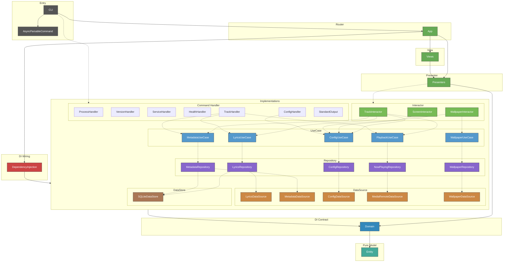

# CLAUDE.md

This file provides guidance to Claude Code (claude.ai/code) when working with code in this repository.

## Build & Test

```sh
swift build                          # debug build
swift build -c release               # release build
swift test                           # run all tests
swift test --filter ConfigTests      # run single test suite
make build                           # release build via Makefile
make install                         # install to /usr/local/bin
make lint                            # check formatting (swift-format)
make format                          # auto-fix formatting
swift .claude/scripts/check-overlay.swift  # verify overlay is rendering
```

## Architecture

macOS desktop overlay app showing synced lyrics and video wallpaper. VIPER + Clean Architecture with Swift Package targets enforcing layer boundaries at compile time.

### Module Dependency Graph



### VIPER Component Summary

| Component | Instances | Responsibility |
|---|---|---|
| **View** | `HeaderView`, `LyricsColumnView`, `LyricLineView`, `RippleView`, `OverlayContentView`, `AppWindow` | Pure rendering. SwiftUI views get data from Presenters via `@ObservedObject`. `AppWindow` (NSWindow subclass) in Views module |
| **Presenter** | `HeaderPresenter`, `LyricsPresenter`, `WallpaperPresenter`, `RipplePresenter`, `AppPresenter` | Display logic, decode animations, Combine subscriptions. `@Published` state for Views. Each Presenter maps 1:1 to an Interactor |
| **Interactor** | `TrackInteractor`, `WallpaperInteractor`, `ScreenInteractor` | Business logic. Abstractions in Domain, implementations in dedicated modules. TrackInteractor uses Combine hot stream |
| **Router** | `AppRouter` | Pure wireframe: creates Presenters in correct order, builds AppWindow, manages DisplayLink. No Interactor references |
| **Entity** | `Entity` module | Pure data types (`TrackUpdate`, `PlaybackPosition`, `WallpaperState`, `ScreenLayout`, `AppStyle`, etc.) |

### Dependency Direction

```
View → Presenter → Interactor → UseCase → Repository → DataSource
                 → Router (wireframe only)
```

Presenters subscribe to Interactors via Combine. Interactors access UseCases via `@Dependency`. Views never reference Interactors or UseCases directly.

### Layer Summary

| Layer | Modules | Responsibility |
|---|---|---|
| Executable / CLI | `CLI` | Entry point (`@main RootCommand: ParsableCommand`), ArgumentParser commands, LaunchAgent. Product name: `lyra` |
| Async Bridge | `AsyncRunnableCommand` | `AsyncRunnableCommand` protocol — bridges `async run()` to sync `ParsableCommand` via `DispatchSemaphore`, keeping the main thread free for `NSApplication.run()` |
| Router | `App` | `AppRouter` (pure wireframe), `AppDelegate` |
| View | `Views` | SwiftUI views + `AppWindow` (NSWindow subclass). Feature dirs: `Header/`, `Lyrics/`, `Ripple/`, `Overlay/`, `Shared/` |
| Presenter | `Presenters` | `Track/` (Header, Lyrics), `Wallpaper/` (Wallpaper, Ripple), `App/` (AppPresenter). DecodeEffect engine, RippleState |
| Handler | `ProcessHandler`, `VersionHandler`, `ServiceHandler`, `HealthHandler`, `TrackHandler`, `ConfigHandler` | CLI command logic. ProcessHandler: process lifecycle. VersionHandler: version string. ServiceHandler: LaunchAgent install/uninstall. HealthHandler: connectivity checks. TrackHandler: now-playing info with metadata/lyrics resolution. ConfigHandler: config template/init/path resolution. Protocols in Domain, injected via `@Dependency`. All handlers return `Result<Success, Failure>` — never throw |
| StandardOutput | `StandardOutput` | `StandardOutput` protocol (Domain/Misc) + `PrintStandardOutput` impl. CLI commands call `write(_ result:)` for typed results (success → stdout, failure → stderr), `write(_ message:)` for strings, `writeJson` for Encodable. Single source of all CLI message strings |
| Interactor | `TrackInteractor`, `ScreenInteractor`, `WallpaperInteractor` | Combine-based reactive pipelines over UseCases (GUI) |
| DI Wiring | `DependencyInjection` | All liveValue registrations, FontMetrics, HealthCheck |
| Entity | `Entity` | Pure data types, zero external dependencies |
| Domain | `Domain` | Protocols, DependencyKeys (`@_exported import Entity`) |
| UseCase | `ConfigUseCase`, `PlaybackUseCase`, `LyricsUseCase`, `MetadataUseCase`, `WallpaperUseCase` | Business logic only, no cross-UseCase deps |
| Repository | `ConfigRepository`, `LyricsRepository`, `MetadataRepository`, `NowPlayingRepository`, `WallpaperRepository` | DataSource + DataStore orchestration, cache strategy |
| DataSource | `LyricsDataSource`, `MetadataDataSource`, `ConfigDataSource`, `MediaRemoteDataSource`, `WallpaperDataSource` | API execution, file I/O, private framework access |
| DataStore | `SQLiteDataStore` | GRDB SQLite cache |

### Key Design Decisions

**MediaRemoteDataSource via swift interpreter**: Compiled binaries cannot access `MediaRemote.framework` (private framework). A helper swift script (`Resources/media-remote-helper.swift`) runs as a persistent subprocess via `/usr/bin/env swift`, using `MRMediaRemoteRegisterForNowPlayingNotifications` for event-driven updates and streaming JSON over a pipe.

**VIPER data flow**: `TrackInteractor` exposes a shared Combine publisher (`AnyPublisher<TrackUpdate, Never>`) built as a declarative pipeline: NowPlaying stream → `removeDuplicates` → `switchToLatest(resolve)` → `share()`. `HeaderPresenter` and `LyricsPresenter` each subscribe independently via `.sink`. No manual dispatch or procedural send calls.

**Presenter / View separation**: Presenters (`ObservableObject`) own all display state via `@Published` properties. Views observe Presenters via `@ObservedObject` and are purely declarative — no business logic, no `@Dependency` references to Interactors or UseCases. Style information (fonts, colors, sizes) flows from Interactor → Presenter → View.

**FetchState\<T\>**: Generic enum (`.idle`, `.loading`, `.revealing(T)`, `.success(T)`, `.failure`) drives both data flow and UI animation. The `.revealing` → `.success` transition is timed by Presenters using `DecodeEffectState`.

**Entity types**: `AppStyle`, `TextLayout`, `TextAppearance`, `ArtworkStyle`, `RippleStyle`, `WallpaperStyle`, `DecodeEffect`, `AIEndpoint`, `ColorStyle`, `HealthCheckResult`, `ConfigValidationResult`, `MusicBrainzMetadata`, `MediaRemotePollResult`, `LocalWallpaper`, `RemoteWallpaper`, `YouTubeWallpaper`, `TrackUpdate`, `TrackLyricsState`, `WallpaperState`, `ScreenLayout`, `WallpaperConfig`, `NowPlayingInfo`, `LyricLine`, `LyricsContent`. Config flows through Interactors, not via global `AppStyleKey`.

**No AppStyleKey**: `@Dependency(\.appStyle)` was removed. All config access goes through the owning Interactor's computed properties (e.g., `trackInteractor.textLayout`, `wallpaperInteractor.rippleConfig`). This enforces the VIPER dependency rule.

**WallpaperDataSource\<LocationType\>**: Generic protocol defining `resolve(_ location: LocationType) async throws -> String`. Three implementations with distinct location types:
- `LocalWallpaperDataSourceImpl: WallpaperDataSource<LocalWallpaper>` — relative/absolute path resolution via Files library
- `RemoteWallpaperDataSourceImpl: WallpaperDataSource<RemoteWallpaper>` — HTTP(S) download with SHA256-keyed cache
- `YouTubeWallpaperDataSourceImpl: WallpaperDataSource<YouTubeWallpaper>` — yt-dlp/uvx download with H.264/AVC codec, SHA256-keyed cache

**WallpaperRepository URL classification**: Repository classifies wallpaper config string and dispatches to the appropriate DataSource. Priority: local path (no scheme) → YouTube URL (host contains youtube.com/youtu.be) → remote HTTP(S) URL. All paths converge to a local file path string.

**Wallpaper cache**: `~/.cache/lyra/wallpapers/SHA256(url).{ext}`. Cache is permanent (wallpapers are reused). `WallpaperCache` helper shared by Remote and YouTube DataSources.

**Wallpaper async resolution**: `WallpaperPresenter.start()` resolves wallpaper via `WallpaperInteractor` in a background Task. `WallpaperPresenter` also manages AVPlayer lifecycle (create, seek, loop, pause/play) and owns sleep/wake monitoring via `observeSleepWake()`.

**Domain organization**: Domain module root is organized by layer subdirectories (`Interactor/`, `UseCase/`, `Repository/`, `DataSource/`, `DataStore/`, `Handler/`, `Misc/`) matching the architecture. Each file contains a protocol + `TestDependencyKey` + `DependencyValues` extension.

**Config layer**: Pure data — no AppKit imports. `Entity/Config/` contains `AppConfig`, `TextConfig`, `TextAppearanceConfig`, `ArtworkConfig`, `RippleConfig`, `DecodeEffectConfig`, `AIConfig`, `WallpaperConfig`. Font metrics resolution lives in `Views/Lyrics/ColumnLayout.swift` (the only place lineHeight is needed).

**Text style resolution**: `UnresolvedTextAppearance` (all-optional, private to `TextConfig.swift`) → variadic `resolve(defaults:filled:)` chain → `TextAppearanceConfig` (all non-optional). Layer defaults (title: bold/18pt, artist: medium, highlight: gold gradient) are applied via `Optional<UnresolvedTextAppearance>.resolve()`, ensuring defaults apply even when the TOML section is absent.

**FlexibleDouble**: `Codable` wrapper that decodes both TOML Int and Double via `singleValueContainer`. Used for all numeric config fields.

**MetadataDataSource\<Value\>**: Generic protocol defining `resolve(track:) -> [Value]`. Three implementations with distinct value types:
- `LLMMetadataDataSourceImpl: MetadataDataSource<Track>` — AI-based title/artist extraction
- `MusicBrainzMetadataDataSourceImpl: MetadataDataSource<MusicBrainzMetadata>` — MusicBrainz API lookup
- `RegexMetadataDataSourceImpl: MetadataDataSource<Track>` — regex-based title parsing and candidate generation

Each is injected individually into `MetadataRepository` (not as an array). Repository manages cache strategy and type conversion (`MusicBrainzMetadata → Track`).

**MetadataDataStore\<Value\>**: Generic cache protocol with `read(title:artist:) -> Value?` and `write(title:artist:value:)`. Two parameterizations:
- `MetadataDataStore<Track>` — LLM result cache (`GRDBLLMMetadataDataStore`)
- `MetadataDataStore<MusicBrainzMetadata>` — MusicBrainz result cache (`GRDBMetadataDataStore`)

Cache is Repository's responsibility, not DataSource's. DataSources are pure API/computation with no cache access.

**MetadataRepository cache strategy**: Priority order: LLM cache → LLM DataSource → MusicBrainz cache → MusicBrainz DataSource → Regex DataSource. LLM/MusicBrainz results are cached on success. Regex results are not cached.

**ColorStyle**: Domain-level enum (`.solid(hex)`, `.gradient([hex])`) enabling any text style to use either solid colors or gradients. Polymorphic TOML decoding supports both `color = "#FFF"` and `color = ["#AAA", "#BBB"]`.

**DI with swift-dependencies**: Protocol definitions + `TestDependencyKey` in `Domain`, all `liveValue` registrations centralized in `DependencyInjection` module (`InteractorRegistration`, `UseCaseRegistration`, `RepositoryRegistration`, `DataSourceRegistration`, `DataStoreRegistration`, `HealthCheckRegistration`). No direct instantiation — everything through `@Dependency`.

**Config commands**: `lyra config template` (stdout), `lyra config init` (file creation), `lyra config edit` ($EDITOR), `lyra config open` (GUI). Template generation flows through UseCase→Repository→DataSource. `ConfigDataSource.template(format:)` encodes `AppConfig.defaults` via `TOMLEncoder`/`JSONEncoder`. `ConfigFormat` enum in Entity. `ConfigWriteError` for init failure handling.

**Track command**: `lyra track` outputs currently playing track info as JSON. Flags: `--resolve` (`-r`) resolves metadata via MusicBrainz/regex, `--lyrics` (`-l`) fetches lyrics from LRCLIB. The two flags are independent and combinable (`-rl`). Default (no flags) returns raw MediaRemote data. Uses `PlaybackUseCase.fetchNowPlaying()` (one-shot) + `MetadataUseCase` + `LyricsUseCase` via `@Dependency`. Output type is `NowPlayingInfo` (Codable).

**NowPlayingRepository dual API**: `fetch()` for one-shot retrieval (used by CLI `track` command), `stream()` for continuous observation (used by GUI via `TrackInteractor`). `PlaybackUseCase` mirrors both: `fetchNowPlaying()` and `observeNowPlaying()`.

**AsyncRunnableCommand vs AsyncParsableCommand**: `@main AsyncParsableCommand` starts Swift's cooperative thread pool and takes ownership of the main thread. `NSApplication.run()` must own the main thread exclusively for SwiftUI rendering. The two are fundamentally incompatible — when both compete, the overlay window is blank. `AsyncRunnableCommand` protocol solves this by keeping `RootCommand` as sync `ParsableCommand` (main thread free for NSApplication) while bridging async subcommands (`TrackCommand`, `HealthcheckCommand`) via `DispatchSemaphore` on a cooperative thread pool thread. `DaemonCommand` stays sync and calls `MainActor.assumeIsolated { app.run() }` directly on the main thread.

**HealthCheckable**: Protocol in Domain with `serviceName` + `healthCheck()`. Implemented by `LRCLibAPI`, `MusicBrainzAPI`, `OpenAICompatibleAPI`. `lyra healthcheck` validates config, API connectivity, and AI token validity.

### Testing Guidelines

**Async test timing**: Never use fixed `Task.sleep` to wait for state changes in Presenter/Interactor tests. CI environments have variable load, and fixed delays cause flaky failures. Always use polling helpers:

```swift
// Good — poll until condition is met
let deadline = ContinuousClock.now + .seconds(3)
while !presenter.titleState.isSuccess, ContinuousClock.now < deadline {
    try? await Task.sleep(for: .milliseconds(10))
}

// Bad — fixed delay that may be too short on CI
try? await Task.sleep(for: .milliseconds(200))
#expect(presenter.titleState == .success("Song"))
```

This applies to all Combine + Timer + MainActor tests where DecodeEffect, state transitions, or async operations are involved.

**View testing strategy**: SwiftUI Views (body) are not unit-tested. All display logic is pushed to Presenters, which are thoroughly tested. Views are pure rendering with no business logic.

**SwiftUIResolver**: Config→SwiftUI type conversions (font, color, shapeStyle, lineHeight) are centralized in `SwiftUIResolver` protocol with DI. Views access via `@Dependency(\.swiftUIResolver)` in body. `LiveSwiftUIResolver` is tested directly in `SwiftUIResolverTests`.

### Git Workflow

**Never commit directly to main.** All changes, including documentation-only updates, must go through a branch → PR → merge flow. Documentation-only changes (CLAUDE.md, README, etc.) should normally be batched into the next code-change PR, but small doc-only PRs are acceptable when needed; direct commits to `main` are never allowed.

### Version Management

Version is defined in `Sources/VersionHandler/Resources/version.txt` (single source of truth). CI reads this file to auto-create/update git tags on push to main.

**PR version bump rule**: When creating a PR, always include a version bump commit. Determine the level from the changes in the PR:
- `feat:` → minor bump
- `fix:` / `refactor:` / `chore:` → patch bump
- Breaking changes → major bump
