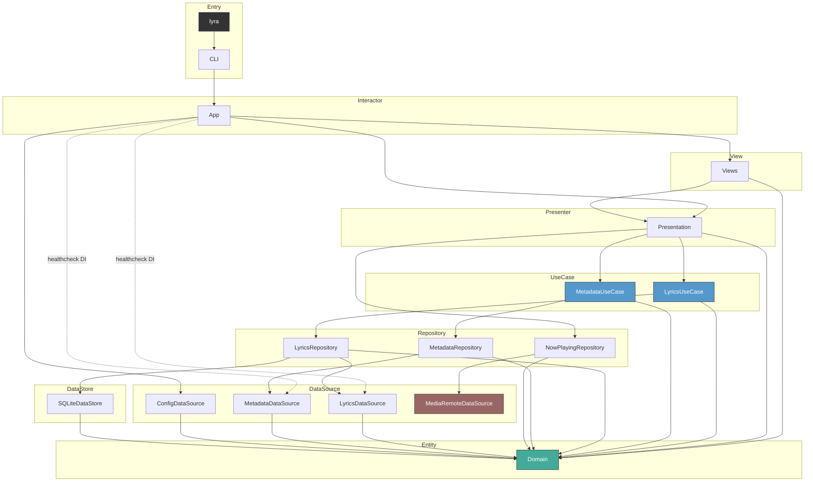

# CLAUDE.md

This file provides guidance to Claude Code (claude.ai/code) when working with code in this repository.

## Build & Test

```sh
swift build                          # debug build
swift build -c release               # release build
swift test                           # run all tests
swift test --filter ConfigTests      # run single test suite
make build                           # release build via Makefile
make install                         # install to /usr/local/bin
```

## Architecture

macOS desktop overlay app showing synced lyrics and video wallpaper. VIPER + Clean Architecture with Swift Package targets enforcing layer boundaries at compile time.

### Module Dependency Graph



### Layer Summary (VIPER + Clean Architecture)

| Layer | Modules | Responsibility |
|---|---|---|
| Executable | `lyra` | Entry point |
| CLI | `CLI` | ArgumentParser commands, LaunchAgent |
| View | `Views` | SwiftUI views — purely declarative, no logic |
| Interactor | `App` | OverlayWindow, AppStyleBuilder, healthcheck DI |
| Presenter | `Presentation` | OverlayController, OverlayState, DecodeEffect, CharacterPool |
| Entity | `Domain` | Protocols, models, DependencyKeys |
| UseCase | `LyricsUseCase`, `MetadataUseCase` | Business logic only, no cross-UseCase deps |
| Repository | `LyricsRepository`, `MetadataRepository`, `NowPlayingRepository` | DataSource + DataStore, cache strategy |
| DataSource | `LyricsDataSource`, `MetadataDataSource`, `ConfigDataSource`, `MediaRemoteDataSource` | API execution, file I/O, private framework access |
| DataStore | `SQLiteDataStore` | GRDB SQLite cache |

### Key Design Decisions

**MediaRemoteDataSource via swift interpreter**: Compiled binaries cannot access `MediaRemote.framework` (private framework). A helper swift script (`Resources/media-remote-helper.swift`) runs as a persistent subprocess via `/usr/bin/env swift`, using `MRMediaRemoteRegisterForNowPlayingNotifications` for event-driven updates and streaming JSON over a pipe.

**Presentation / UI separation**: `Presentation` owns all state and logic (NowPlaying observation, lyrics fetching, decode animation timing, FetchState transitions). `Views` are purely declarative — they read display-ready strings from `OverlayState` and render them. `App.OverlayWindow` handles only window management.

**FetchState\<T\>**: Generic enum (`.idle`, `.loading`, `.revealing(T)`, `.success(T)`, `.failure`) drives both data flow and UI animation. The `.revealing` → `.success` transition is timed by `OverlayController` using `DecodeEffectState`.

**Domain types**: `AppStyle`, `TextLayout`, `TextAppearance`, `ArtworkStyle`, `RippleStyle`, `DecodeEffect`, `AIEndpoint`. DI via `AppStyleKey` / `\.appStyle`.

**Config layer**: Pure data — no AppKit imports. `Config/Models/` contains `AppConfig`, `TextConfig`, `TextAppearanceConfig`, `UnresolvedTextAppearance`, `ArtworkConfig`, `RippleConfig`, `DecodeEffectConfig`, `AIConfig`. Font metrics resolution lives in `App/AppStyleBuilder.swift`.

**Text style resolution**: `UnresolvedTextAppearance` (all-optional fields from TOML) → variadic `resolve(defaults:filled:)` chain → `TextAppearanceConfig` (all non-optional). Layer defaults (title: bold/18pt, artist: medium, highlight: gold gradient) are applied via `Optional<UnresolvedTextAppearance>.resolve()`, ensuring defaults apply even when the TOML section is absent.

**FlexibleDouble**: `Codable` wrapper that decodes both TOML Int and Double via `singleValueContainer`. Used for all numeric config fields.

**ConfigLoader**: Singleton (`ConfigLoader.shared`) handling file discovery, TOML/JSON parsing, includes resolution, and error notification.

**MetadataNormalizer**: Protocol for song metadata resolution. `LLMNormalizer` (AI-based) and `RegexNormalizer` (regex + MusicBrainz) are tried in order. When LLM succeeds, MusicBrainz never runs.

**ColorStyle**: Domain-level enum (`.solid(hex)`, `.gradient([hex])`) enabling any text style to use either solid colors or gradients. Polymorphic TOML decoding supports both `color = "#FFF"` and `color = ["#AAA", "#BBB"]`.

**DI with swift-dependencies**: Protocol definitions + `DependencyKey` in `Domain`, `liveValue` registered in infrastructure modules. App style is resolved once at startup via `AppStyleKey.liveValue` in `App/AppStyleBuilder.swift`.

**HealthCheckable**: Protocol in Domain with `serviceName` + `healthCheck()`. Implemented by `LRCLibAPI`, `MusicBrainzAPI`, `OpenAICompatibleAPI`. `lyra healthcheck` validates config, API connectivity, and AI token validity.

### Version Management

Version is defined in `Sources/CLI/Resources/version.txt` (single source of truth). CI reads this file to auto-create/update git tags on push to main.
