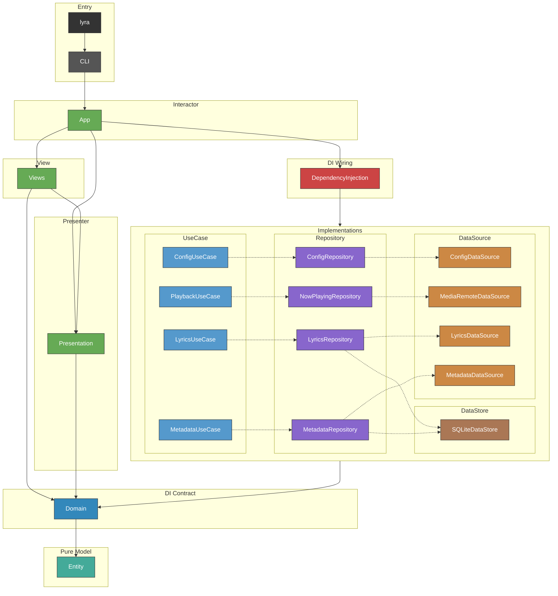

# CLAUDE.md

This file provides guidance to Claude Code (claude.ai/code) when working with code in this repository.

## Build & Test

```sh
swift build                          # debug build
swift build -c release               # release build
swift test                           # run all tests
swift test --filter ConfigTests      # run single test suite
make build                           # release build via Makefile
make install                         # install to /usr/local/bin
```

## Architecture

macOS desktop overlay app showing synced lyrics and video wallpaper. VIPER + Clean Architecture with Swift Package targets enforcing layer boundaries at compile time.

### Module Dependency Graph



### Layer Summary (VIPER + Clean Architecture)

| Layer | Modules | Responsibility |
|---|---|---|
| Executable | `lyra` | Entry point |
| CLI | `CLI` | ArgumentParser commands, LaunchAgent |
| View | `Views` | SwiftUI views — purely declarative, no logic |
| DI Wiring | `DependencyInjection` | All liveValue registrations, FontMetrics, HealthCheck |
| Interactor | `App` | OverlayWindow management only |
| Presenter | `Presentation` | OverlayController, OverlayState, DecodeEffect, CharacterPool |
| Entity | `Entity` | Pure data types, zero external dependencies |
| Domain | `Domain` | Protocols, DependencyKeys (`@_exported import Entity`) |
| UseCase | `ConfigUseCase`, `PlaybackUseCase`, `LyricsUseCase`, `MetadataUseCase` | Business logic only, no cross-UseCase deps |
| Repository | `ConfigRepository`, `LyricsRepository`, `MetadataRepository`, `NowPlayingRepository` | DataSource + DataStore orchestration, cache strategy |
| DataSource | `LyricsDataSource`, `MetadataDataSource`, `ConfigDataSource`, `MediaRemoteDataSource` | API execution, file I/O, private framework access |
| DataStore | `SQLiteDataStore` | GRDB SQLite cache |

### Key Design Decisions

**MediaRemoteDataSource via swift interpreter**: Compiled binaries cannot access `MediaRemote.framework` (private framework). A helper swift script (`Resources/media-remote-helper.swift`) runs as a persistent subprocess via `/usr/bin/env swift`, using `MRMediaRemoteRegisterForNowPlayingNotifications` for event-driven updates and streaming JSON over a pipe.

**Presentation / UI separation**: `Presentation` owns all state and logic (NowPlaying observation, lyrics fetching, decode animation timing, FetchState transitions). `Views` are purely declarative — they read display-ready strings from `OverlayState` and render them. `App.OverlayWindow` handles only window management.

**FetchState\<T\>**: Generic enum (`.idle`, `.loading`, `.revealing(T)`, `.success(T)`, `.failure`) drives both data flow and UI animation. The `.revealing` → `.success` transition is timed by `OverlayController` using `DecodeEffectState`.

**Entity types**: `AppStyle`, `TextLayout`, `TextAppearance`, `ArtworkStyle`, `RippleStyle`, `DecodeEffect`, `AIEndpoint`, `ColorStyle`, `HealthCheckResult`, `ConfigValidationResult`, `MusicBrainzMetadata`, `MediaRemotePollResult`. DI via `AppStyleKey` / `\.appStyle`.

**Domain Dependencies organization**: `Dependencies/` is organized by layer subdirectories (`UseCase/`, `Repository/`, `DataSource/`, `DataStore/`, `Misc/`) matching the architecture. Each file contains a protocol + `TestDependencyKey` + `DependencyValues` extension.

**Config layer**: Pure data — no AppKit imports. `Entity/Config/` contains `AppConfig`, `TextConfig`, `TextAppearanceConfig`, `ArtworkConfig`, `RippleConfig`, `DecodeEffectConfig`, `AIConfig`. Font metrics resolution lives in `DependencyInjection/AppStyleRegistration.swift`.

**Text style resolution**: `UnresolvedTextAppearance` (all-optional, private to `TextConfig.swift`) → variadic `resolve(defaults:filled:)` chain → `TextAppearanceConfig` (all non-optional). Layer defaults (title: bold/18pt, artist: medium, highlight: gold gradient) are applied via `Optional<UnresolvedTextAppearance>.resolve()`, ensuring defaults apply even when the TOML section is absent.

**FlexibleDouble**: `Codable` wrapper that decodes both TOML Int and Double via `singleValueContainer`. Used for all numeric config fields.

**MetadataDataSource\<Value\>**: Generic protocol defining `resolve(track:) -> [Value]`. Three implementations with distinct value types:
- `LLMMetadataDataSourceImpl: MetadataDataSource<Track>` — AI-based title/artist extraction
- `MusicBrainzMetadataDataSourceImpl: MetadataDataSource<MusicBrainzMetadata>` — MusicBrainz API lookup
- `RegexMetadataDataSourceImpl: MetadataDataSource<Track>` — regex-based title parsing and candidate generation

Each is injected individually into `MetadataRepository` (not as an array). Repository manages cache strategy and type conversion (`MusicBrainzMetadata → Track`).

**MetadataDataStore\<Value\>**: Generic cache protocol with `read(title:artist:) -> Value?` and `write(title:artist:value:)`. Two parameterizations:
- `MetadataDataStore<Track>` — LLM result cache (`GRDBLLMMetadataDataStore`)
- `MetadataDataStore<MusicBrainzMetadata>` — MusicBrainz result cache (`GRDBMetadataDataStore`)

Cache is Repository's responsibility, not DataSource's. DataSources are pure API/computation with no cache access.

**MetadataRepository cache strategy**: Priority order: LLM cache → LLM DataSource → MusicBrainz cache → MusicBrainz DataSource → Regex DataSource. LLM/MusicBrainz results are cached on success. Regex results are not cached.

**ColorStyle**: Domain-level enum (`.solid(hex)`, `.gradient([hex])`) enabling any text style to use either solid colors or gradients. Polymorphic TOML decoding supports both `color = "#FFF"` and `color = ["#AAA", "#BBB"]`.

**DI with swift-dependencies**: Protocol definitions + `TestDependencyKey` in `Domain`, all `liveValue` registrations centralized in `DependencyInjection` module. App style is resolved once at startup via `AppStyleKey.liveValue` in `DependencyInjection/AppStyleRegistration.swift`. No direct instantiation — everything through `@Dependency`.

**HealthCheckable**: Protocol in Domain with `serviceName` + `healthCheck()`. Implemented by `LRCLibAPI`, `MusicBrainzAPI`, `OpenAICompatibleAPI`. `lyra healthcheck` validates config, API connectivity, and AI token validity.

### Version Management

Version is defined in `Sources/CLI/Resources/version.txt` (single source of truth). CI reads this file to auto-create/update git tags on push to main.
