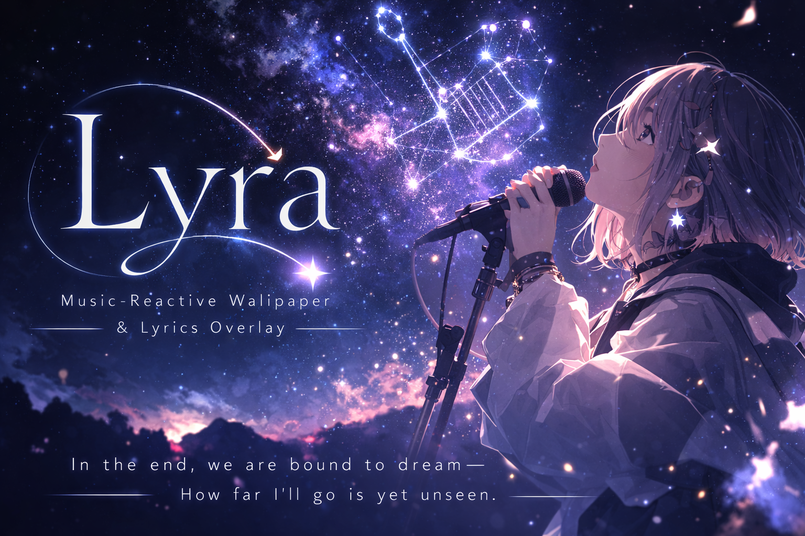

<p align="center">
  
</p>

<p align="center">
  
  
  
  
  
  <a href="https://codecov.io/gh/GeneralD/lyra"></a>
  <a href="https://coderabbit.ai"></a>
  
</p>

<p align="center">
  <a href="https://codecov.io/gh/GeneralD/lyra"></a>
</p>

# lyra

Desktop lyrics overlay and video wallpaper for macOS.

Displays synced lyrics from [LRCLIB](https://lrclib.net) over your desktop, with optional video wallpaper and mouse-reactive ripple effects. Text appears with a matrix-style decode animation.

<p align="center">
  
</p>

## Install

```sh
# via Homebrew
brew tap generald/tap
brew install lyra

# via Mint
mint install GeneralD/lyra

# or build from source
make install
```

## Usage

```sh
lyra start            # start as background daemon
lyra stop             # stop the daemon
lyra restart          # restart
lyra daemon           # run in foreground (debug)
lyra version          # show version
lyra healthcheck      # check API connectivity

lyra config template  # print default config to stdout
lyra config init      # create config file with defaults
lyra config edit      # open config in $EDITOR
lyra config open      # open config in GUI app

lyra track            # show now-playing info as JSON
lyra track -r         # resolve metadata (MusicBrainz/regex)
lyra track -l         # include lyrics (LRCLIB)
lyra track -rl        # resolve + lyrics

lyra benchmark        # measure CPU/memory baselines
lyra benchmark -d 30  # 30s per scenario
lyra benchmark --json # JSON output for CI
```

### Auto-start

```sh
# via Homebrew (recommended for Homebrew installs)
brew services start lyra
brew services stop lyra

# or manually (Mint / source-build users)
lyra service install    # register LaunchAgent directly
lyra service uninstall
```

> **Note:** Both methods use LaunchAgent but with different labels (`homebrew.mxcl.lyra` vs `com.generald.lyra`). Use one approach — do not mix them, or the daemon will run twice.

### Shell completion

```sh
# zsh / bash / fish
eval "$(lyra completion zsh)"
```

Homebrew installs completions automatically.

## Configuration

```sh
# Generate a starter config with all defaults
lyra config init                    # creates ~/.config/lyra/config.toml
lyra config init --format json      # JSON variant
lyra config template > custom.toml  # pipe to any path
```

Or create `~/.config/lyra/config.toml` (or `config.json`) manually. All fields are optional — missing values use sensible defaults.

Alternative paths: `~/.lyra/config.toml`, `$XDG_CONFIG_HOME/lyra/config.toml`

### Top-level

| Key | Type | Default | Description |
|---|---|---|---|
| `screen` | string / int | `"main"` | Which display to use (see [Screen selection](#screen-selection)) |
| `screen_debounce` | number | `5` | Seconds between re-evaluations in `"vacant"` mode |
| `wallpaper` | string | — | Video wallpaper. Local path, HTTP(S) URL, or YouTube URL (see [Wallpaper](#wallpaper)) |
| `includes` | array | — | TOML-only: list of additional TOML files to merge (ignored for `config.json`; paths relative to config dir or absolute) |

### `[text.default]` — base text style

All text sections inherit from `[text.default]`. Section-specific values override the base.

| Key | Type | Default | Description |
|---|---|---|---|
| `font` | string | system font | Font family name (e.g. `"Helvetica Neue"`) |
| `size` | number | `12` | Font size in points |
| `weight` | string | `"regular"` | Font weight: `"regular"`, `"medium"`, `"bold"`, etc. |
| `color` | string / array | `"#FFFFFFD9"` | Solid hex `"#RRGGBBAA"` or gradient `["#AAA", "#BBB"]` |
| `shadow` | string | `"#000000E6"` | Shadow color in hex |
| `spacing` | number | `6` | Vertical padding around each line |

### `[text.title]`, `[text.artist]`, `[text.lyric]`, `[text.highlight]`

Each overrides specific properties from `[text.default]`. Unset properties fall back to the base.

| Section | Built-in overrides |
|---|---|
| `title` | `size = 18`, `weight = "bold"` |
| `artist` | `weight = "medium"` |
| `lyric` | inherits default as-is |
| `highlight` | `color = ["#B8942DFF", "#EDCF73FF", "#FFEB99FF", "#CCA64DFF", "#A68038FF"]` (gold gradient). Inherits from `lyric`, then `default` |

### `[text.decode_effect]`

Controls the matrix-style text reveal animation.

| Key | Type | Default | Description |
|---|---|---|---|
| `duration` | number | `0.8` | Animation duration in seconds |
| `charset` | string / array | all | Character sets for scramble: `"latin"`, `"cyrillic"`, `"greek"`, `"symbols"`, `"cjk"`. Single string or array |

### `[artwork]`

| Key | Type | Default | Description |
|---|---|---|---|
| `size` | number | `96` | Album artwork size in points |
| `opacity` | number | `1.0` | `0` hides artwork (text aligns left), `1` fully visible |

### `[ripple]`

Mouse-reactive ripple effect on the overlay.

| Key | Type | Default | Description |
|---|---|---|---|
| `enabled` | boolean | `true` | Set to `false` to disable ripple effects entirely |
| `color` | string | `"#AAAAFFFF"` | Ripple color in hex |
| `radius` | number | `60` | Ripple radius in points |
| `duration` | number | `0.6` | Ripple animation duration in seconds |
| `idle` | number | `1` | Seconds before ripple fades after mouse stops |

### `[ai]`

Optional LLM-based song title and artist extraction via any OpenAI-compatible API. When omitted, lyra uses regex-based parsing only. All three fields are required to enable this feature.

| Key | Type | Default | Description |
|---|---|---|---|
| `endpoint` | string | — | OpenAI-compatible API base URL (e.g. `"https://api.openai.com/v1"`) |
| `model` | string | — | Model name (e.g. `"gpt-4o-mini"`) |
| `api_key` | string | — | API key for authentication |

> **Tip:** Keep your API key out of version control by splitting `[ai]` into a separate file and using `includes`:
>
> ```toml
> # config.toml
> includes = ["ai.toml"]
> ```
>
> ```toml
> # ai.toml (add to .gitignore)
> [ai]
> endpoint = "https://api.openai.com/v1"
> model = "gpt-4o-mini"
> api_key = "sk-..."
> ```
>
> Included files are merged into the main config. Values in the main file take precedence over included ones.

### Screen selection

| Value | Behavior |
|---|---|
| `"main"` | Current main display (with focused window) |
| `"primary"` | Primary display (menu bar screen) |
| `"smallest"` | Smallest display by area |
| `"largest"` | Largest display by area |
| `"vacant"` | Least-occupied display (auto-migrates every `screen_debounce` seconds) |
| `0`, `1`, … | Display by index |

### Wallpaper

The `wallpaper` field accepts three types of values:

```toml
# Local file (relative to config dir or absolute)
wallpaper = "loop.mp4"
wallpaper = "/Users/me/Videos/bg.mp4"

# Direct HTTP(S) URL
wallpaper = "https://example.com/background.mp4"

# YouTube URL
wallpaper = "https://www.youtube.com/watch?v=XXXXX"
wallpaper = "https://youtu.be/XXXXX"
```

Remote and YouTube videos are downloaded once and cached in `~/.cache/lyra/wallpapers/`. Subsequent launches use the cached file instantly.

**YouTube requirements:**

| Tool | Install | Notes |
|---|---|---|
| `yt-dlp` | `brew install yt-dlp` | Preferred. Downloads video-only H.264 at up to 4K |
| `uvx` | `brew install uv` | Zero-install alternative — runs `uvx yt-dlp` without global install |
| `ffmpeg` | `brew install ffmpeg` | Required for auto-loop. Remuxes DASH container to standard MP4 |

If neither `yt-dlp` nor `uvx` is found, lyra will show an error. If `ffmpeg` is not found, the video plays but may not loop automatically.

**Trim playback range** (optional):

```toml
[wallpaper]
location = "https://www.youtube.com/watch?v=XXXXX"
start = "0:30"     # skip intro
end = "3:45"       # stop before outro
```

Time format: `M:SS`, `H:MM:SS`, or fractional seconds (`1:23.5`). Both `start` and `end` are optional. The bare string format (`wallpaper = "file.mp4"`) still works for simple cases.

### Full example

#### **config.toml**

```toml
includes = ["ai.toml"]

screen = "main"

[wallpaper]
location = "https://www.youtube.com/watch?v=Sn1ieBOLGB0"
start = "0:17"
end = "3:37"

[text.default]
font = "Helvetica Neue"
size = 14
color = "#FFFFFFD9"
shadow = "#000000E6"
spacing = 8

[text.title]
size = 20
weight = "bold"

[text.artist]
weight = "medium"

[text.lyric]
color = "#FFFFFFE6"

[text.highlight]
color = ["#B8942DFF", "#EDCF73FF", "#FFEB99FF", "#CCA64DFF", "#A68038FF"]

[text.decode_effect]
duration = 1.0
charset = ["latin", "cyrillic"]

[artwork]
size = 120
opacity = 0.9

[ripple]
# enabled = true
color = "#AAAAFFFF"
radius = 80
duration = 0.4
idle = 1.5
```

#### **ai.toml**

```toml
[ai]
endpoint = "https://api.openai.com/v1"
model = "gpt-4o-mini"
api_key = "sk-..."
```

## Requirements

- macOS 14+
- Swift 6.0+

## License

GPL-3.0
