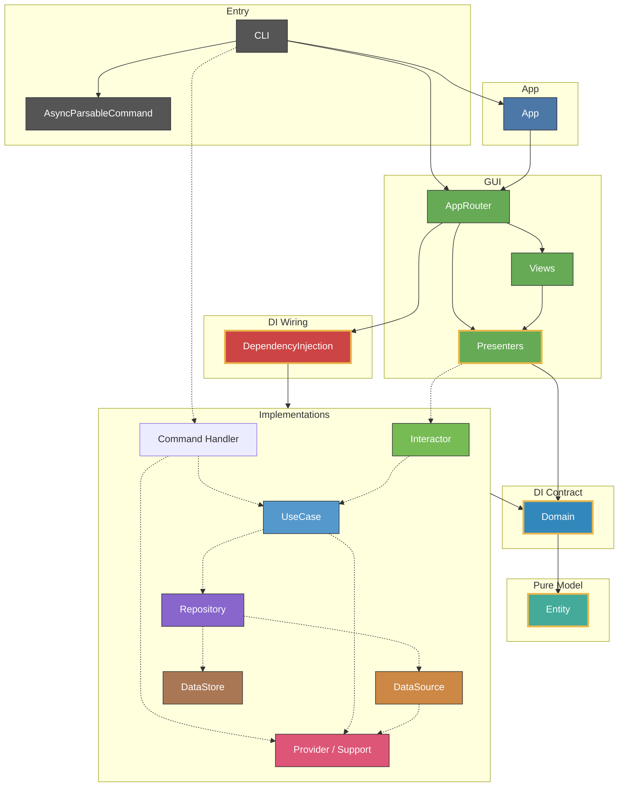
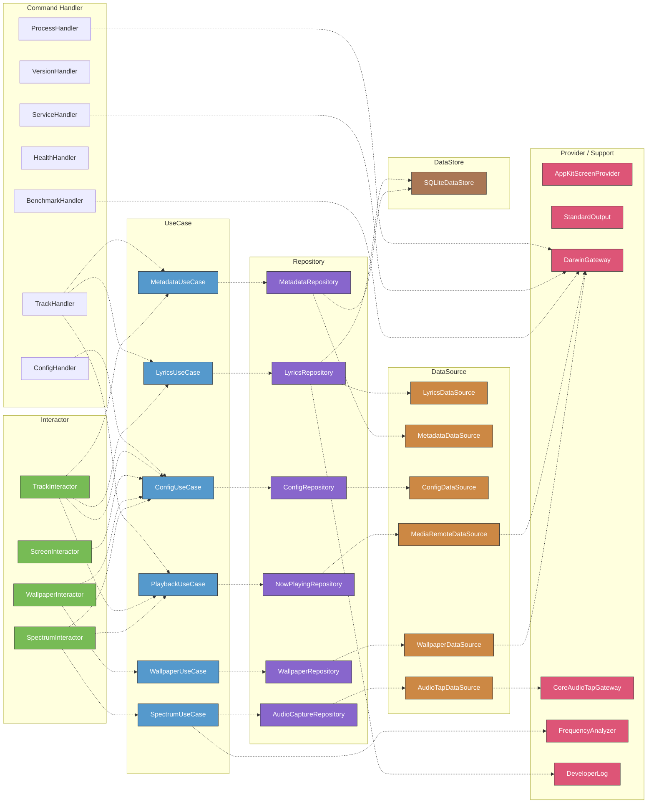
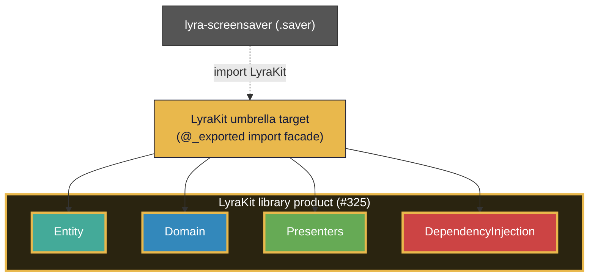

# lyra Architecture

macOS desktop overlay app showing synced lyrics and video wallpaper. VIPER + Clean Architecture with Swift Package targets enforcing layer boundaries at compile time.

> This is the canonical architecture reference for lyra. `.claude/CLAUDE.md` keeps a short summary and points here; the **enforceable** layer boundaries live in `.claude/rules/architecture-boundaries.md`.

## Module Dependency Graph

Two views: the **Layer Overview** shows how the layers relate; the
**Implementation Modules** diagram expands the `Implementations` box module by
module. Dotted edges are protocol-mediated (`@Dependency` via Domain); solid
edges are direct module dependencies.

### Layer Overview



> The four **gold-bordered** nodes (`Entity`, `Domain`, `Presenters`,
> `DependencyInjection`) are what the `LyraKit` library product re-exports for
> external reuse (#325). They span four layers, so see the grouped LyraKit
> diagram under Key Design Decisions for the single-rectangle view.

### Implementation Modules



## VIPER Component Summary

| Component | Instances | Responsibility |
|---|---|---|
| **View** | `HeaderView`, `LyricsColumnView`, `LyricLineView`, `RippleView`, `SpectrumView`, `OverlayContentView`, `AppWindow` | Pure rendering. SwiftUI views get data from Presenters via `@ObservedObject`. `AppWindow` (NSWindow subclass) in Views module |
| **Presenter** | `HeaderPresenter`, `LyricsPresenter`, `WallpaperPresenter`, `RipplePresenter`, `SpectrumPresenter`, `AppPresenter` | Display logic, decode animations, Combine subscriptions. `@Published` state for Views. Each Presenter maps 1:1 to an Interactor |
| **Interactor** | `TrackInteractor`, `WallpaperInteractor`, `ScreenInteractor`, `SpectrumInteractor` | Business logic. Abstractions in Domain, implementations in dedicated modules. TrackInteractor uses Combine hot stream |
| **Router** | `AppRouter` | Pure wireframe: creates Presenters in correct order, builds AppWindow, manages DisplayLink. For UI-test mode, app launch reads environment once and bootstraps fixture dependencies before Presenter creation |
| **Entity** | `Entity` module | Pure data types (`TrackUpdate`, `PlaybackPosition`, `WallpaperState`, `ScreenLayout`, `AppStyle`, etc.) |

## Dependency Direction

```text
View → Presenter → Interactor → UseCase → Repository → DataSource
                 → Router (wireframe only)
```

Presenters subscribe to Interactors via Combine. Interactors access UseCases via `@Dependency`. Views never reference Interactors or UseCases directly.

## Layer Summary

| Layer | Modules | Responsibility |
|---|---|---|
| Executable / CLI | `CLI` | Entry point (`@main RootCommand: ParsableCommand`), ArgumentParser commands, LaunchAgent. Product name: `lyra` |
| Async Bridge | `AsyncRunnableCommand` | `AsyncRunnableCommand` protocol — bridges `async run()` to sync `ParsableCommand` via `DispatchSemaphore`, keeping the main thread free for `NSApplication.run()` |
| Router | `App`, `AppRouter` | `App` owns AppKit foreground lifecycle and termination-signal handling seams; `AppRouter` holds `AppRouter`, bootstrap, and launch environment wiring |
| View | `Views` | SwiftUI views + `AppWindow` (NSWindow subclass). Feature dirs: `Header/`, `Lyrics/`, `Ripple/`, `Overlay/`, `Shared/` |
| Presenter | `Presenters` | `Track/` (Header, Lyrics), `Wallpaper/` (Wallpaper, Ripple), `App/` (AppPresenter). DecodeEffect engine, RippleState |
| Handler | `ProcessHandler`, `VersionHandler`, `ServiceHandler`, `HealthHandler`, `TrackHandler`, `ConfigHandler`, `BenchmarkHandler` | CLI command logic. ProcessHandler: process lifecycle. VersionHandler: version string. ServiceHandler: LaunchAgent install/uninstall. HealthHandler: connectivity checks. TrackHandler: now-playing info with metadata/lyrics resolution. ConfigHandler: config template/init/path resolution. BenchmarkHandler: CPU/memory measurement via `ProcessGateway`. Protocols in Domain, injected via `@Dependency`. All handlers return `Result<Success, Failure>` — never throw |
| Provider / Support | `AppKitScreenProvider`, `StandardOutput`, `DarwinGateway`, `CoreAudioTapGateway`, `FrequencyAnalyzer` | Platform/provider implementations that do not fit the core Clean Architecture layers directly. `AppKitScreenProvider` adapts `NSScreen` into `ScreenProvider`; `StandardOutput` owns CLI output rendering; `DarwinGateway` owns macOS process/system calls; `CoreAudioTapGateway` owns the live CoreAudio process-tap calls (`AudioTapGateway` implementation); `FrequencyAnalyzer` owns the vDSP FFT → per-bar magnitude conversion (pure computation behind Domain's `FrequencyAnalyzing` / `FrequencyAnalyzerFactory`) |
| Interactor | `TrackInteractor`, `ScreenInteractor`, `WallpaperInteractor`, `SpectrumInteractor` | Combine-based reactive pipelines over UseCases (GUI) |
| DI Wiring | `DependencyInjection` | All liveValue registrations, FontMetrics, HealthCheck |
| Entity | `Entity` | Pure data types, zero external dependencies |
| Domain | `Domain` | Protocols, DependencyKeys (`@_exported import Entity`) |
| UseCase | `ConfigUseCase`, `PlaybackUseCase`, `LyricsUseCase`, `MetadataUseCase`, `WallpaperUseCase`, `SpectrumUseCase` | Business logic only, no cross-UseCase deps |
| Repository | `ConfigRepository`, `LyricsRepository`, `MetadataRepository`, `NowPlayingRepository`, `WallpaperRepository`, `AudioCaptureRepository` | DataSource + DataStore orchestration, cache strategy |
| DataSource | `LyricsDataSource`, `MetadataDataSource`, `ConfigDataSource`, `MediaRemoteDataSource`, `WallpaperDataSource`, `AudioTapDataSource` | API execution, file I/O, private framework access, CoreAudio process tap |
| DataStore | `SQLiteDataStore` | GRDB SQLite cache |

## Key Design Decisions

**Library products for external reuse (#325)**: `Package.swift` exposes a `LyraKit` **library product** alongside the `lyra` executable, so a sibling package — the planned `lyra-screensaver` `.saver` bundle (#325) — can depend on lyra over SPM and **reuse** the video-wallpaper pipeline (`WallpaperPresenter` / `WallpaperPlaybackController` playback, NSWindow-free) rather than re-implementing it. Because SwiftPM makes *target* names importable (not *product* names), the product exposes a single **`LyraKit` umbrella target** (`Sources/LyraKit/LyraKit.swift`, a pure `@_exported import` facade over `Entity` / `Domain` / `Presenters` / `DependencyInjection`) so a consumer writes one `import LyraKit` instead of importing each module. `DependencyInjection` is included so `@Dependency` resolves to the real `liveValue`s in the consumer without re-registering the graph; the trade-off is that the consumer links the whole implementation graph (including MediaRemote / Audio). A lighter wallpaper-only product — achievable by splitting the DI registrations per feature — is a possible follow-up if the `.saver` binary needs trimming. The umbrella target is a re-export facade (coverage-ignored), and the library surface is for lyra's own sibling repos, not a stability-guaranteed public API.

<p align="center">
  
</p>

The four modules the `LyraKit` product re-exports, grouped. In the Layer Overview
above these same four carry a **gold border** — but they live in four different
layer subgraphs, and mermaid puts a node in only one subgraph, so they cannot be
enclosed in a single `LyraKit` rectangle there without breaking the layer
grouping. This dedicated view is that rectangle:



**MediaRemoteDataSource via swift-interpret helper**: `MediaRemote.framework` is a private framework, and `MRMediaRemoteGetNowPlayingInfo` only returns data when the **host process** carries an Apple-internal entitlement (`com.apple.private.tcc.allow` family). Apple-signed binaries — including `/usr/bin/swift` — qualify; any third-party binary (Developer ID, ad-hoc, anything notarized outside Apple) does **not**, because AMFI strips Apple-private entitlements from non-Apple-signed Mach-Os at load time. The helper Swift source (`Resources/media-remote-helper.swift`) is therefore spawned via the **absolute path** `/usr/bin/swift <src>` so that the Apple-signed `xcode_select` tool-shim is unconditionally the host process. **Never go through `/usr/bin/env swift`** — `env` respects `$PATH` and a developer with a Homebrew / swift.org / asdf swift earlier in `PATH` would silently fall into a non-Apple-signed binary, reintroducing the same regression. **Never pre-compile the helper with `swiftc`** — the resulting binary becomes the host, loses the entitlement, and `MRMediaRemoteGetNowPlayingInfo` silently returns no info on macOS 26+ (regression tracked in #261). The helper runs as a persistent subprocess and streams JSON over a pipe, using `MRMediaRemoteRegisterForNowPlayingNotifications` for event-driven updates. The 1–2 s `swift-frontend -interpret` cost on first launch is the price of admission; there is no Apple-supported alternative for third parties. **Artwork emission is scoped to track changes (#255)**: each JSON line carries an `event` tag (`"track-change"` for notification-driven + initial fetches, `"tick"` for the 3 s periodic snapshot). Base64-encoding the cover (hundreds of KB–several MB) on every tick pegged daemon CPU for no benefit, so `artwork_base64` is sent only on `track-change`; `MediaRemoteDataSourceImpl` backfills the cached cover on ticks and clears it when a `track-change` arrives cover-less. This composes with the daemon-side decode memoization (`lastArtworkBase64`/`lastArtworkData`, #270): #270 avoids re-*decoding* an unchanged payload, #255 avoids re-*transmitting* it.

**ProcessGateway OS boundary**: `ProcessGateway` centralizes OS-bound work in Domain (resource sampling, process management, lock files, launchctl, executable discovery, streaming subprocesses). `DarwinGateway` is the live macOS implementation, and `DependencyInjection` wires it into handlers and data sources so application logic no longer reaches directly into `Process`, `flock`, `getrusage`, or `which`.

**AudioTapGateway CoreAudio boundary (#313)**: `AudioTapGateway` (Domain) wraps the imperative CoreAudio calls of the process-tap capture chain (tap → aggregate device → IOProc), and `CoreAudioTapGateway` is the live 1:1 pass-through implementation — fully symmetric to `ProcessGateway`/`DarwinGateway`. The protocol signature is deliberately CoreAudio-shaped (`CATapDescription`, `AudioStreamBasicDescription`, `AudioDeviceIOBlock`): type-erasing those would force per-callback conversion — allocation on the RT-safe IOProc path. Domain's `import CoreAudio` follows the same contract-layer exception as the Interactor protocols' Combine import. A GitHub survey (2026-07) found no maintained SPM library wrapping the macOS 14.4+ process-tap API (`SimplyCoreAudio` is stale and pre-dates it; `AudioCap` is sample code), so absorbing CoreAudio behind a third-party wrapper was rejected; if one matures later, this Gateway protocol is the single swap point. Rule of thumb for future gateways: protocol in Domain (platform-typed signatures allowed when the boundary's shape is the contract), live implementation in its own Support module, `liveValue` in `DependencyInjection/GatewayRegistration.swift`. The same shape covers non-gateway Support modules too: `FrequencyAnalyzer` is consumed through Domain's `FrequencyAnalyzing` protocol, built via the injected `FrequencyAnalyzerFactory` (a factory because the analyzer is rebuilt at runtime — bar count follows the overlay width, sample rate follows the tap — and the UseCase memoizes across rebuilds).

**Analyzer memoization is UseCase-private state, not a DataStore (#313)**: `SpectrumUseCaseImpl` keeps the built analyzer in a private var keyed on `(bars, sampleRate)`. Modeling this as an in-memory DataStore was considered and rejected: the DataStore layer caches *domain data* — Entity values a Repository can read back (`MetadataDataStore.read(title:artist:)`) — whereas this memo reuses a *computational resource* (vDSP FFT setup) that is single-slot, instance-scoped, and main-thread-confined (the documented reason the class is `@unchecked Sendable`). Moving it behind a shared injected store would weaken the thread-confinement story and add indirection with no testability gain (rebuild-on-change is already covered by tests). Boundary for future work: if spectrum *results* (per-track bar data, resolved values) ever need caching across consumers, that IS domain data — put it in a DataStore behind the Repository, per the MetadataRepository precedent.

**AppKit lifecycle boundary**: The `App` module owns foreground `NSApplication` setup, accessory activation, `AppDelegate` retention, and termination signal registration. `DaemonCommand` stays CLI glue after lock acquisition and calls the App lifecycle runner instead of touching AppKit directly. `AppDelegate` receives router and termination-handler collaborators so launch bootstrap and signal-triggered shutdown can be unit-tested without `NSApplication.run()` or live signal registration.

**VIPER data flow**: `TrackInteractor` exposes a shared Combine publisher (`AnyPublisher<TrackUpdate, Never>`) built as a declarative pipeline: NowPlaying stream → `removeDuplicates` → `switchToLatest(resolve)` → `share()`. `HeaderPresenter` and `LyricsPresenter` each subscribe independently via `.sink`. No manual dispatch or procedural send calls.

**Presenter / View separation**: Presenters (`ObservableObject`) own all display state via `@Published` properties. Views observe Presenters via `@ObservedObject` and are purely declarative — no business logic, no `@Dependency` references to Interactors or UseCases. Style information (fonts, colors, sizes) flows from Interactor → Presenter → View.

**FetchState\<T\>**: Generic enum (`.idle`, `.loading`, `.revealing(T)`, `.success(T)`, `.failure`) drives both data flow and UI animation. The `.revealing` → `.success` transition is timed by Presenters using `DecodeEffectState`. Use `FetchState<T>` only when the payload `T` is genuinely consumed downstream (e.g. `LyricsPresenter.lyricsState`, whose content feeds `columns(in:)` and `updateActiveLineTick()`). When a Presenter only needs the animation lifecycle and the View already renders the text from a separate `display…` property, expose the payload-less `RevealPhase` (`.idle` / `.revealing` / `.revealed`) instead and keep the decode target in a private field — `HeaderPresenter` does this for `titlePhase` / `artistPhase` so the public surface never duplicates `displayTitle` / `displayArtist` (#275).

**Spectrum analyzer (#23)**: Real-time bars driven by the now-playing app's audio via a CoreAudio **process tap** (macOS 14.4+ APIs: `kAudioHardwarePropertyProcessObjectList` filtered to the now-playing pid's **process subtree** → `CATapDescription(stereoMixdownOfProcesses:)` → `AudioHardwareCreateProcessTap` → private aggregate device + `AudioDeviceCreateIOProcIDWithBlock`; requires the *System Audio Recording* TCC permission declared as `NSAudioCaptureUsageDescription` in the embedded Info.plist). The subtree matching (ppid walk via `proc_pidinfo`) is load-bearing: Chromium-based browsers emit audio from a helper subprocess, so a tap scoped to the main pid alone captures silence — empirically hit with Arc, whose "Browser Helper" child owns the audio stream. The pipeline is: `PlaybackUseCase.observeNowPlaying()` (backed by the **multicast** `NowPlayingRepository.stream()`, so no Interactor→Interactor dependency and no second helper stream) → `SpectrumInteractorImpl` consumes the stream in a single `for await` processor task — inherent serialization, so pause/play bursts cannot interleave tap create/destroy — deduping `AudioSourceState(pid:isPlaying:)` transitions itself (the helper's 3 s ticks must not rebuild the tap) → `SpectrumUseCase` (business logic: capture lifecycle + PCM→per-bar conversion via the pure `FrequencyAnalyzer`) → `AudioCaptureRepository` (thin orchestration over the tap DataSource) → `AudioTapDataSourceImpl` owns `ProcessTapEngine` (`@available(macOS 14.4, *)`, availability-erased as `AnyObject` for the 14.0 target) and a lock-free SPSC `SampleRingBuffer` (swift-atomics `ManagedAtomic` monotonic write index; the IOProc callback is RT-safe — no allocation, locks, or Swift concurrency). `FrequencyAnalyzer` (pure computation, injected as Domain's `FrequencyAnalyzing` via `FrequencyAnalyzerFactory`) converts the newest PCM window: Hann window → vDSP FFT → `linear` (amplitude, cava's look) or `db` scale → per-bar max grouping over log-spaced bands. **Output is un-gained** — the analyzer preserves amplitude ratios and the gain lives in the Presenter (see #297 below). `SpectrumView` follows the #252/#258 zero-idle-cost pattern (conditional inclusion + `TimelineView(.animation(paused:))`); `binHeights()` is read-only so the Canvas draw closure never mutates `@Published` state. Tap lifecycle: playing+pid → create; paused/pid-lost/session-gone → destroy (a dead tap costs zero CPU). Known limitation (by decision): the tap captures the whole process tree — for browsers that means every tab, documented in README. TCC caveat for dev runs: a daemon spawned from a terminal inherits the terminal as TCC responsible process, so the permission prompt never appears and the tap reads silence — launch via launchd (LaunchAgent) so lyra itself is the responsible process.

**Spectrum cava-faithful smoothing + configurability (#297)**: `SpectrumPresenter.tick()` runs on the DisplayLink and applies a faithful port of cavacore.c (MIT): per-bar sensitivity scaling → gravity release → **non-normalized leaky integrator** (sustained energy compounds toward `1/(1-noise_reduction)` ≈ 4× at 0.77, so beats tower over one-frame transients — the reason cava's kick band reads prominent) → clamp at full height, with the gain auto-tuned from overshoot (cava's **autosens**, moved here from the UseCase). Three knob families are curated-default-but-configurable, following the philosophy of showing the good part without forcing setup: (1) **bar count is derived from the overlay size cava-style** (fixed `bar_width` + `bar_spacing`, count fills the track) — the View reports the track length via `SpectrumPresenter.updateBarTrackLength` (overlay width for vertical placements, height for horizontal), `targetBarCount` derives the count, and `SpectrumUseCase.magnitudes(style:barCount:)` rebuilds the `FrequencyAnalyzer` when the count changes; (2) **band cutoffs** `min_freq`/`max_freq` (default 40 Hz–14 kHz) — `FrequencyAnalyzer` maps Hz→FFT bin (at the tap's actual sample rate, propagated from the capture path — #299) and log-divides that range; (3) **gradient direction** `frequency`/`amplitude`/`level` and **placement** `bottom`/`top`/`left`/`right`/`underlay` — `left`/`right` rotate the bars into horizontal columns growing inward, `spectrumBarRects` computing an edge-anchored growth axis vs. an edge-parallel track axis so one geometry covers all four edges (`SpectrumGradientDirection`, `SpectrumPlacement` in Entity). The growth-axis size is `height_ratio` (fraction of the axis) plus an optional absolute clamp `min_height`/`max_height` in points (CSS `min-height`/`max-height` semantics, min wins on conflict) — the pure testable `spectrumBarStripDepth` free function resolves it, so a ratio-based length stays sane across very different displays (e.g. capping a horizontal placement on an ultrawide).

**Spectrum sample-rate propagation (#299)**: the process-tap mixdown follows the current output device, so its rate is 44.1 kHz, 48 kHz, or whatever the hardware runs at — not a fixed 48 kHz. `ProcessTapEngine` reads the tap's real rate from `kAudioTapPropertyFormat` at construction and exposes it; `AudioTapDataSourceImpl.latestSamples` tags each `StereoSamples` window with it (an Entity field, default 48000 for the no-capture placeholder that the analyzer never runs on); `SpectrumUseCaseImpl` reads `window.sampleRate` and keys the memoized `FrequencyAnalyzer` on `(bars, sampleRate)`; because `ProcessTapEngine.sampleRate` is a `let` set once at tap construction, the rate is fixed for the tap's lifetime — a tap recreation (play/pause, source change) picks up a new device rate and triggers a rebuild, but a live device switch without tap recreation does not. This keeps a physical frequency on the same visual bar and the `min_freq`/`max_freq` cutoffs accurate regardless of the hardware rate. (#299 also tracks a second, decoupled item — refresh-rate-independent smoothing — which changes the tuned look and needs real-device re-tuning, so it ships separately.)

**Spectrum bar opacity + corner radius (#300)**: Two opt-in `[spectrum]` keys layered onto the same Config→Style→View pipeline, both backward-compatible at their defaults. `bar_opacity` (0–1, default 1) is applied as `GraphicsContext.opacity` on the bar layer *after* the `background_color` fill, so it multiplies with each color's own alpha and stays independent of the backdrop — pairing an opaque `bar_color` with this knob separates colour from transparency. `bar_corner_radius` (default nil = derive) overrides the cava-style default, which was extracted from the hard-coded `min(bar_width / 4, 3)` into the pure `autoCornerRadius(thickness:)` free function; `spectrumBarRects` gained an optional `cornerRadius:` parameter capped per-bar at half the thickness (0 for square corners). Both values clamp in `ConfigRepository` (opacity 0…1, radius floored at 0).

**Spectrum refresh-rate-independent smoothing (#299)**: cava's smoothing constants are tuned at a 66 fps reference (`framerate_mod = 66 / fps`); the port hardcoded `66 / 60`, so on a 120 Hz ProMotion / variable-refresh display the `CADisplayLink`-driven `tick()` fired twice as often and the bars fell at double speed. `DisplayLinkDriver` now passes the display's real seconds-per-frame (`CADisplayLink.targetTimestamp - timestamp`) through the `onFrame` fan-out to `SpectrumPresenter.tick(frameInterval:)`, and the pure `spectrumFramerateConstants(frameInterval:)` free function derives `framerateMod` / `integralExponent` / `gravityScale` from the clamped (24…240 fps) rate per frame — so the fall speed, integral decay, and autosens settle at the same wall-clock rate on any refresh rate. `tick()` defaults `frameInterval` to 1/60, keeping the default-rate fall speed and gravity/fall behavior unchanged and timing-agnostic callers/tests unaffected (the integral decay's exact value was refined in #306, below). The base "feel" constants (`fallIncrement`, the 66 reference, autosens step sizes) are unchanged and stay tunable on real 120 Hz hardware, since making the physics correct shifts the look that was previously compensated at 120 Hz. (Paired with #299's sample-rate propagation, which ships in a separate PR.)

**Spectrum 120 Hz integral-decay retune (#306)**: real-hardware verification of #299 found the leaky-integral term still drained faster in wall-clock time at 120 Hz than at 60 Hz, despite the framerate-independence framework. Root cause: the integral's per-frame decay used `reduction / integralMod` where `integralMod = framerateMod^0.1` — an empirically-tuned cava approximation, not a wall-clock-exact derivation. Replaced with `reduction ^ integralExponent` where `integralExponent = 60 / fps`, which is exactly invariant (`(reduction^(60/fps))^fps == reduction^60` for any fps) and reduces to exponent `1` at 60 fps — the exact pre-#299 hardcoded-60fps decay, with no divisor at all. The gravity/fall term (`gravityScale`) was left unchanged; it was already the well-compensated half of the pair. Empirically confirmed post-fix: heights sampled at the same wall-clock instant now agree to ~1e-6 across 60/120/240 Hz (`SpectrumPresenterTests.decayIsWallClockInvariantAcrossFramerates`). Note the 60 Hz decay value itself shifted slightly (`reduction / 1.1^0.1 ≈ 0.7627` → exactly `reduction = 0.77`, ~1% difference) — an intentional correction, not a regression; visually indistinguishable. **PR review follow-up**: a decay-only fix leaves the integral's *input* term unscaled — a sustained (non-falling) `value` still gets added once per frame with no frame-rate compensation, so at higher fps more additions land per wall-clock second and the sustained steady state (`value / (1 - reduction)`, cava's documented ≈4× at 0.77) overshoots further the higher the refresh rate (120 Hz reached ≈8× instead of ≈4× — worse than the pre-#306 approximation's ≈30% overshoot). `tick()` now precomputes `integralInputScale = (1 - integralDecay) / (1 - reduction)` once per frame (also fixing a Copilot-flagged per-bar `pow` call) and `stepped()` applies it as `mem*integralDecay + value*integralInputScale`, which is the scaling that makes the sustained steady state itself, not just the post-release decay, wall-clock invariant — verified in `SpectrumPresenterTests.sustainedInputIsWallClockInvariantAcrossFramerates`.

**Spectrum capture retry on tap-creation failure (#312)**: `SpectrumInteractorImpl`'s single for-await loop dedupes the now-playing helper's periodic identical ticks via `previous` (a live tap must not be needlessly rebuilt). The bug: `previous` was settled *before* `spectrum.startCapture(pid:)`'s result was known, so a transient tap-creation failure right after an app switch — the new pid not yet in `kAudioHardwarePropertyProcessObjectList` (empty process list → `ProcessTapEngine.init?` returns nil), or HAL resource contention because the old tap's synchronous `stop()` teardown wasn't fully drained by coreaudiod — became **permanent**: every subsequent identical tick was swallowed by `guard source != previous`, so the spectrum stayed dead until a daemon restart. Fix: `previous` is still set to the attempted source, but after a failed start a bounded retry budget (`failedAttempts`, counted per source) deliberately lets the next identical tick back through the `source != previous` dedup and re-attempts — **up to `maxCaptureAttempts` (3) consecutive attempts per source**, then it gives up until the source changes, so a *permanent* denial (pre-14.4 OS, TCC) can't hit CoreAudio / log every tick forever. Retry rides the helper's tick cadence rather than an in-loop backoff sleep on purpose: it keeps the single-consumer serialization intact (a sleep would delay a genuinely-new event) and lets a real source change preempt the retry (a new `AudioSourceState` resets the counter). Each failure is logged to stderr (`lyra: spectrum: startCapture(pid: N) failed (attempt k/3); …`), matching the #318 stderr convention — the interactor/tap chain was previously fully silent. Verified by `SpectrumInteractorImplTests.failedCaptureRetriesOnNextTick` and `.failedCaptureGivesUpAfterBoundedRetries`.

**AI processing indicator (#57)**: While the AI (LLM) extractor resolves title/artist on a cache miss, the header scrambles in a configurable color so the user sees that work is happening. `TrackInteractorImpl.resolveTrack` emits an extra `TrackUpdate(aiResolving: true)` after the debounce only when an `[ai]` endpoint is configured **and** `MetadataUseCase.isAIMetadataCached(track:)` returns `false` (an LLM cache hit means no API round-trip, so no indicator). `HeaderPresenter` maps `aiResolving` to `DecodeEffectState.startLoading` (the indefinite scramble, distinct from `decode`'s settle) and swaps `titleColor` / `artistColor` to `DecodeEffect.processingColor` (default green `#4ADE80FF`, config key `text.decode_effect.processing_color`, solid or gradient). The resolved (non-`aiResolving`) update settles the scramble and restores the normal color. `HeaderView` reads the effective `titleColor` / `artistColor` (`@Published`) rather than the static `titleStyle.color`.

**Confidence-based metadata+lyrics resolution (#308)**: `MetadataRepositoryImpl.resolve()` no longer short-circuits when the LLM cache/DataSource succeeds — LLM, MusicBrainz, and Regex are always all queried (cache-or-datasource per source) and merged (`llmCandidates + mbCandidates + regexCandidates + [track]`), so a bad LLM guess can no longer permanently starve the other sources from ever being tried. `LyricsRepositoryImpl.fetchLyrics(candidates:)` tries three tiers across *all* candidates before giving up — Tier A (`LyricsDataSource.get()`, LRCLIB's own exact match, trusted as-is), Tier B (`LyricsDataSource.search()` fuzzy match, now gated by the new `LyricsMatchValidator` — title similarity via normalized Levenshtein distance, plus duration tolerance when both sides have it), and Tier C (`customScriptLyricsDataSource`, a second `LyricsDataSource` DI key backed by `CustomScriptLyricsDataSourceImpl`, which shells out to a user-configured `[lyrics] fallback_command` argv array with a timeout, expanding `$LYRA_CONFIG_DIR`/`$LYRA_CACHE_DIR` placeholders (both `$VAR` and `${VAR}` forms; literal substitution, not shell interpolation) in every argv element *before* the absolute-executable guard so configs stay machine-portable, mirroring `YouTubeWallpaperDataSourceImpl`'s test-injectable `processRunner` pattern). Whichever tier validates first stores the result under *the matched candidate's* title/artist (fixing a latent bug where the cache was always keyed by `candidates.first` regardless of which candidate actually matched); `LyricsResult.trackName`/`artistName`/`withDisplay()` already carried enough shape to make the confirmed candidate's identity part of the cached lyrics entry itself, so no separate cross-repository "joint commit" coordinator was needed. When no tier validates, nothing is cached and `TrackInteractorImpl.resolveTrack(from:)` falls back to the raw (unprocessed) title/artist rather than an unvalidated candidate guess — a targeted 2-line fix, not a new orchestration layer. The same unvalidated-candidate-guess bug was independently found in `TrackHandlerImpl.infoWithLyrics` (the CLI `lyra track -l` path), which fell back to `candidates.first`'s title/artist on a lyrics miss instead of the raw `track.title`/`track.artist`; fixed identically. The cache **read** side of `LyricsRepositoryImpl.fetchLyrics(candidates:)` had the mirror bug — it checked only `candidates.first`'s cache key, so an entry written under a later-matched candidate (per the write-side fix above) was unreachable on a subsequent read; the read path now loops over every candidate's cache key before falling through to Tier A/B/C. **Review round 2 (cache coherence)**: (a) the MusicBrainz cache stores **all** candidate recordings per query, not just the first — `MetadataDataStore<[MusicBrainzMetadata]>`, with the v5 migration rebuilding `musicbrainz_cache` without its UNIQUE(query_title, query_artist) constraint (one row per candidate; write = delete-then-insert) — because a cache hit that truncated the candidate set made lyrics cached under a later candidate unreachable on replays; (b) candidate dedup keys on a `Hashable` (title, artist, duration) struct — duration participates because LRCLIB exact match and `LyricsMatchValidator` discriminate on it, and the struct removes the `\u{1}`-sentinel collision; (c) the lyrics cache **re-validates entries on read** so pre-#308 poisoned rows can't short-circuit the tiers (invalid entries are skipped and later overwritten by a validated match); (d) `displayAdjusted` fills title and artist independently (a Tier C script may omit `artist_name` — the matched candidate's artist is used, not the raw fallback); (e) `timeout_ms` clamps to a finite 1 ms…1 h window before `Int` conversion (`Int(Double)` traps on NaN/±inf/overflow); (f) `[ai]`/`[lyrics]` decode leniently at runtime but `ConfigDataSourceImpl.tryDecode()` (the healthcheck path) probes both sections strictly, so a malformed section fails validation instead of silently disabling the feature. **Live-device verification fix**: Tier C results were never cached — `GRDBLyricsDataStore.write` guarded on `result.id != nil`, and script results carry no LRCLIB id, so every replay of a script-resolved track silently re-paid the full cascade (all LRCLIB lookups + the script run). Id-less lyric-bearing results are now stored under a stable FNV-1a-derived **negative** synthetic id (genuine LRCLIB ids are positive, so the namespaces can never collide; the stable hash makes rewrites converge on one row), while id-less results with no lyrics content remain unstored.

**Lyrics-resolution debug trace (#331)**: An opt-in observability facility for diagnosing intermittent lyrics misses (#326) from real data instead of guessing. `DeveloperLog` (Domain protocol; live `FileDeveloperLog` in its own module, disabled `testValue`) is a **general** write-only, config-gated developer sink — the `StandardOutput` family (an output sink, deliberately *not* a `DataStore`: nothing reads it back as domain data, so it has no `read`/`write` of Entity values and the DataStore layer's "cache of domain data a Repository reads back" rule does not apply). It is injected wherever a trace is produced, exactly as other cross-cutting services (`StandardOutput`, clocks, `RandomSource`, gateways) are — so `LyricsRepositoryImpl` emitting to it from the Repository layer is a normal cross-cutting edge, not a layering violation. The protocol is general but **each purpose gets its own DI instance** rather than one shared multi-channel log (mirroring `customScriptLyricsDataSource: any LyricsDataSource` — a general contract, a purpose-named instance): today the single `lyricsResolutionLog` key wires the trace to the `[developer] lyrics_resolution` toggle and `lyrics-debug.log`; a future trace (e.g. wallpaper resolution) adds its own key reusing `FileDeveloperLog` with its own toggle + filename, deferring any channel/routing infrastructure until a second consumer actually exists. `LyricsRepositoryImpl.fetchLyrics(candidates:)` feeds the sink a human-readable block per resolution: the generated candidates, and for the cache-read loop plus every tier the accept/reject with its *reason* — `LyricsMatchValidator` gained `titleSimilarity`/`durationDelta` accessors so the trace states the Levenshtein score and duration delta behind each decision (the exact discriminators between "wrong name", "duration mismatch", and "cache poisoning" as failure modes). Instrumentation is **behavior-neutral** — the tiers now return an internal `TierAttempt` (result + trace lines) but the returned result is unchanged, and `let tracing = resolutionLog.isEnabled` gates all trace-string building so a disabled log costs nothing on the resolution path. The enabled state + file path are read once at the DI wiring site (keeping `FileDeveloperLog` purpose-agnostic and unit-testable) and passed to the sink, mirroring `CustomScriptLyricsDataSourceImpl` so toggling needs a daemon restart; the sink writes its **own** append-only file (`${XDG_CACHE_HOME:-~/.cache}/lyra/lyrics-debug.log` by default) rather than relying on launchd stdout redirection — the self-installed LaunchAgent plist carries no `StandardOutPath`, and the brew service's redirection is formula-owned, so an app-owned file is the only path identical across brew / self-install / foreground `lyra daemon`. `[developer]` (`DeveloperConfig`) is a home for opt-in diagnostic toggles — deliberately not a general `[log]` subsystem, since none was built. No logger library was added: the existing `fputs(…, stderr)` convention (#318) plus a single-purpose file sink is lighter than a `swift-log` facade for a one-off debug trace.

**Entity types**: `AppStyle`, `TextLayout`, `TextAppearance`, `ArtworkStyle`, `RippleStyle`, `WallpaperStyle`, `WallpaperItem`, `WallpaperPlaybackMode`, `DecodeEffect`, `AIEndpoint`, `ColorStyle`, `HealthCheckResult`, `ConfigValidationResult`, `MusicBrainzMetadata`, `MediaRemotePollResult`, `LocalWallpaper`, `RemoteWallpaper`, `YouTubeWallpaper`, `TrackUpdate`, `TrackLyricsState`, `WallpaperState`, `ResolvedWallpaperItem`, `ScreenLayout`, `WallpaperConfig`, `WallpaperItemConfig`, `NowPlayingInfo`, `LyricLine`, `LyricsContent`, `RevealPhase`, `SpectrumConfig`, `SpectrumStyle`, `SpectrumPlacement`, `SpectrumGradientDirection`, `AudioSourceState`, `DeveloperConfig`. Config flows through Interactors, not via global `AppStyleKey`.

**No AppStyleKey**: `@Dependency(\.appStyle)` was removed. All config access goes through the owning Interactor's computed properties (e.g., `trackInteractor.textLayout`, `wallpaperInteractor.rippleConfig`). This enforces the VIPER dependency rule.

**WallpaperDataSource\<LocationType\>**: Generic protocol defining `resolve(_ location: LocationType) async throws -> String`. Three implementations with distinct location types:

- `LocalWallpaperDataSourceImpl: WallpaperDataSource<LocalWallpaper>` — relative/absolute path resolution via Files library
- `RemoteWallpaperDataSourceImpl: WallpaperDataSource<RemoteWallpaper>` — HTTP(S) download with SHA256-keyed cache
- `YouTubeWallpaperDataSourceImpl: WallpaperDataSource<YouTubeWallpaper>` — yt-dlp/uvx download, highest-quality video-only stream with HEVC transcode fallback (see Key Design Decisions), SHA256-keyed cache

**WallpaperRepository URL classification**: Repository classifies wallpaper config string and dispatches to the appropriate DataSource. Priority: local path (no scheme) → YouTube URL (host contains youtube.com/youtu.be) → remote HTTP(S) URL. All paths converge to a local file path string.

**Wallpaper cache**: `~/.cache/lyra/wallpapers/SHA256(url).{ext}`. Cache is permanent (wallpapers are reused). `WallpaperCache` helper shared by Remote and YouTube DataSources.

**YouTube highest-quality download + codec compatibility (#292)**: YouTube only serves H.264/AVC up to 1080p; 1440p/4K exist solely as VP9 or AV1. The old `player_client=android` selector is now crippled by YouTube SABR streaming — it skips every video-only format and leaves only the combined 360p (the "sometimes terrible quality" bug). The fix uses `player_client=default` (the web client), which publishes the full https DASH ladder at every resolution with no PO Token required. But raising the ceiling exposes a playback wall: **AVFoundation cannot decode AV1 on pre-M3 Apple Silicon or Intel Macs (`VTIsHardwareDecodeSupported(AV1)=false`), and never decodes VP9/WebM at all** — empirically confirmed on M1 Max. So `YouTubeWallpaperDataSourceImpl` gates the codec-agnostic `bestvideo[height<=maxHeight]` selector on a *transcode capability* check (`ffmpeg` **and** `ffprobe` both present): with the toolchain it grabs the best 4K stream and, after download, `ffprobe` detects the codec — AVC/HEVC are stream-copied (`-c copy`, cheap), while AV1/VP9 are hardware-transcoded to HEVC (`-c:v hevc_videotoolbox -tag:v hvc1`, ~4x realtime, one-time per wallpaper before the SHA256 cache fills). Without the toolchain it falls back to the AVC-only selector (natively playable, 1080p ceiling). `processRunner` returns `(status, stdout, stderr)` because codec detection needs `ffprobe`'s stdout.

**Wallpaper async resolution**: `WallpaperPresenter.start()` consumes `WallpaperInteractor.resolvedWallpapers()` — an `AsyncStream<ResolvedWallpaperItem>` — in a background Task, starting playback the moment the first item arrives. `WallpaperPresenter` also manages AVPlayer lifecycle (create, seek, loop, pause/play) and owns sleep/wake monitoring via `observeSleepWake()`.

**Multi-wallpaper playback**: `WallpaperStyle` is a list of `WallpaperItem` with a `WallpaperPlaybackMode` (`.cycle` or `.shuffle`). Config accepts a bare string, a legacy `[wallpaper]` table, or an array-of-tables `[[wallpaper.items]]` with optional `mode`; each item can specify optional trim (`start`/`end`) and per-item `scale`. `WallpaperInteractorImpl` resolves every item in parallel via a `TaskGroup`. In cycle mode it buffers completions and yields in configured order (skipping items that fail), so playback order is deterministic even when downloads finish out of order. In shuffle mode it yields items as they complete, so playback starts with whichever item resolves first. `WallpaperPresenter` advances to the next item on `AVPlayerItemDidPlayToEndTime` (or when the end-trim boundary is reached) when `items.count > 1`; `nextIndex(from:)` dispatches on mode — cycle uses `(current + 1) % count`, shuffle picks via `RandomSource.next(below:)` from indices excluding the current item.

**RandomSource**: Protocol in Domain (`Sources/Domain/Misc/RandomSource.swift`) exposing `next(below count: Int) -> Int`. `SystemRandomSource` is the live implementation. `WallpaperPresenter` injects it via `@Dependency(\.randomSource)` so shuffle order is deterministic in tests (via a `FakeRandomSource` returning a fixed sequence).

**Domain organization**: Domain module root is organized by layer subdirectories (`Interactor/`, `UseCase/`, `Repository/`, `DataSource/`, `DataStore/`, `Handler/`, `Misc/`) matching the architecture. Each file contains a protocol + `TestDependencyKey` + `DependencyValues` extension.

**Config layer**: Pure data — no AppKit imports. `Entity/Config/` contains `AppConfig`, `TextConfig`, `TextAppearanceConfig`, `ArtworkConfig`, `RippleConfig`, `DecodeEffectConfig`, `AIConfig`, `WallpaperConfig`, `DeveloperConfig`. Font metrics resolution lives in `Views/Lyrics/ColumnLayout.swift` (the only place lineHeight is needed).

**Text style resolution**: `UnresolvedTextAppearance` (all-optional, private to `TextConfig.swift`) → variadic `resolve(defaults:filled:)` chain → `TextAppearanceConfig` (all non-optional). Layer defaults (title: bold/18pt, artist: medium, highlight: gold gradient) are applied via `Optional<UnresolvedTextAppearance>.resolve()`, ensuring defaults apply even when the TOML section is absent.

**FlexibleDouble**: `Codable` wrapper that decodes both TOML Int and Double via `singleValueContainer`. Used for all numeric config fields.

**MetadataDataSource\<Value\>**: Generic protocol defining `resolve(track:) -> [Value]`. Three implementations with distinct value types:

- `LLMMetadataDataSourceImpl: MetadataDataSource<Track>` — AI-based title/artist extraction
- `MusicBrainzMetadataDataSourceImpl: MetadataDataSource<MusicBrainzMetadata>` — MusicBrainz API lookup
- `RegexMetadataDataSourceImpl: MetadataDataSource<Track>` — regex-based title parsing and candidate generation

Each is injected individually into `MetadataRepository` (not as an array). Repository manages cache strategy and type conversion (`MusicBrainzMetadata → Track`).

**MetadataDataStore\<Value\>**: Generic cache protocol with `read(title:artist:) -> Value?` and `write(title:artist:value:)`. Two parameterizations:

- `MetadataDataStore<Track>` — LLM result cache (`GRDBLLMMetadataDataStore`)
- `MetadataDataStore<MusicBrainzMetadata>` — MusicBrainz result cache (`GRDBMetadataDataStore`)

Cache is Repository's responsibility, not DataSource's. DataSources are pure API/computation with no cache access.

**MetadataRepository cache strategy**: Priority order: LLM cache → LLM DataSource → MusicBrainz cache → MusicBrainz DataSource → Regex DataSource. LLM/MusicBrainz results are cached on success. Regex results are not cached.

**Network session strategy — ephemeral session per call (#318)**: The API DataSources (LRCLIB lyrics, MusicBrainz, OpenAI-compatible LLM) must NOT hold a process-lifetime `URLSession`. In a long-running daemon, pooled connections go silently stale after sleep/wake or network changes, and with every request error swallowed by `try?` the only visible symptom was "lyrics never appear until `lyra restart`" (#318). The shared mechanism is the generic `ScopedAPISession<API>` (its own `Sources/ScopedAPISession` module, Foundation-only): `withAPI { … }` builds a `URLSessionConfiguration.ephemeral` session (request timeout is a per-service init arg — 10 s for LRCLIB/MusicBrainz, 60 s for the LLM, which matches the old `URLSession.shared` default since local LLMs can take tens of seconds per completion), runs the call, and `finishTasksAndInvalidate()`s the session in a `defer`. The session is deliberately **function-local**, not stored behind a class that invalidates in `deinit`: a stored-session/`deinit` design is ARC-fragile — once the caller copies the wrapped client out, the owner (and its session) can be released *before* the request is issued, killing an in-flight or not-yet-started call. Each DataSource holds a `ScopedAPISession<any XxxAPI>` and keeps its `init(api:)` test seam (which wraps a constant `{ _ in stub }` factory — the throwaway session the stub ignores). Per-API differences (base URL, Bearer auth) live in the `makeAPI` closure, so one generic type replaces the three former per-protocol wrapper classes. `LRCLibHealthCheck` already used this exact ephemeral+timeout construction; the daemon path now matches it. Failures are logged to stderr (`lyra: LRCLIB get failed: …`), except LRCLIB 404 which is the regular "no lyrics for this track" answer — so "no lyrics" and "fetch broken" stay distinguishable in the daemon log. Test gotcha: a per-call ephemeral session ignores `URLProtocol.registerClass` (that hook only applies to `URLSession.shared`), so production-wiring tests assert graceful degradation against a refused local port (`http://127.0.0.1:1`) instead of a global URL-protocol mock.

**ColorStyle**: Domain-level enum (`.solid(hex)`, `.gradient([hex])`) enabling any text style to use either solid colors or gradients. Polymorphic TOML decoding supports both `color = "#FFF"` and `color = ["#AAA", "#BBB"]`.

**DI with swift-dependencies**: Protocol definitions + `TestDependencyKey` in `Domain`, all Domain-facing `liveValue` registrations centralized in `DependencyInjection` module (`InteractorRegistration`, `UseCaseRegistration`, `RepositoryRegistration`, `DataSourceRegistration`, `DataStoreRegistration`, `HealthCheckRegistration`). No direct instantiation — everything through `@Dependency`. AppKit foreground lifecycle is an App-module bootstrap dependency because the live implementation owns `NSApplication` and `AppDelegate` setup. UI-test mode is the other wiring-location exception: `AppRouter` may override a small fixture graph at launch based on environment variables, but feature code still reads dependencies normally through `@Dependency`.

**UI Test Bootstrap**: `XCUIApplication` launches the app as a separate process, so UI tests cannot directly override in-memory `DependencyValues` the way unit tests do with `withDependencies`. Any UI-test fixture graph must therefore be selected during app startup (for example via launch arguments/environment in `AppDelegate`/`AppRouter`). Treat this as bootstrap responsibility, not Presenter responsibility: avoid sprinkling `isUITest` checks through feature code.

**Config commands**: `lyra config template` (stdout), `lyra config init` (file creation), `lyra config edit` ($EDITOR), `lyra config open` (GUI). Template generation flows through UseCase→Repository→DataSource. `ConfigDataSource.template(format:)` encodes `AppConfig.defaults` via `TOMLEncoder`/`JSONEncoder`. `ConfigFormat` enum in Entity. `ConfigWriteError` for init failure handling.

**Track command**: `lyra track` outputs currently playing track info as JSON. Flags: `--resolve` (`-r`) resolves metadata via MusicBrainz/regex, `--lyrics` (`-l`) fetches lyrics from LRCLIB. The two flags are independent and combinable (`-rl`). Default (no flags) returns raw MediaRemote data. Uses `PlaybackUseCase.fetchNowPlaying()` (one-shot) + `MetadataUseCase` + `LyricsUseCase` via `@Dependency`. Output type is `NowPlayingInfo` (Codable).

**NowPlayingRepository dual API**: `fetch()` for one-shot retrieval (used by CLI `track` command), `stream()` for continuous observation (used by GUI via `TrackInteractor` and `SpectrumInteractor`). `PlaybackUseCase` mirrors both: `fetchNowPlaying()` and `observeNowPlaying()`. **`stream()` is multicast (#23)**: the MediaRemote helper pipe supports only one poll loop, so the repository runs a single lazily-started pump, broadcasts every event to all subscriber continuations, and replays the last value to late subscribers. Any layer may therefore call `observeNowPlaying()` freely — never work around the single-consumer pipe by wiring one Interactor to another.

**AsyncRunnableCommand vs AsyncParsableCommand**: `@main AsyncParsableCommand` starts Swift's cooperative thread pool and takes ownership of the main thread. `NSApplication.run()` must own the main thread exclusively for SwiftUI rendering. The two are fundamentally incompatible — when both compete, the overlay window is blank. `AsyncRunnableCommand` protocol solves this by keeping `RootCommand` as sync `ParsableCommand` (main thread free for NSApplication) while bridging async subcommands (`TrackCommand`, `HealthcheckCommand`) via `DispatchSemaphore` on a cooperative thread pool thread. `DaemonCommand` stays sync and enters `MainActor.assumeIsolated` to call the App foreground runner, which owns `NSApplication.run()` on the main thread.

**ConfigDataSourceImpl configHome override**: `ConfigDataSourceImpl(configHome:)` accepts an optional config directory path, defaulting to `nil` (reads `XDG_CONFIG_HOME` from environment). Tests inject a temp directory directly to avoid `setenv` race conditions.

**Benchmark command**: `lyra benchmark` measures CPU (user/system via `getrusage`) and memory (RSS via `task_info`) across configurable scenarios: `idle`, `cpu_spike`, `memory_alloc`. Supports `--duration`, `--scenarios`, `--json` flags. Results are typed via `BenchmarkReport` (Entity) and printed via `StandardOutput.write(_:)`.

**Vacant screen mode**: `ScreenSelector.vacant` dynamically picks the least-occupied display. `ScreenInteractorImpl` queries `ScreenProvider.visibleWindowBounds` (backed by `CGWindowListCopyWindowInfo` in `AppKitScreenProvider`), calculates per-screen window coverage by intersecting window rects with each screen's frame, and selects the screen with the lowest occupancy ratio. `AppPresenter` runs a periodic polling task (interval = `AppStyle.screenDebounce`, default 5s, injected `ContinuousClock`) that calls `recalculateLayout()`. The polling task is cancelled on `stop()`. Config: `screen = "vacant"`, `screen_debounce = 5`.

**Layout reconciliation (no dedup on apply)**: The overlay window's geometry is fully model-determined, and `AppWindow.apply` is idempotent — it reconciles window frame, hosting view, player container, and `AVPlayerLayer` (bounds + position, transform-safe) against the resolved `ScreenLayout` on every call, skipping `setFrame` when the frame already matches. `AppPresenter.onWindowFrameChange` intentionally does NOT dedupe layouts, and `ScreenInteractor.screenChanges` also fires on `NSWindow.didMove/didResize`: during display hot-plugging the window server moves/resizes the actual window behind the app's back, so a model-value comparison cannot detect the drift (#265). Do not re-add `removeDuplicates` there as an "optimization" — the idempotent apply already makes repeated signals cheap and loop-free.

**HealthCheckable**: Protocol in Domain with `serviceName` + `healthCheck()`. Implemented by `LRCLibHealthCheck`, `MusicBrainzHealthCheck`, `OpenAICompatibleHealthCheck` — standalone structs that own a `URLSession.data(for:)`-backed `requestPerformer` (no Papyrus dependency, since health checks only inspect status codes). `lyra healthcheck` validates config, API connectivity, and AI token validity.

**HTTP client layer (Papyrus)**: `LRCLib`, `MusicBrainz`, and `OpenAICompatible` are declarative Papyrus protocols (`@API`, `@GET`, `@POST`, `@KeyMapping(.snakeCase)`, `@Headers`). The `@API` macro generates `<Protocol>API` structs (e.g., `LRCLibAPI: LRCLib`) that wrap a `Provider`. DataSources accept `any <Protocol>` via init, so tests use manual stubs (`LRCLibStub`, `MusicBrainzStub`, `OpenAICompatibleStub`) for protocol-level mocking. URL construction is verified by injecting a custom `HTTPService` (`TestHTTPService`) into a `Provider` to capture outgoing `URLRequest`s. `OpenAICompatibleAPI.provider(for: AIEndpoint)` builds a Provider that attaches `Bearer <apiKey>` via `modifyRequests` (per-instance auth, since `@Authorization` is static).
