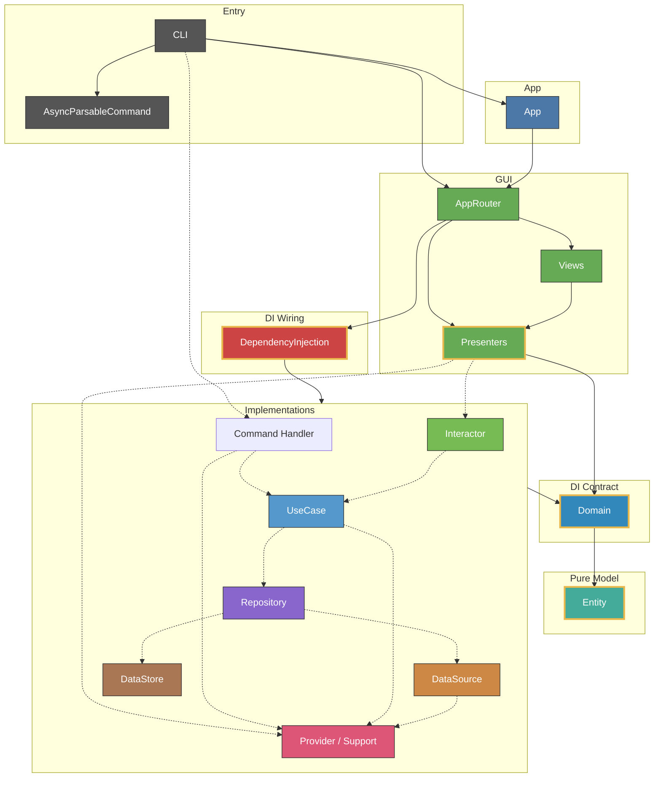
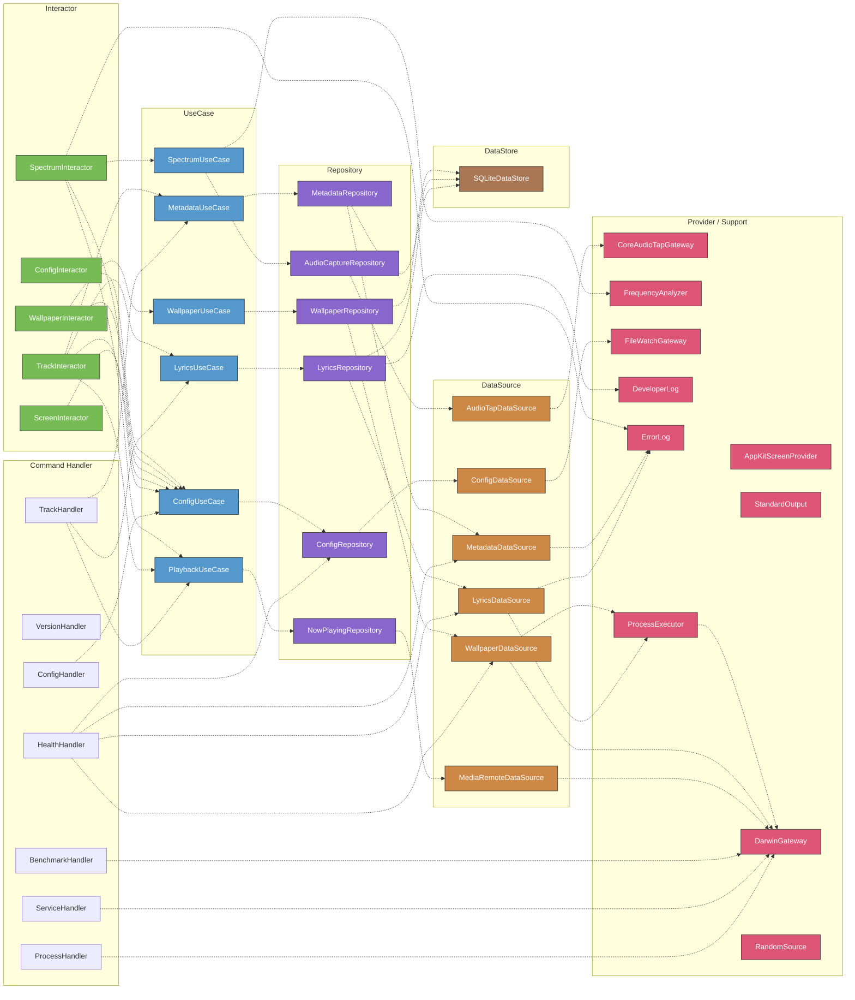
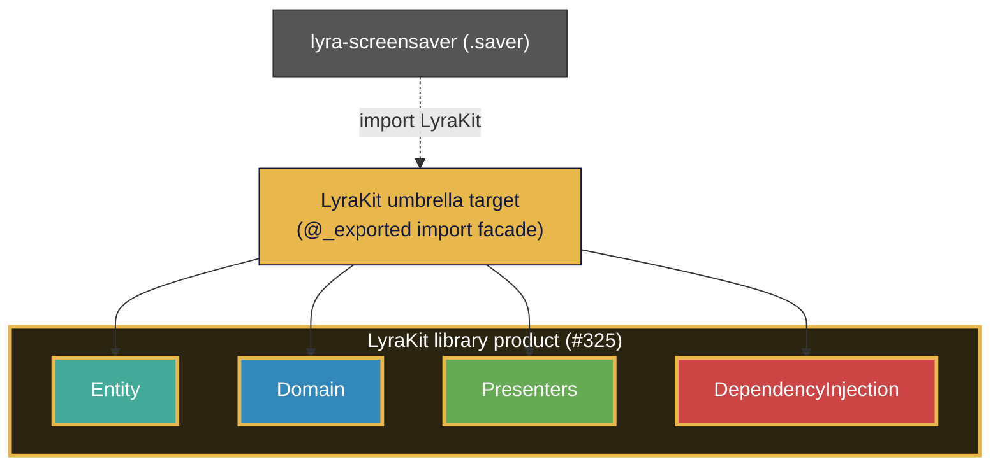

# lyra Architecture

macOS desktop overlay app showing synced lyrics and video wallpaper. VIPER + Clean Architecture with Swift Package targets enforcing layer boundaries at compile time.

> This is the canonical architecture reference for lyra. `.claude/CLAUDE.md` keeps a short summary and points here; the **enforceable** layer boundaries live in `.claude/rules/architecture-boundaries.md`.

## Module Dependency Graph

Two views: the **Layer Overview** shows how the layers relate; the
**Implementation Modules** diagram expands the `Implementations` box module by
module. Dotted edges are protocol-mediated (`@Dependency` via Domain); solid
edges are direct module dependencies.

### Layer Overview


```mermaid
graph TD
    subgraph Entry
        CLI[CLI]
        AsyncParsableCommand[AsyncParsableCommand]
    end

    subgraph AppLayer["App"]
        App[App]
    end

    subgraph GUI
        AppRouter[AppRouter]
        Views[Views]
        Presenters[Presenters]
    end

    subgraph DI Wiring
        DependencyInjection[DependencyInjection]
    end

    subgraph DI Contract
        Domain[Domain]
    end

    subgraph Pure Model
        Entity[Entity]
    end

    subgraph Implementations
        CommandHandler[Command Handler]
        Interactor[Interactor]
        UseCase[UseCase]
        Repository[Repository]
        DataSource[DataSource]
        DataStore[DataStore]
        Support[Provider / Support]
    end

    CLI --> App & AppRouter & AsyncParsableCommand
    App --> AppRouter
    AppRouter --> Views & Presenters & DependencyInjection
    DependencyInjection --> Implementations
    Views --> Presenters
    Presenters --> Domain
    Implementations --> Domain
    Domain --> Entity

    CLI -.-> CommandHandler
    Presenters -.-> Interactor & Support
    CommandHandler -.-> UseCase & Support
    Interactor -.-> UseCase
    UseCase -.-> Repository & Support
    Repository -.-> DataSource & DataStore
    DataSource -.-> Support

    style AsyncParsableCommand fill:#555,stroke:#333,color:#fff
    style CLI fill:#555,stroke:#333,color:#fff
    style App fill:#4c78a8,stroke:#333,color:#fff
    style AppRouter fill:#6a5,stroke:#333,color:#fff
    style Views fill:#6a5,stroke:#333,color:#fff
    style Presenters fill:#6a5,stroke:#E9B84C,stroke-width:3px,color:#fff
    style DependencyInjection fill:#c44,stroke:#E9B84C,stroke-width:3px,color:#fff
    style Entity fill:#4a9,stroke:#E9B84C,stroke-width:3px,color:#fff
    style Domain fill:#38b,stroke:#E9B84C,stroke-width:3px,color:#fff
    style Interactor fill:#7b5,stroke:#333,color:#fff
    style UseCase fill:#59c,stroke:#333,color:#fff
    style Repository fill:#86c,stroke:#333,color:#fff
    style DataSource fill:#c84,stroke:#333,color:#fff
    style Support fill:#d57,stroke:#333,color:#fff
    style DataStore fill:#a75,stroke:#333,color:#fff
```

> The four **gold-bordered** nodes (`Entity`, `Domain`, `Presenters`,
> `DependencyInjection`) are what the `LyraKit` library product re-exports for
> external reuse (#325). They span four layers, so see the grouped LyraKit
> diagram under Key Design Decisions for the single-rectangle view.

### Implementation Modules


```mermaid
graph LR
    subgraph CommandHandler["Command Handler"]
        ProcessHandler[ProcessHandler]
        VersionHandler[VersionHandler]
        ServiceHandler[ServiceHandler]
        HealthHandler[HealthHandler]
        TrackHandler[TrackHandler]
        ConfigHandler[ConfigHandler]
        BenchmarkHandler[BenchmarkHandler]
    end

    subgraph Interactor
        TrackInteractor[TrackInteractor]
        ScreenInteractor[ScreenInteractor]
        WallpaperInteractor[WallpaperInteractor]
        SpectrumInteractor[SpectrumInteractor]
        ConfigInteractor[ConfigInteractor]
    end

    subgraph UseCase
        ConfigUseCase[ConfigUseCase]
        PlaybackUseCase[PlaybackUseCase]
        LyricsUseCase[LyricsUseCase]
        MetadataUseCase[MetadataUseCase]
        WallpaperUseCase[WallpaperUseCase]
        SpectrumUseCase[SpectrumUseCase]
    end

    subgraph Repository
        ConfigRepository[ConfigRepository]
        LyricsRepository[LyricsRepository]
        MetadataRepository[MetadataRepository]
        NowPlayingRepository[NowPlayingRepository]
        WallpaperRepository[WallpaperRepository]
        AudioCaptureRepository[AudioCaptureRepository]
    end

    subgraph DataSource
        LyricsDataSource[LyricsDataSource]
        MetadataDataSource[MetadataDataSource]
        ConfigDataSource[ConfigDataSource]
        MediaRemoteDataSource[MediaRemoteDataSource]
        WallpaperDataSource[WallpaperDataSource]
        AudioTapDataSource[AudioTapDataSource]
    end

    subgraph Support["Provider / Support"]
        AppKitScreenProvider[AppKitScreenProvider]
        StandardOutput[StandardOutput]
        DarwinGateway[DarwinGateway]
        CoreAudioTapGateway[CoreAudioTapGateway]
        FrequencyAnalyzer[FrequencyAnalyzer]
        FileWatchGateway[FileWatchGateway]
        DeveloperLog[DeveloperLog]
        ErrorLog[ErrorLog]
        ProcessExecutor[ProcessExecutor]
        RandomSource[RandomSource]
    end

    subgraph DataStore
        SQLiteDataStore[SQLiteDataStore]
    end

    TrackHandler -.-> PlaybackUseCase & MetadataUseCase & LyricsUseCase
    ConfigHandler -.-> ConfigUseCase
    ProcessHandler -.-> DarwinGateway
    ServiceHandler -.-> DarwinGateway
    BenchmarkHandler -.-> DarwinGateway
    HealthHandler -.-> LyricsDataSource & MetadataDataSource & WallpaperDataSource & ConfigRepository
    TrackInteractor -.-> PlaybackUseCase & MetadataUseCase & LyricsUseCase & ConfigUseCase
    ScreenInteractor -.-> ConfigUseCase
    WallpaperInteractor -.-> WallpaperUseCase & ConfigUseCase
    SpectrumInteractor -.-> ConfigUseCase & PlaybackUseCase & SpectrumUseCase
    ConfigInteractor -.-> ConfigUseCase
    SpectrumUseCase -.-> AudioCaptureRepository
    SpectrumUseCase -.-> FrequencyAnalyzer
    AudioCaptureRepository -.-> AudioTapDataSource
    ConfigUseCase -.-> ConfigRepository
    ConfigRepository -.-> ConfigDataSource
    PlaybackUseCase -.-> NowPlayingRepository
    NowPlayingRepository -.-> MediaRemoteDataSource
    LyricsUseCase -.-> LyricsRepository
    LyricsRepository -.-> LyricsDataSource & SQLiteDataStore & DeveloperLog
    MetadataUseCase -.-> MetadataRepository
    MetadataRepository -.-> MetadataDataSource & SQLiteDataStore
    WallpaperUseCase -.-> WallpaperRepository
    WallpaperRepository -.-> WallpaperDataSource & SQLiteDataStore
    MediaRemoteDataSource -.-> DarwinGateway
    WallpaperDataSource -.-> DarwinGateway
    LyricsDataSource -.-> ProcessExecutor
    LyricsDataSource & MetadataDataSource & SpectrumInteractor -.-> ErrorLog
    WallpaperDataSource -.-> ProcessExecutor
    ProcessExecutor -.-> DarwinGateway
    ConfigDataSource -.-> FileWatchGateway
    AudioTapDataSource -.-> CoreAudioTapGateway

    style TrackInteractor fill:#7b5,stroke:#333,color:#fff
    style ScreenInteractor fill:#7b5,stroke:#333,color:#fff
    style WallpaperInteractor fill:#7b5,stroke:#333,color:#fff
    style SpectrumInteractor fill:#7b5,stroke:#333,color:#fff
    style ConfigInteractor fill:#7b5,stroke:#333,color:#fff
    style ConfigUseCase fill:#59c,stroke:#333,color:#fff
    style PlaybackUseCase fill:#59c,stroke:#333,color:#fff
    style LyricsUseCase fill:#59c,stroke:#333,color:#fff
    style MetadataUseCase fill:#59c,stroke:#333,color:#fff
    style WallpaperUseCase fill:#59c,stroke:#333,color:#fff
    style SpectrumUseCase fill:#59c,stroke:#333,color:#fff
    style ConfigRepository fill:#86c,stroke:#333,color:#fff
    style LyricsRepository fill:#86c,stroke:#333,color:#fff
    style MetadataRepository fill:#86c,stroke:#333,color:#fff
    style NowPlayingRepository fill:#86c,stroke:#333,color:#fff
    style WallpaperRepository fill:#86c,stroke:#333,color:#fff
    style AudioCaptureRepository fill:#86c,stroke:#333,color:#fff
    style LyricsDataSource fill:#c84,stroke:#333,color:#fff
    style MetadataDataSource fill:#c84,stroke:#333,color:#fff
    style ConfigDataSource fill:#c84,stroke:#333,color:#fff
    style MediaRemoteDataSource fill:#c84,stroke:#333,color:#fff
    style WallpaperDataSource fill:#c84,stroke:#333,color:#fff
    style AudioTapDataSource fill:#c84,stroke:#333,color:#fff
    style AppKitScreenProvider fill:#d57,stroke:#333,color:#fff
    style StandardOutput fill:#d57,stroke:#333,color:#fff
    style DarwinGateway fill:#d57,stroke:#333,color:#fff
    style CoreAudioTapGateway fill:#d57,stroke:#333,color:#fff
    style FrequencyAnalyzer fill:#d57,stroke:#333,color:#fff
    style FileWatchGateway fill:#d57,stroke:#333,color:#fff
    style DeveloperLog fill:#d57,stroke:#333,color:#fff
    style ErrorLog fill:#d57,stroke:#333,color:#fff
    style ProcessExecutor fill:#d57,stroke:#333,color:#fff
    style RandomSource fill:#d57,stroke:#333,color:#fff
    style SQLiteDataStore fill:#a75,stroke:#333,color:#fff
```

## VIPER Component Summary

| Component | Instances | Responsibility |
|---|---|---|
| **View** | `HeaderView`, `LyricsColumnView`, `LyricLineView`, `RippleView`, `SpectrumView`, `OverlayContentView`, `AppWindow`, `ConfigStatusOverlay` | Pure rendering. SwiftUI views get data from Presenters via `@ObservedObject`. `AppWindow` (NSWindow subclass) lives in Views. `ConfigStatusOverlay` renders the destabilized-geodesic error indicator for config hot-reload failures (#41) |
| **Presenter** | `HeaderPresenter`, `LyricsPresenter`, `WallpaperPresenter`, `RipplePresenter`, `SpectrumPresenter`, `AppPresenter`, `ConfigStatusPresenter` | Display logic, decode animations, Combine subscriptions. `@Published` state for Views. Each Presenter maps 1:1 to an Interactor. `ConfigStatusPresenter` exposes `ConfigInteractor.invalidConfig` as `@Published` state and owns its start/stop watch lifecycle (#41) |
| **Interactor** | `TrackInteractor`, `WallpaperInteractor`, `ScreenInteractor`, `SpectrumInteractor`, `ConfigInteractor` | Business logic. Abstractions in Domain, implementations in dedicated modules. TrackInteractor uses a Combine hot stream. `ConfigInteractor` debounces `ConfigUseCase.watchChanges` events and republishes `ConfigUseCase.reload()` outcomes; the watch itself is armed at the DataSource layer (#41) |
| **Router** | `AppRouter` | Pure wireframe: creates Presenters in correct order, builds AppWindow, manages DisplayLink. For UI-test mode, app launch reads environment once and bootstraps fixture dependencies before Presenter creation |
| **Entity** | `Entity` module | Pure data types (`TrackUpdate`, `PlaybackPosition`, `WallpaperState`, `ScreenLayout`, `AppStyle`, etc.) |

## Dependency Direction

```text
View → Presenter → Interactor → UseCase → Repository → DataSource
                 → Router (wireframe only)
```

Presenters subscribe to Interactors via Combine. Interactors access UseCases via `@Dependency`. Views never reference Interactors or UseCases directly.

## Layer Summary

| Layer | Modules | Responsibility |
|---|---|---|
| Executable / CLI | `CLI` | Entry point (`@main RootCommand: ParsableCommand`), ArgumentParser commands, LaunchAgent. Product name: `lyra` |
| Async Bridge | `AsyncRunnableCommand` | `AsyncRunnableCommand` protocol — bridges `async run()` to sync `ParsableCommand` via `DispatchSemaphore`, keeping the main thread free for `NSApplication.run()` |
| Router | `App`, `AppRouter` | `App` owns AppKit foreground lifecycle and termination-signal handling seams; `AppRouter` holds `AppRouter`, bootstrap, and launch environment wiring |
| View | `Views` | SwiftUI views + `AppWindow` (NSWindow subclass). Feature dirs: `Header/`, `Lyrics/`, `Ripple/`, `Overlay/`, `Shared/` |
| Presenter | `Presenters` | `Track/` (Header, Lyrics), `Wallpaper/` (Wallpaper, Ripple), `App/` (AppPresenter), `Config/` (`ConfigStatusPresenter`, #41). DecodeEffect engine, RippleState |
| Handler | `ProcessHandler`, `VersionHandler`, `ServiceHandler`, `HealthHandler`, `TrackHandler`, `ConfigHandler`, `BenchmarkHandler` | CLI command logic. ProcessHandler: process lifecycle. VersionHandler: version string. ServiceHandler: LaunchAgent install/uninstall. HealthHandler: connectivity checks. TrackHandler: now-playing info with metadata/lyrics resolution. ConfigHandler: config template/init/path resolution. BenchmarkHandler: CPU/memory measurement via `ProcessGateway`. Protocols in Domain, injected via `@Dependency`. All handlers return `Result<Success, Failure>` — never throw |
| Provider / Support | `AppKitScreenProvider`, `StandardOutput`, `DarwinGateway`, `CoreAudioTapGateway`, `FrequencyAnalyzer`, `FileWatchGateway`, `DeveloperLog`, `ErrorLog`, `ProcessExecutor`, `RandomSource` | Platform/provider implementations that do not fit the core Clean Architecture layers directly. `AppKitScreenProvider` adapts `NSScreen` into `ScreenProvider`; `StandardOutput` owns CLI output rendering; `DarwinGateway` owns macOS process/system calls; `CoreAudioTapGateway` owns the live CoreAudio process-tap calls (`AudioTapGateway` implementation); `FrequencyAnalyzer` owns the vDSP FFT to per-bar magnitude conversion (pure computation behind Domain's `FrequencyAnalyzing` / `FrequencyAnalyzerFactory`); `FileWatchGateway` owns the DispatchSource-based config watch — directory + file two-tier (`ConfigWatchGateway` implementation, consumed by `ConfigDataSource`, #41); `DeveloperLog` (`FileDeveloperLog`) is a general write-only config-gated diagnostic sink (StandardOutput family, not a DataStore), injected as a cross-cutting service — the lyrics-resolution trace (#331) is its first instance; `ErrorLog` (`StandardErrorLog`) is the always-on stderr error sink that replaced hand-written `fputs` at four sites (#345), owning the `lyra: <Subsystem> …` convention so it has exactly one home; `ProcessExecutor` (`ProcessExecutorImpl`) is the DataSource-tier collaborator that adds a clock-driven timeout + capture over `ProcessGateway.runProcess`, shared by the lyrics and YouTube DataSources so neither carries its own subprocess plumbing (#340); `RandomSource` (`SystemRandomSource`) provides injectable randomness consumed by Presenters (`DecodeEffect`, wallpaper shuffle) so random behavior is deterministic under test |
| Interactor | `TrackInteractor`, `ScreenInteractor`, `WallpaperInteractor`, `SpectrumInteractor`, `ConfigInteractor` | Combine-based reactive pipelines over UseCases (GUI) |
| DI Wiring | `DependencyInjection` | All liveValue registrations; also hosts two thin boundary pieces with no module of their own — `AppKitFontMetrics` (`FontMetricsProvider` live, consumed by Views' `SwiftUIResolver`) and the `healthCheckers` aggregation (the `HealthCheckable` implementations live beside their APIs in the DataSource/Repository modules) |
| Entity | `Entity` | Pure data types, zero external dependencies |
| Domain | `Domain` | Protocols, DependencyKeys (`@_exported import Entity`) |
| UseCase | `ConfigUseCase`, `PlaybackUseCase`, `LyricsUseCase`, `MetadataUseCase`, `WallpaperUseCase`, `SpectrumUseCase` | Business logic only, no cross-UseCase deps |
| Repository | `ConfigRepository`, `LyricsRepository`, `MetadataRepository`, `NowPlayingRepository`, `WallpaperRepository`, `AudioCaptureRepository` | DataSource + DataStore orchestration, cache strategy |
| DataSource | `LyricsDataSource`, `MetadataDataSource`, `ConfigDataSource`, `MediaRemoteDataSource`, `WallpaperDataSource`, `AudioTapDataSource` | API execution, file I/O, private framework access, CoreAudio process tap |
| DataStore | `SQLiteDataStore` | GRDB SQLite cache |

## Key Design Decisions

**Library products for external reuse (#325)**: `Package.swift` exposes a `LyraKit` **library product** alongside the `lyra` executable, so a sibling package — the planned `lyra-screensaver` `.saver` bundle (#325) — can depend on lyra over SPM and **reuse** the video-wallpaper pipeline (`WallpaperPresenter` / `WallpaperPlaybackController` playback, NSWindow-free) rather than re-implementing it. Because SwiftPM makes *target* names importable (not *product* names), the product exposes a single **`LyraKit` umbrella target** (`Sources/LyraKit/LyraKit.swift`, a pure `@_exported import` facade over `Entity` / `Domain` / `Presenters` / `DependencyInjection`) so a consumer writes one `import LyraKit` instead of importing each module. `DependencyInjection` is included so `@Dependency` resolves to the real `liveValue`s in the consumer without re-registering the graph; the trade-off is that the consumer links the whole implementation graph (including MediaRemote / Audio). A lighter wallpaper-only product — achievable by splitting the DI registrations per feature — is a possible follow-up if the `.saver` binary needs trimming. The umbrella target is a re-export facade (coverage-ignored), and the library surface is for lyra's own sibling repos, not a stability-guaranteed public API.

<p align="center">
  
</p>

The four modules the `LyraKit` product re-exports, grouped. In the Layer Overview
above these same four carry a **gold border** — but they live in four different
layer subgraphs, and mermaid puts a node in only one subgraph, so they cannot be
enclosed in a single `LyraKit` rectangle there without breaking the layer
grouping. This dedicated view is that rectangle:


```mermaid
graph TD
    Consumer["lyra-screensaver (.saver)"]
    LyraKit["LyraKit umbrella target<br/>(@_exported import facade)"]
    subgraph LyraKitProduct["LyraKit library product (#325)"]
        direction TB
        Entity2[Entity]
        Domain2[Domain]
        Presenters2[Presenters]
        DependencyInjection2[DependencyInjection]
    end
    Consumer -. import LyraKit .-> LyraKit
    LyraKit --> Entity2 & Domain2 & Presenters2 & DependencyInjection2

    style LyraKitProduct fill:#2a2410,stroke:#E9B84C,stroke-width:3px,color:#fff
    style LyraKit fill:#E9B84C,stroke:#141A3C,color:#141A3C
    style Consumer fill:#555,stroke:#333,color:#fff
    style Entity2 fill:#4a9,stroke:#E9B84C,stroke-width:3px,color:#fff
    style Domain2 fill:#38b,stroke:#E9B84C,stroke-width:3px,color:#fff
    style Presenters2 fill:#6a5,stroke:#E9B84C,stroke-width:3px,color:#fff
    style DependencyInjection2 fill:#c44,stroke:#E9B84C,stroke-width:3px,color:#fff
```

**MediaRemoteDataSource via swift-interpret helper**: `MediaRemote.framework` is a private framework, and `MRMediaRemoteGetNowPlayingInfo` only returns data when the **host process** carries an Apple-internal entitlement (`com.apple.private.tcc.allow` family). Apple-signed binaries — including `/usr/bin/swift` — qualify; any third-party binary (Developer ID, ad-hoc, anything notarized outside Apple) does **not**, because AMFI strips Apple-private entitlements from non-Apple-signed Mach-Os at load time. The helper Swift source (`Resources/media-remote-helper.swift`) is therefore spawned via the **absolute path** `/usr/bin/swift <src>` so that the Apple-signed `xcode_select` tool-shim is unconditionally the host process. **Never go through `/usr/bin/env swift`** — `env` respects `$PATH` and a developer with a Homebrew / swift.org / asdf swift earlier in `PATH` would silently fall into a non-Apple-signed binary, reintroducing the same regression. **Never pre-compile the helper with `swiftc`** — the resulting binary becomes the host, loses the entitlement, and `MRMediaRemoteGetNowPlayingInfo` silently returns no info on macOS 26+ (regression tracked in #261). The helper runs as a persistent subprocess and streams JSON over a pipe, using `MRMediaRemoteRegisterForNowPlayingNotifications` for event-driven updates. The 1–2 s `swift-frontend -interpret` cost on first launch is the price of admission; there is no Apple-supported alternative for third parties. **Artwork emission is scoped to track changes (#255)**: each JSON line carries an `event` tag (`"track-change"` for notification-driven + initial fetches, `"tick"` for the 3 s periodic snapshot). Base64-encoding the cover (hundreds of KB–several MB) on every tick pegged daemon CPU for no benefit, so `artwork_base64` is sent only on `track-change`; `MediaRemoteDataSourceImpl` backfills the cached cover on ticks and clears it when a `track-change` arrives cover-less. This composes with the daemon-side decode memoization (`lastArtworkBase64`/`lastArtworkData`, #270): #270 avoids re-*decoding* an unchanged payload, #255 avoids re-*transmitting* it.

**ProcessGateway OS boundary**: `ProcessGateway` centralizes OS-bound work in Domain (resource sampling, process management, lock files, launchctl, executable discovery, streaming subprocesses). `DarwinGateway` is the live macOS implementation, and `DependencyInjection` wires it into handlers and data sources so application logic no longer reaches directly into `Process`, `flock`, `getrusage`, or `which`.

**ProcessExecutor two-seam split for a testable timeout (#340)**: Running a user script with a timeout has two responsibilities that must be split so the timeout is testable. The **OS primitive** is `ProcessGateway.runProcess(executable:arguments:environment:)` (live in `DarwinGateway`): it spawns the child, drains stdout/stderr *without* blocking a thread-pool thread (`readabilityHandler`, not `readDataToEndOfFile` — the old blocking drain parked two pool threads per call for the child's whole lifetime and was the pool-exhaustion cause), and on task **cancellation** terminates the child (SIGTERM → SIGKILL after a 500 ms grace, targeting the direct pid) and resumes *immediately* with `CancellationError` — it does **not** wait for the pipes to EOF, so a SIGTERM-ignoring script whose orphaned grandchild holds the pipe open cannot stall the return. The **timeout race** lives one layer up in `ProcessExecutor` (`ProcessExecutorImpl`, its own covered module): it races `@Dependency(\.continuousClock).sleep(timeoutMs)` against `gateway.runProcess(...)` and, on timeout, cancels the run task (which kills the child) and returns `(-1, "", "timed out …")`; `timeoutMs == nil` disables the race for long-lived tools (yt-dlp/ffmpeg). This split is what makes the oracle deterministic: the pre-#340 tests could only assert a timeout by spawning a real subprocess and measuring wall-clock, so the pass/fail hinged on CI scheduling and flaked. Now `ProcessExecutorImplTests` drives the race with a fake hung gateway + `ImmediateClock`/`TestClock` (zero real time), and `DarwinGatewayRunProcessTests` keeps only thin real-subprocess smokes with **no** timing oracle. Both `CustomScriptLyricsDataSourceImpl` and `YouTubeWallpaperDataSourceImpl` now delegate their live `processRunner` to `@Dependency(\.processExecutor)` (captured at init so a construction-time override sticks), removing two duplicated `executeProcess` statics — including the residual `waitUntilExit()` on the YouTube side that #308 had removed from the lyrics side. `ProcessExecutor` is a DataSource-tier collaborator over the gateway, not an upper layer reaching down, so the adjacent-layer rule (`architecture-boundaries.md`) holds: DataSource → ProcessExecutor → ProcessGateway.

**AudioTapGateway CoreAudio boundary (#313)**: `AudioTapGateway` (Domain) wraps the imperative CoreAudio calls of the process-tap capture chain (tap → aggregate device → IOProc), and `CoreAudioTapGateway` is the live 1:1 pass-through implementation — fully symmetric to `ProcessGateway`/`DarwinGateway`. The protocol signature is deliberately CoreAudio-shaped (`CATapDescription`, `AudioStreamBasicDescription`, `AudioDeviceIOBlock`): type-erasing those would force per-callback conversion — allocation on the RT-safe IOProc path. Domain's `import CoreAudio` follows the same contract-layer exception as the Interactor protocols' Combine import. A GitHub survey (2026-07) found no maintained SPM library wrapping the macOS 14.4+ process-tap API (`SimplyCoreAudio` is stale and pre-dates it; `AudioCap` is sample code), so absorbing CoreAudio behind a third-party wrapper was rejected; if one matures later, this Gateway protocol is the single swap point. Rule of thumb for future gateways: protocol in Domain (platform-typed signatures allowed when the boundary's shape is the contract), live implementation in its own Support module, `liveValue` in `DependencyInjection/GatewayRegistration.swift`. The same shape covers non-gateway Support modules too: `FrequencyAnalyzer` is consumed through Domain's `FrequencyAnalyzing` protocol, built via the injected `FrequencyAnalyzerFactory` (a factory because the analyzer is rebuilt at runtime — bar count follows the overlay width, sample rate follows the tap — and the UseCase memoizes across rebuilds).

**Analyzer memoization is UseCase-private state, not a DataStore (#313)**: `SpectrumUseCaseImpl` keeps the built analyzer in a private var keyed on `(bars, sampleRate)`. Modeling this as an in-memory DataStore was considered and rejected: the DataStore layer caches *domain data* — Entity values a Repository can read back (`MetadataDataStore.read(title:artist:)`) — whereas this memo reuses a *computational resource* (vDSP FFT setup) that is single-slot, instance-scoped, and main-thread-confined (the documented reason the class is `@unchecked Sendable`). Moving it behind a shared injected store would weaken the thread-confinement story and add indirection with no testability gain (rebuild-on-change is already covered by tests). Boundary for future work: if spectrum *results* (per-track bar data, resolved values) ever need caching across consumers, that IS domain data — put it in a DataStore behind the Repository, per the MetadataRepository precedent.

**AppKit lifecycle boundary**: The `App` module owns foreground `NSApplication` setup, accessory activation, `AppDelegate` retention, and termination signal registration. `DaemonCommand` stays CLI glue after lock acquisition and calls the App lifecycle runner instead of touching AppKit directly. `AppDelegate` receives router and termination-handler collaborators so launch bootstrap and signal-triggered shutdown can be unit-tested without `NSApplication.run()` or live signal registration.

**VIPER data flow**: `TrackInteractor` exposes a shared Combine publisher (`AnyPublisher<TrackUpdate, Never>`) built as a declarative pipeline: NowPlaying stream → `removeDuplicates` → `switchToLatest(resolve)` → `share()`. `HeaderPresenter` and `LyricsPresenter` each subscribe independently via `.sink`. No manual dispatch or procedural send calls.

**Presenter / View separation**: Presenters (`ObservableObject`) own all display state via `@Published` properties. Views observe Presenters via `@ObservedObject` and are purely declarative — no business logic, no `@Dependency` references to Interactors or UseCases. Style information (fonts, colors, sizes) flows from Interactor → Presenter → View.

**FetchState\<T\>**: Generic enum (`.idle`, `.loading`, `.revealing(T)`, `.success(T)`, `.failure`) drives both data flow and UI animation. The `.revealing` → `.success` transition is timed by Presenters using `DecodeEffectState`. Use `FetchState<T>` only when the payload `T` is genuinely consumed downstream (e.g. `LyricsPresenter.lyricsState`, whose content feeds `columns(in:)` and `updateActiveLineTick()`). When a Presenter only needs the animation lifecycle and the View already renders the text from a separate `display…` property, expose the payload-less `RevealPhase` (`.idle` / `.revealing` / `.revealed`) instead and keep the decode target in a private field — `HeaderPresenter` does this for `titlePhase` / `artistPhase` so the public surface never duplicates `displayTitle` / `displayArtist` (#275).

**Spectrum analyzer (#23)**: Real-time bars driven by the now-playing app's audio via a CoreAudio **process tap** (macOS 14.4+ APIs: `kAudioHardwarePropertyProcessObjectList` filtered to the now-playing pid's **process subtree** → `CATapDescription(stereoMixdownOfProcesses:)` → `AudioHardwareCreateProcessTap` → private aggregate device + `AudioDeviceCreateIOProcIDWithBlock`; requires the *System Audio Recording* TCC permission declared as `NSAudioCaptureUsageDescription` in the embedded Info.plist). The subtree matching (ppid walk via `proc_pidinfo`) is load-bearing: Chromium-based browsers emit audio from a helper subprocess, so a tap scoped to the main pid alone captures silence — empirically hit with Arc, whose "Browser Helper" child owns the audio stream. The pipeline is: `PlaybackUseCase.observeNowPlaying()` (backed by the **multicast** `NowPlayingRepository.stream()`, so no Interactor→Interactor dependency and no second helper stream) → `SpectrumInteractorImpl` consumes the stream in a single `for await` processor task — inherent serialization, so pause/play bursts cannot interleave tap create/destroy — deduping `AudioSourceState(pid:isPlaying:)` transitions itself (the helper's 3 s ticks must not rebuild the tap) → `SpectrumUseCase` (business logic: capture lifecycle + PCM→per-bar conversion via the pure `FrequencyAnalyzer`) → `AudioCaptureRepository` (thin orchestration over the tap DataSource) → `AudioTapDataSourceImpl` owns `ProcessTapEngine` (`@available(macOS 14.4, *)`, availability-erased as `AnyObject` for the 14.0 target) and a lock-free SPSC `SampleRingBuffer` (swift-atomics `ManagedAtomic` monotonic write index; the IOProc callback is RT-safe — no allocation, locks, or Swift concurrency). `FrequencyAnalyzer` (pure computation, injected as Domain's `FrequencyAnalyzing` via `FrequencyAnalyzerFactory`) converts the newest PCM window: Hann window → vDSP FFT → `linear` (amplitude, cava's look) or `db` scale → per-bar max grouping over log-spaced bands. **Output is un-gained** — the analyzer preserves amplitude ratios and the gain lives in the Presenter (see #297 below). `SpectrumView` follows the #252/#258 zero-idle-cost pattern (conditional inclusion + `TimelineView(.animation(paused:))`); `binHeights()` is read-only so the Canvas draw closure never mutates `@Published` state. Tap lifecycle: playing+pid → create; paused/pid-lost/session-gone → destroy (a dead tap costs zero CPU). Known limitation (by decision): the tap captures the whole process tree — for browsers that means every tab, documented in README. TCC caveat for dev runs: a daemon spawned from a terminal inherits the terminal as TCC responsible process, so the permission prompt never appears and the tap reads silence — launch via launchd (LaunchAgent) so lyra itself is the responsible process.

**Spectrum cava-faithful smoothing + configurability (#297)**: `SpectrumPresenter.tick()` runs on the DisplayLink and applies a faithful port of cavacore.c (MIT): per-bar sensitivity scaling → gravity release → **non-normalized leaky integrator** (sustained energy compounds toward `1/(1-noise_reduction)` ≈ 4× at 0.77, so beats tower over one-frame transients — the reason cava's kick band reads prominent) → clamp at full height, with the gain auto-tuned from overshoot (cava's **autosens**, moved here from the UseCase). Three knob families are curated-default-but-configurable, following the philosophy of showing the good part without forcing setup: (1) **bar count is derived from the overlay size cava-style** (fixed `bar_width` + `bar_spacing`, count fills the track) — the View reports the track length via `SpectrumPresenter.updateBarTrackLength` (overlay width for vertical placements, height for horizontal), `targetBarCount` derives the count, and `SpectrumUseCase.magnitudes(style:barCount:)` rebuilds the `FrequencyAnalyzer` when the count changes; (2) **band cutoffs** `min_freq`/`max_freq` (default 40 Hz–14 kHz) — `FrequencyAnalyzer` maps Hz→FFT bin (at the tap's actual sample rate, propagated from the capture path — #299) and log-divides that range; (3) **gradient direction** `frequency`/`amplitude`/`level` and **placement** `bottom`/`top`/`left`/`right`/`underlay` — `left`/`right` rotate the bars into horizontal columns growing inward, `spectrumBarRects` computing an edge-anchored growth axis vs. an edge-parallel track axis so one geometry covers all four edges (`SpectrumGradientDirection`, `SpectrumPlacement` in Entity). The growth-axis size is `height_ratio` (fraction of the axis) plus an optional absolute clamp `min_height`/`max_height` in points (CSS `min-height`/`max-height` semantics, min wins on conflict) — the pure testable `spectrumBarStripDepth` free function resolves it, so a ratio-based length stays sane across very different displays (e.g. capping a horizontal placement on an ultrawide).

**Spectrum sample-rate propagation (#299)**: the process-tap mixdown follows the current output device, so its rate is 44.1 kHz, 48 kHz, or whatever the hardware runs at — not a fixed 48 kHz. `ProcessTapEngine` reads the tap's real rate from `kAudioTapPropertyFormat` at construction and exposes it; `AudioTapDataSourceImpl.latestSamples` tags each `StereoSamples` window with it (an Entity field, default 48000 for the no-capture placeholder that the analyzer never runs on); `SpectrumUseCaseImpl` reads `window.sampleRate` and keys the memoized `FrequencyAnalyzer` on `(bars, sampleRate)`; because `ProcessTapEngine.sampleRate` is a `let` set once at tap construction, the rate is fixed for the tap's lifetime — a tap recreation (play/pause, source change) picks up a new device rate and triggers a rebuild, but a live device switch without tap recreation does not. This keeps a physical frequency on the same visual bar and the `min_freq`/`max_freq` cutoffs accurate regardless of the hardware rate. (#299 also tracks a second, decoupled item — refresh-rate-independent smoothing — which changes the tuned look and needs real-device re-tuning, so it ships separately.)

**Spectrum bar opacity + corner radius (#300)**: Two opt-in `[spectrum]` keys layered onto the same Config→Style→View pipeline, both backward-compatible at their defaults. `bar_opacity` (0–1, default 1) is applied as `GraphicsContext.opacity` on the bar layer *after* the `background_color` fill, so it multiplies with each color's own alpha and stays independent of the backdrop — pairing an opaque `bar_color` with this knob separates colour from transparency. `bar_corner_radius` (default nil = derive) overrides the cava-style default, which was extracted from the hard-coded `min(bar_width / 4, 3)` into the pure `autoCornerRadius(thickness:)` free function; `spectrumBarRects` gained an optional `cornerRadius:` parameter capped per-bar at half the thickness (0 for square corners). Both values clamp in `ConfigRepository` (opacity 0…1, radius floored at 0).

**Spectrum refresh-rate-independent smoothing (#299)**: cava's smoothing constants are tuned at a 66 fps reference (`framerate_mod = 66 / fps`); the port hardcoded `66 / 60`, so on a 120 Hz ProMotion / variable-refresh display the `CADisplayLink`-driven `tick()` fired twice as often and the bars fell at double speed. `DisplayLinkDriver` now passes the display's real seconds-per-frame (`CADisplayLink.targetTimestamp - timestamp`) through the `onFrame` fan-out to `SpectrumPresenter.tick(frameInterval:)`, and the pure `spectrumFramerateConstants(frameInterval:)` free function derives `framerateMod` / `integralExponent` / `gravityScale` from the clamped (24…240 fps) rate per frame — so the fall speed, integral decay, and autosens settle at the same wall-clock rate on any refresh rate. `tick()` defaults `frameInterval` to 1/60, keeping the default-rate fall speed and gravity/fall behavior unchanged and timing-agnostic callers/tests unaffected (the integral decay's exact value was refined in #306, below). The base "feel" constants (`fallIncrement`, the 66 reference, autosens step sizes) are unchanged and stay tunable on real 120 Hz hardware, since making the physics correct shifts the look that was previously compensated at 120 Hz. (Paired with #299's sample-rate propagation, which ships in a separate PR.)

**Spectrum 120 Hz integral-decay retune (#306)**: real-hardware verification of #299 found the leaky-integral term still drained faster in wall-clock time at 120 Hz than at 60 Hz, despite the framerate-independence framework. Root cause: the integral's per-frame decay used `reduction / integralMod` where `integralMod = framerateMod^0.1` — an empirically-tuned cava approximation, not a wall-clock-exact derivation. Replaced with `reduction ^ integralExponent` where `integralExponent = 60 / fps`, which is exactly invariant (`(reduction^(60/fps))^fps == reduction^60` for any fps) and reduces to exponent `1` at 60 fps — the exact pre-#299 hardcoded-60fps decay, with no divisor at all. The gravity/fall term (`gravityScale`) was left unchanged; it was already the well-compensated half of the pair. Empirically confirmed post-fix: heights sampled at the same wall-clock instant now agree to ~1e-6 across 60/120/240 Hz (`SpectrumPresenterTests.decayIsWallClockInvariantAcrossFramerates`). Note the 60 Hz decay value itself shifted slightly (`reduction / 1.1^0.1 ≈ 0.7627` → exactly `reduction = 0.77`, ~1% difference) — an intentional correction, not a regression; visually indistinguishable. **PR review follow-up**: a decay-only fix leaves the integral's *input* term unscaled — a sustained (non-falling) `value` still gets added once per frame with no frame-rate compensation, so at higher fps more additions land per wall-clock second and the sustained steady state (`value / (1 - reduction)`, cava's documented ≈4× at 0.77) overshoots further the higher the refresh rate (120 Hz reached ≈8× instead of ≈4× — worse than the pre-#306 approximation's ≈30% overshoot). `tick()` now precomputes `integralInputScale = (1 - integralDecay) / (1 - reduction)` once per frame (also fixing a Copilot-flagged per-bar `pow` call) and `stepped()` applies it as `mem*integralDecay + value*integralInputScale`, which is the scaling that makes the sustained steady state itself, not just the post-release decay, wall-clock invariant — verified in `SpectrumPresenterTests.sustainedInputIsWallClockInvariantAcrossFramerates`.

**Spectrum capture retry on tap-creation failure (#312)**: `SpectrumInteractorImpl`'s single for-await loop dedupes the now-playing helper's periodic identical ticks via `previous` (a live tap must not be needlessly rebuilt). The bug: `previous` was settled *before* `spectrum.startCapture(pid:)`'s result was known, so a transient tap-creation failure right after an app switch — the new pid not yet in `kAudioHardwarePropertyProcessObjectList` (empty process list → `ProcessTapEngine.init?` returns nil), or HAL resource contention because the old tap's synchronous `stop()` teardown wasn't fully drained by coreaudiod — became **permanent**: every subsequent identical tick was swallowed by `guard source != previous`, so the spectrum stayed dead until a daemon restart. Fix: `previous` is still set to the attempted source, but after a failed start a bounded retry budget (`failedAttempts`, counted per source) deliberately lets the next identical tick back through the `source != previous` dedup and re-attempts — **up to `maxCaptureAttempts` (3) consecutive attempts per source**, then it gives up until the source changes, so a *permanent* denial (pre-14.4 OS, TCC) can't hit CoreAudio / log every tick forever. Retry rides the helper's tick cadence rather than an in-loop backoff sleep on purpose: it keeps the single-consumer serialization intact (a sleep would delay a genuinely-new event) and lets a real source change preempt the retry (a new `AudioSourceState` resets the counter). Each failure is reported through the injected `ErrorLog` (`lyra: Spectrum startCapture(pid: N) failed (attempt k/3); …` — the subsystem name lost its lowercase spelling and its extra colon when the vocabulary was unified in #345) — the interactor/tap chain was previously fully silent. Verified by `SpectrumInteractorImplTests.failedCaptureRetriesOnNextTick` and `.failedCaptureGivesUpAfterBoundedRetries`.

**AI processing indicator (#57)**: While the AI (LLM) extractor resolves title/artist on a cache miss, the header scrambles in a configurable color so the user sees that work is happening. `TrackInteractorImpl.resolveTrack` emits an extra `TrackUpdate(aiResolving: true)` after the debounce only when an `[ai]` endpoint is configured **and** `MetadataUseCase.isAIMetadataCached(track:)` returns `false` (an LLM cache hit means no API round-trip, so no indicator). `HeaderPresenter` maps `aiResolving` to `DecodeEffectState.startLoading` (the indefinite scramble, distinct from `decode`'s settle) and swaps `titleColor` / `artistColor` to `DecodeEffect.processingColor` (default green `#4ADE80FF`, config key `text.decode_effect.processing_color`, solid or gradient). The resolved (non-`aiResolving`) update settles the scramble and restores the normal color. `HeaderView` reads the effective `titleColor` / `artistColor` (`@Published`) rather than the static `titleStyle.color`.

**Confidence-based metadata+lyrics resolution (#308)**: `MetadataRepositoryImpl.resolve()` no longer short-circuits when the LLM cache/DataSource succeeds — LLM, MusicBrainz, and Regex are always all queried (cache-or-datasource per source) and merged (`llmCandidates + mbCandidates + regexCandidates + [track]`), so a bad LLM guess can no longer permanently starve the other sources from ever being tried. `LyricsRepositoryImpl.fetchLyrics(candidates:)` tries three tiers across *all* candidates before giving up — Tier A (`LyricsDataSource.get()`, LRCLIB's own exact match, trusted as-is — **superseded by #326**, which validates Tier A too), Tier B (`LyricsDataSource.search()` fuzzy match, now gated by the new `LyricsMatchValidator` — title similarity via normalized Levenshtein distance, plus duration tolerance when both sides have it), and Tier C (`customScriptLyricsDataSource`, a second `LyricsDataSource` DI key backed by `CustomScriptLyricsDataSourceImpl`, which shells out to a user-configured `[lyrics] fallback_command` argv array with a timeout, expanding `$LYRA_CONFIG_DIR`/`$LYRA_CACHE_DIR` placeholders (both `$VAR` and `${VAR}` forms; literal substitution, not shell interpolation) in every argv element *before* the absolute-executable guard so configs stay machine-portable, mirroring `YouTubeWallpaperDataSourceImpl`'s test-injectable `processRunner` pattern). Whichever tier validates first stores the result under *the matched candidate's* title/artist (fixing a latent bug where the cache was always keyed by `candidates.first` regardless of which candidate actually matched); `LyricsResult.trackName`/`artistName`/`withDisplay()` already carried enough shape to make the confirmed candidate's identity part of the cached lyrics entry itself, so no separate cross-repository "joint commit" coordinator was needed. When no tier validates, nothing is cached and `TrackInteractorImpl.resolveTrack(from:)` falls back to the raw (unprocessed) title/artist rather than an unvalidated candidate guess — a targeted 2-line fix, not a new orchestration layer. The same unvalidated-candidate-guess bug was independently found in `TrackHandlerImpl.infoWithLyrics` (the CLI `lyra track -l` path), which fell back to `candidates.first`'s title/artist on a lyrics miss instead of the raw `track.title`/`track.artist`; fixed identically. The cache **read** side of `LyricsRepositoryImpl.fetchLyrics(candidates:)` had the mirror bug — it checked only `candidates.first`'s cache key, so an entry written under a later-matched candidate (per the write-side fix above) was unreachable on a subsequent read; the read path now loops over every candidate's cache key before falling through to Tier A/B/C. **Review round 2 (cache coherence)**: (a) the MusicBrainz cache stores **all** candidate recordings per query, not just the first — `MetadataDataStore<[MusicBrainzMetadata]>`, with the v5 migration rebuilding `musicbrainz_cache` without its UNIQUE(query_title, query_artist) constraint (one row per candidate; write = delete-then-insert) — because a cache hit that truncated the candidate set made lyrics cached under a later candidate unreachable on replays; (b) candidate dedup keys on a `Hashable` (title, artist, duration) struct — duration participates because LRCLIB exact match and `LyricsMatchValidator` discriminate on it, and the struct removes the `\u{1}`-sentinel collision; (c) the lyrics cache **re-validates entries on read** so pre-#308 poisoned rows can't short-circuit the tiers (invalid entries are skipped and later overwritten by a validated match); (d) `displayAdjusted` fills title and artist independently (a Tier C script may omit `artist_name` — the matched candidate's artist is used, not the raw fallback); (e) `timeout_ms` clamps to a finite 1 ms…1 h window before `Int` conversion (`Int(Double)` traps on NaN/±inf/overflow); (f) `[ai]`/`[lyrics]` decode leniently at runtime but `ConfigDataSourceImpl.tryDecode()` (the healthcheck path) probes both sections strictly, so a malformed section fails validation instead of silently disabling the feature. **Live-device verification fix**: Tier C results were never cached — `GRDBLyricsDataStore.write` guarded on `result.id != nil`, and script results carry no LRCLIB id, so every replay of a script-resolved track silently re-paid the full cascade (all LRCLIB lookups + the script run). Id-less lyric-bearing results are now stored under a stable FNV-1a-derived **negative** synthetic id (genuine LRCLIB ids are positive, so the namespaces can never collide; the stable hash makes rewrites converge on one row), while id-less results with no lyrics content remain unstored.

**Error reporting behind an injected contract (#345)**: lyra had two output paths modelled as Domain protocols with DI — `StandardOutput` (CLI results) and `DeveloperLog` (config-gated decision traces, #331) — while error reporting was a third, un-DI'd path: `fputs(…, stderr)` written by hand at four sites across four modules (`LyricsDataSourceImpl`, `MusicBrainzMetadataDataSourceImpl`, `LLMMetadataDataSourceImpl`, `SpectrumInteractorImpl`). The convention was real but held only by string agreement — every site restated the `lyra:` prefix, the subsystem name, and the trailing newline, so nothing failed to build or test when one drifted, and one already had (the spectrum site wrote a lowercase `spectrum:` carrying an extra colon the other three did not). The cost that mattered was not cosmetic: #318's rule that LRCLIB's 404 is a *regular* "no lyrics for this track" answer and must not be reported — the rule keeping "no lyrics" distinguishable from "fetch is broken" — was guarded by a bare `fputs` no test could observe, so a regression would have surfaced only as a daemon log filling with 404s. `ErrorLog` (Domain protocol; live `StandardErrorLog` in its own covered module; silent `testValue`) is the same StandardOutput-family shape as `DeveloperLog` — write-only, an output sink, deliberately *not* a DataStore — and receives the **message only**: `record(.lrclib, "get failed: \(error)")`. Prefix, subsystem rendering, and newline moved into the sink, so the convention has exactly one home; consuming it from a DataSource *and* from `SpectrumInteractorImpl` is the same cross-cutting edge `DeveloperLog` already establishes, not a layering violation. The subsystem is `ErrorSubsystem` (Entity), a closed raw-value enum rather than a string, which turns "the four sites agree" from a convention into a compile-time fact and gives the naming rule something to be tested against (`CaseIterable` plus a shape assertion over `allCases`). The 404 guard deliberately **stays at the call site** rather than moving into the sink: that a 404 means "no lyrics" is LRCLIB's own contract, not something a general error log could know — what changed is that it now guards a *dependency*, so `LyricsErrorReportingTests` pins both directions (404 silent; 400/429/500/502 and response-less transport errors reported, each under its own operation name). Deliberately **not** done: no logger library — #331's rejection of `swift-log` (a facade + backend split is overkill for one sink) and of `os.Logger` (does not reach stdout, fighting the "read the file, paste it into an issue" loop) stands — and no levels, timestamps, aggregation, rotation, or remote shipping, since all four sites report one severity and none has a second consumer. The single intentional behavior change is that spectrum line: unifying the subsystem vocabulary was an acceptance criterion, and it cannot be met while also preserving every byte of existing output.

**Deterministic scheduling in AppRouter tests (#347)**: Two `AppRouterTests` cases intermittently failed on CI with `attachedPlayers.count == 0` after a three-second poll, on a commit whose only delta was one markdown line, and passed on a plain re-run. The tests already injected `ImmediateClock`, and the path they wait on — `WallpaperPresenter.loadWallpapers`' `Task { @MainActor }`, the fixture `AsyncStream`, `WallpaperPlaybackController.play` (all-synchronous AVFoundation calls when the item has no start offset), then `$player … .receive(on: DispatchQueue.main)` into `AppWindow.attachPlayerLayer` — contains no clock at all. It is a chain of main-queue hops, so what the test waits on is *scheduling order*, which `ImmediateClock` cannot fast-forward. The old `waitUntil` helper polled that order against a `ContinuousClock` deadline, and that is the bug, not merely a short timeout: when CI stalls the main queue past the deadline, the poll's expired `Task.sleep` continuation is enqueued *ahead* of the `.receive(on:)` block the presenter emits later, so the assertion runs first and reads a count of zero that becomes one a moment later. Raising the deadline only raises the stakes of the same bet (`PresentersTests` had already moved theirs from 2 s to 5 s for the same reason). The fix waits on the value itself: `settle(_:until:)` (`Tests/TestSupport/Settle.swift`; moved into the shared `TestSupport` target in #349 so every test target can import it) suspends on a `@Published` publisher — the presenters' published state, and `SpyWindow`'s recorded attaches, layouts, and detaches, now `@Published` — until it emits a value that satisfies the condition. The continuation resumes when the write happens, so the wait assumes nothing about time or about executor ordering (a serial executor is not required to be FIFO, and `Task.yield()` only offers other tasks a turn), and a value published before the call satisfies it at once. A value that never arrives is a hang rather than a flake, so the three suites carry `.timeLimit(.minutes(1))`. Making `settle` a no-op reproduces the CI failure deterministically (`attachedPlayers.count → 0`, `appliedWallpaperScales → [1.0]`), which is the evidence that the order, not the clock, was the thing being waited on. A first cut instead stepped the main queue with a bounded `Task.yield()` loop (`drain(until:)`); it passed the same evidence but rested on the main dispatch queue being FIFO — true on Darwin, promised by no specification — and review rightly asked for an explicit completion signal, which the publisher is. The issue proposed the stronger tool — `ConcurrencyExtras.withMainSerialExecutor`, redirecting the thread pool onto the main actor so that nonisolated tasks land on the main queue too — and it was built (as a `TestScoping` trait with reference-counted scopes, since Swift Testing interleaves `@MainActor` tests at every `await` and a plain save/restore would switch the executor off under a sibling mid-test) and then **rejected on evidence**: the hook is process-wide, so while any traited test ran, every thread-pool task in the process was funneled onto the main thread, and the full parallel `swift test` failed 12 tests across six unrelated targets (`ConfigInteractorImpl`, `NowPlayingRepository`, `TrackInteractor` ×2, `ViewRendering`, the config hot-reload E2E, and `DarwinGateway.runProcess` with a 160 s stall) that pass without it. PointFree's tool assumes XCTest's serialized `invokeTest`, not a process running hundreds of suites concurrently. `settle` needs a publisher to await; a condition that is only readable — a plain property written from the thread pool or a subprocess — still polls to a deadline. Production code is untouched — the presenter's `Task` + `AsyncStream` + Combine shape is sound; the determinism was reclaimed on the test side. Scope: `AppRouterTests` only (its private `waitUntil` is gone); the published-state polls in the other targets were migrated by #349 (next entry), and `PresentersTests/TestSupport/WaitUntil.swift` remains for the waits that have no publisher.

**Published-state waits migrated to `settle` in the presenter and view tests (#349, step 1)**: #347 fixed two tests; the inventory behind #349 classified every wait site in the test tree (264) by *what* it waits on, because the right tool follows from that alone: a deadline poll on state the subject publishes is the #347 bet re-run at every site, while a poll on state that is only readable is the only tool there is. The 150 sites in `PresentersTests` / `ViewsTests` that wait on a `@Published` property are this step: 137 of them are migrated here, as 147 `settle` calls — a compound condition becomes one call per value, and two `ConfigStatusPresenterTests` sites the inventory had not classified came along — and the remaining 13 are reclassified below. Most were a one-line rewrite — `await waitUntil { presenter.wallpaperURL == url }` → `await settle(presenter.$wallpaperURL) { $0 == url }` — and the per-file helpers that wrapped the poll (`waitForReveal`, `waitForLyricsSuccess`, `waitForItemsLoaded`, the private `waitUntil` copies) are gone with it; test-local spies (`Counter`, `Recorder`) gained `@Published` recordings so a spy's observation is awaited the same way as a presenter's state, and every suite that calls `settle` carries `.timeLimit(.minutes(1))`. One production change was made for it: `WallpaperPresenter.items` is now `@Published private(set)`. Twelve tests wait for the resolved-item list to reach a count, and the list had no published neighbour to stand in — the *first* item also sets `wallpaperURL`, but every later item updates nothing observable — so publishing the list is the honest signal; the property was already `private(set)`, no view reads it, and the cost is one `objectWillChange` per append. Thirteen inventoried sites were deliberately left as they are: the spectrum tests (`SpectrumPresenterTests`, `SpectrumViewRenderingTests`) drive the presenter by calling `tick()` in a loop bounded by a tick *count* (`tickUntil`, `tickUntilBars` — file-private helpers then, the shared `TestSupport.tickUntil` since step 3–4), which is a deterministic step function rather than a deadline poll — the bar levels are a function of how many ticks the presenter has received, and a wait whose progress the test itself must drive is not the `settle` shape; they belong to the issue's tick-driven class, not its published class. Evidence: with `settle` made a no-op, 64 of the 346 tests in the migrated targets fail with 132 recorded expectations spread over every migrated file, and `LyricsPresenterColumnsTests` crashes the process indexing a column list that never populated (`Index out of range`) — the wait is load-bearing everywhere it was introduced, not decorative; the sites that still pass are those whose value was already published before the call, which `settle` satisfies at once by design, and 20 consecutive runs of the three targets under an 8-way CPU load pass — one of them taking 21 s where an unloaded run takes 3, the kind of stall that used to expire a three-second deadline. The remaining `waitUntil` calls in these targets are negative waits (a value must *not* change within a window), external waits (`AVPlayer.rate`, subprocesses) and the spy sites that step 2 covers — `PresentersTests/TestSupport/WaitUntil.swift` stays for them.

**Spy-side waits migrated to `Collector` (#349, step 2)**: Step 1 covered state the subject publishes; the second class in the #349 inventory — 54 sites across eight targets — waits on state a *test spy* records from off the main actor: a Combine sink on the interactor's worker, a nonisolated `Task`, a gateway callback. `settle(_:until:)` cannot serve them (it is `@MainActor` and needs a publisher, and a `@Published` write from the thread pool is not something Combine promises to deliver in order), and the shape they all shared — an `NSLock`-guarded array plus a `waitForCount(_:timeout:)` that polled it every 10 ms to a two- or three-second deadline (`ArtworkCollector`, `PositionCollector`, `TrackUpdateCollector`, the `Observed` boxes in the config tests, `Harness.pollUntil` in the spectrum tests) — is the #347 bet again. It was also the first thing to fall when a slow runner ran #350's CI: ten of these expired in one run that took 10.9 s against a 5.3 s baseline, none of them in files that PR touched. The repository already had the right tool: `TrackInteractorRaceTests.UpdateCollector` resumed a `CheckedContinuation` when a matching element arrived. `Tests/TestSupport/Collector.swift` keeps that shape — `Collector<Element>` with `append(_:)`, `values` / `count` / `last` / `contains(where:)`, and three waits: `settle(until:)` over the recorded array, `waitForCount(_:)`, and `waitFor(predicate:)` — but not its hand-rolled engine. The recording is a `CurrentValueSubject<[Element], Never>` behind a lock (appends are serialised so the value only grows), and every wait is a `for await` over its `values`: the same primitive as `settle(_:until:)`, with no continuation bookkeeping of our own. The write is what resumes the wait, nothing is assumed about time or executor ordering, and a condition that already holds returns at once because the subject replays its current value. The engine matters for one more reason, caught in review on #351: Swift Testing's `withTimeLimit` cancels the test task when the limit expires and then *waits for it*, so a wait that ignores cancellation — the first cut's stored `CheckedContinuation`s did — turns a reported failure into a hung `swift test`; `AsyncPublisher` honours cancellation, so a wait whose value never arrives ends when `.timeLimit` cancels the test, and `waitFor(predicate:)` returns `nil` in that one case. There is deliberately no deadline parameter — every suite that waits this way carries `.timeLimit(.minutes(1))` — and `Tests/TestSupportTests` pins the contract (immediate return, resume on append, concurrent appends, cancellation) for both primitives. All 54 sites moved; the five private collectors (the race test's original included), the two `Observed` boxes, `CurrentValueBox`, `ReceivedBox`, `pollUntil` and the per-file `waitUntil` copies are gone, and `Collector<Void>` covers the counters (config pings, screen-change notifications). The spectrum fake now records starts and stops into collectors instead of a lock-guarded tuple, which also let one test stop asserting `capturing == false` straight after waiting for a stop count — the #350 shape — and wait for the capture flag itself. Evidence: with `Collector.settle(until:)` and `settle(_:until:)` made no-ops, 29 of the 205 tests in the migrated targets fail with 38 recorded expectations across ten files and nothing crashes (the first cut's force-unwrapping `waitFor` took two suites down with it) — the wait is load-bearing, not decorative; the sites that still pass are those whose value is recorded synchronously before the wait (`NotificationCenter` posts, sleep/wake events), which the collector satisfies at once by design. A probe that waits on an empty collector under `.timeLimit(.minutes(1))` never returned with the continuation engine (killed after 150 s, its `swiftpm-testing-helper` outliving the parent) and reports `Time limit was exceeded` at 60 s with the Combine engine, the run ending at 64 s. 20 consecutive runs of the migrated targets plus `TestSupportTests` under an 8-way CPU load pass; the full suite passes. The negative waits and the external ones (subprocess, `DispatchSource`, tick-driven loops) are steps 3–4, below.

**External, tick-driven and negative waits migrated (#349, steps 3–4)**: The last three classes in the #349 inventory — 43 *external* sites, 13 *tick-driven*, 13 *negative* — are the ones a publisher cannot serve, and each needed its own answer rather than a fourth `settle`. `Tests/TestSupport` gained two bounded waits, both returning a `Bool` the caller asserts. `pollUntil(timeout:interval:_:)` is for state that is only *readable*: a file a subprocess writes, `kill(pid, 0)`, a child the OS has yet to reap — nothing in-process is written when it changes, so a poll is the only tool there is, and the timeout is a guardrail on the failing path, never a delay on the passing one. `tickUntil(_:tick:until:)` is for state the *test* drives — the spectrum and lyrics presenters whose display link the test stands in for — and its bound is a tick budget, not a wall clock, because the writer of the awaited value is the test itself and awaiting a publisher without ticking would hang; `tickUntil(n, …) == false` is also how "nothing happens after n ticks" is proved, replacing the 100–200 ms negative windows. Both end on cancellation (`.timeLimit` cancels the test task; a wait that swallowed the `CancellationError` would spin to its own bound), and `TestSupportTests` pins both contracts. Classifying by *what is waited on* also corrected the inventory in one place: the `DispatchSource` and FSEvents sites (`ConfigWatchTests`, `FileWatchGatewayTests`) had been counted as external because the OS is the cause, but the signal is the gateway's callback — a spy the test owns — so their `Counter` / `FiredBox` became `Collector<Void>` and every wait is `waitForCount(1)` / `settle { $0.count > n }` — the rename test's included, where review caught a poll whose result was discarded: an atomic save posts up to three unlabelled callbacks (the temp file's creation and the rename on the directory watch, the rename on the old inode's watch), so the in-place edit on the new inode is proved by four awaited appends, a count the rename's churn alone cannot reach. The subprocess tests (`DarwinGatewayProcessTests`, `DarwinGatewayRunProcessTests`, `ProcessLockTests`) are the external class proper: the synchronous helpers (`waitUntilRunning`, `waitForLockFile`, `waitForFile`) and their `usleep` loops collapsed into `try #require(await pollUntil(timeout: .seconds(30)) { … })` at thirteen sites, and the spin that waited to observe its own cancellation (`while !Task.isCancelled { await Task.yield() }`) became a 30 s `Task.sleep` that cancellation ends. Making those tests `async` exposed a join that had only been safe while they were synchronous: `Process.waitUntilExit()` runs the *calling* thread's run loop while Foundation delivers the exit to the run loop of the thread that launched the process, so a test that resumes on another cooperative thread after `await pollUntil` parks in the join for good — the first full-suite run sat 13 minutes in `reacquireAfterCleanup` with the child already reaped and no time-limit report, since the cancellation `.timeLimit` issues has nothing to reach inside a run loop, while the six-target filtered run had passed because its continuation happened to land on the launching thread. `DarwinGatewayTests/LaunchedProcess.swift` is the step's own rule applied once more: the termination handler is a callback the test owns, so it is set before `run()`, recorded into a `Collector<Void>` and awaited (`waitForExit()`); `terminate()` only signals, and no `waitUntilExit()` follows an `await` anywhere in the tree. The tick class replaced the two file-private helpers (`tickUntil`, `tickUntilBars`) with the shared one at 26 sites, and the frames-to-clear measurement now counts ticks under a budget instead of ticks under a deadline. The negative class had no value to wait on, so each site now waits for the *mechanism* that guarantees the absence: `stop()` releases the subscription — a `handleEvents(receiveCancel:)` spy on the publisher the presenter subscribes to, recorded into a `Collector<Void>` and awaited after `stop()`, after which a `send` reaches nobody and the plain `#expect` is sound (`AppPresenterTests`, `ConfigStatusPresenterTests`, `HeaderPresenterTests`, `LyricsPresenterTests`); a duplicate update does not re-trigger — a *sentinel* update that must take effect is sent through the same pipeline, its effect is settled on by a value only the sentinel can produce — a distinct title, or a distinct artwork *size*: a duplicate re-decode also yields a fresh `NSImage` identity, so `!== cached` would settle on the very publish under test (review round 2) — and the transitions recorded in between are asserted to contain no re-trigger, in-order delivery on one pipeline being what makes the sentinel a proof (`HeaderPresenterDuplicateTests`, `LyricsPresenterDuplicateTests`); a single-item wallpaper loops rather than advances — the loop branch changes no presenter state, so the three `WallpaperPresenterTests` sites record the player's `rate` KVO and wait for `loopCurrent()`'s `play()` to re-fire it (or, for `.willSleep`, for the rate to reach 0) before asserting `wallpaperURL` unchanged; a regression that advanced instead would leave the old player's rate untouched and fail at the time limit, not pass vacuously. `PresentersTests/TestSupport/WaitUntil.swift` is deleted; no deadline poll on in-process state remains in the tree. The `Task.yield()` calls that do remain are the `TestClock` idiom (letting a task reach `clock.sleep` before `advance`) and the one in `ConfigInteractorImplTests` documented in step 2, and the remaining `Task.sleep`s are subjects under test (a parked 30 s request there to be cancelled, a fake's simulated latency). Evidence: with `pollUntil` and `tickUntil` made no-ops (`pollUntil` reports `true` without polling, `tickUntil` ticks once and reports `true`), 23 of the 556 tests in the migrated targets fail with 31 recorded expectations across seven files — the spectrum and lyrics tick sites, the `ProcessLockTests` and `DarwinGatewayRunProcessTests` polls, and the contract tests — and nothing crashes; with all four waits (`settle`, `Collector.settle`, `pollUntil`, `tickUntil`) made no-ops, 87 of 551 fail with 155 expectations across sixteen files (`LyricsPresenterColumnsTests` skipped, since it crashes under a no-op `settle` exactly as step 1 recorded). The sites that still pass are those whose condition already holds before the wait (`isRunning` straight after `run()`, a value published before the call), which the primitives satisfy at once by design. 20 consecutive runs of the six migrated targets under an 8-way CPU load pass, the slowest taking 5.4 s where an unloaded run takes 2.2 s. The full suite passes — 1449 tests in 313 suites — where the first full run hung.

**Fixed-delay test doubles replaced (#353)**: The three sites #349 §5 left in place were not waits but *test doubles modelling time*, and each got a time-free equivalent. `LyricsCandidateWaveTests`' never-answering probe slept 30 s so as to be cancelled; it now parks on `TestSupport.suspendUntilCancelled()` — a cancellation-aware `Task.sleep` behind a guardrail the passing path never reaches (default 60 s, the suite limit), returning whether the cancel came — so the double says what it means and records the cancel only when it really arrived. A cancel-only park (`withTaskCancellationHandler` around a `CheckedContinuation`) was the first version and was dropped in review: a suite's `.timeLimit` cancels the test task, but that cancel reaches only structured children, so a subject that regressed into parking its probes on unstructured `Task { }`s would have hung the run instead of failing it; the guardrail makes the failing path independent of cancellation propagation. `MediaRemoteDataSourceImplTests`' streaming gateway delayed its first line 50 ms so that a second `poll()` would arrive while the first still held the iterator — a bet on the scheduler that proved nothing when it lost; the stream is now `AsyncStream(unfolding:)`, whose closure runs inside the consumer's `next()`, so the gateway records each request into a `Collector<Int>` and holds line 0 on a `Collector<Void>` gate, and the test starts the second poll only after observing the first inside `next()`; the second poll runs on a test-owned `TaskExecutor` that records every enqueue, and since a task that never suspends is enqueued exactly once, waiting for its second enqueue observes the `Task.yield()` the subject spins on while the iterator is held — the overlap is a fact before the gate opens (review round 1), after which the test asserts one request per line, in order, and — from the gateway's in-flight `next()` count — that no two were ever in flight together. `AsyncRunnableCommandTests`' sleeping command slept 10 ms so the sync→async bridge would have to let a resumption through; it now suspends on a continuation resumed from a GCD queue — a real off-pool resumption with no timer. That suite carries no `.timeLimit` on purpose: a regression in the bridge blocks the calling thread in `semaphore.wait()`, which no in-process time limit can end, so the CI test job's `timeout-minutes: 30` is the bound that turns such a hang into a failure. Evidence: the four suites run in about 10 ms where the delays alone cost 60 ms, 20/20 under 8× CPU load, and `TestSupportTests` pins the new primitive (returns `true` on the cancel; returns at once when already cancelled; returns `false` on the guardrail instead of hanging). With this, every one of the 264 sites inventoried in #349 is event-based.

**Lyrics-resolution debug trace (#331)**: An opt-in observability facility for diagnosing intermittent lyrics misses (#326) from real data instead of guessing. `DeveloperLog` (Domain protocol; live `FileDeveloperLog` in its own module, disabled `testValue`) is a **general** write-only, config-gated developer sink — the `StandardOutput` family (an output sink, deliberately *not* a `DataStore`: nothing reads it back as domain data, so it has no `read`/`write` of Entity values and the DataStore layer's "cache of domain data a Repository reads back" rule does not apply). It is injected wherever a trace is produced, exactly as other cross-cutting services (`StandardOutput`, clocks, `RandomSource`, gateways) are — so `LyricsRepositoryImpl` emitting to it from the Repository layer is a normal cross-cutting edge, not a layering violation. The protocol is general but **each purpose gets its own DI instance** rather than one shared multi-channel log (mirroring `customScriptLyricsDataSource: any LyricsDataSource` — a general contract, a purpose-named instance): today the single `lyricsResolutionLog` key wires the trace to the `[developer] lyrics_resolution` toggle and `lyrics-debug.log`; a future trace (e.g. wallpaper resolution) adds its own key reusing `FileDeveloperLog` with its own toggle + filename, deferring any channel/routing infrastructure until a second consumer actually exists. `LyricsRepositoryImpl.fetchLyrics(candidates:)` feeds the sink a human-readable block per resolution: the generated candidates, and for the cache-read loop plus every tier the accept/reject with its *reason* — `LyricsMatchValidator` gained `titleSimilarity`/`durationDelta` accessors so the trace states the Levenshtein score and duration delta behind each decision (the exact discriminators between "wrong name", "duration mismatch", and "cache poisoning" as failure modes). Instrumentation is **behavior-neutral** — the tiers now return an internal `TierAttempt` (result + trace lines) but the returned result is unchanged, and `let tracing = resolutionLog.isEnabled` gates all trace-string building so a disabled log costs nothing on the resolution path. The enabled state + file path are read once at the DI wiring site (keeping `FileDeveloperLog` purpose-agnostic and unit-testable) and passed to the sink, mirroring `CustomScriptLyricsDataSourceImpl` so toggling needs a daemon restart; the sink writes its **own** append-only file (`${XDG_CACHE_HOME:-~/.cache}/lyra/lyrics-debug.log` by default) rather than relying on launchd stdout redirection — the self-installed LaunchAgent plist carries no `StandardOutPath`, and the brew service's redirection is formula-owned, so an app-owned file is the only path identical across brew / self-install / foreground `lyra daemon`. `[developer]` (`DeveloperConfig`) is a home for opt-in diagnostic toggles — deliberately not a general `[log]` subsystem, since none was built. No logger library was added: the existing stderr error-reporting convention (#318 — hand-written `fputs` at the time, an injected `ErrorLog` since #345) plus a single-purpose file sink is lighter than a `swift-log` facade for a one-off debug trace.

**Wave-probed candidates + confidence-graduated duration tolerance (#326)**: The #308 design ("try every candidate against every source") was correct in intent but paid for it twice, and the #331 trace log (531 real resolutions) measured both costs. **Latency**: each tier walked its candidates one `await` at a time, so a track with N candidates cost N × the 10 s timeout *per tier* — N was measured at mean 5.1 / p90 8 / **max 17**, i.e. up to ~170 s in Tier A alone, which is the "lyrics appear halfway through the song" symptom. `LyricsRepositoryImpl.attempt(over:probe:)` now probes candidates in **waves — concurrent within a wave, sequential across waves** — returning the highest-priority hit of the first wave that yields one. Because candidates arrive in confidence order (LLM > MusicBrainz > Regex > raw) and every candidate in wave *i* outranks every candidate in wave *i+1*, the *selected* result is identical to the serial loop's; only the round-trip count drops, from N to ceil(N / 4). A flat "probe all N at once" was rejected on two grounds: it destroys the priority ordering, and it bursts up to 17 simultaneous requests at free community APIs (and up to 17 concurrent spawns of the user's Tier C script). The wave size of 4 is the deliberate middle: with mean N = 5.1 most tracks finish in one or two waves, the 17-candidate worst case lands at 5 waves, and concurrency never exceeds 4. The trade the wave makes explicit is **over-fetch** — a hit on candidate 0 still probes candidates 1–3 — which is why the size stays small. Completions are consumed **incrementally rather than collected**: a `withTaskGroup` only returns once every child finishes, so collecting the wave would have made a fast hit wait behind siblings sitting on their 10 s timeout — handing back as latency exactly the early return the serial loop got for free. A hit is final once the *contiguous* run of reported offsets contains it (nothing still in flight outranks it), at which point the group is cancelled; until then the wave keeps waiting, so a lower-priority probe answering first can never reorder the candidates. `LyricsCandidateWaveTests` pins all of it (priority preserved within a wave, next wave never reached after a hit, stragglers actually cancelled, a fast lower-priority hit not outranking a pending higher-priority probe). The same call also collapsed the three near-identical "loop, probe, cache the first hit" bodies in Tier A/B/C into one implementation; a tier now supplies only how to probe a single candidate. Trace lines are re-sorted into candidate order, so the #331 log reads the same regardless of which request returned first. **False negatives**: `LyricsMatchValidator`'s flat ±5 s duration gate was the single largest reject cause — ~30 logged rejections had `titleSim = 1.00` and failed on duration alone, because the same song legitimately ships at different lengths (TV size, album vs single cut, fade differences). Duration is now a discriminator **graduated by title confidence**: on an exact title (normalized equality, or the whole-token prefix that matches a `… - Remastered 2009` catalog title) **whose artist also agrees**, the tolerance becomes `max(20 s, catalogDuration × 30 %)`, while a merely-fuzzy title keeps the strict ±5 s, since there duration is the only evidence left. The artist condition is what keeps the widening honest: titles do not identify a song, and duration was separating same-title/different-artist pairs implicitly, so relaxing it without an artist check would start accepting them (Adele's and Lionel Richie's `Hello` differ by 48 s — inside 30 % of the catalog length). An artist missing on either side is *absent* evidence rather than agreement, so it keeps the strict gate. The ratio is taken against **LRCLIB's** duration, never the played track's: a media source that misreports a length (one logged track read as 1975 s) would otherwise buy itself a proportionally huge tolerance and validate anything. Non-positive durations are now treated as *unknown* rather than a zero-second track — the media source reports 0 on a read failure, and comparing that as a real length rejected every catalog entry for that play. Against the logged data this recovers the whole 5–60 s band (白日 12 s, 残響散歌 46 s, Brave Shine 33 s, Numb 8/15/23 s, …) while still rejecting the live/medley/mis-detected cases (Endless Rain 463 s, Sky High 1748 s, My Dearest 241 s). Finally, **Tier A now validates before caching**, symmetric with Tier B/C: LRCLIB's `/api/get` does its own loose matching, and an unvalidated write was poisoned on arrival — the read-side re-validation (#308) discarded it on every later play, forcing a live re-fetch that a transient network failure turned into "no lyrics". Validated writes are stable on replay. `MetadataRepositoryImpl.resolve()`'s three sources also now run under `async let` instead of sequentially. MusicBrainz's two queries were deliberately **left serial**: the second is a fallback that only runs when the first returns nothing, and MusicBrainz asks for at most one request per second, so parallelizing them would double the request rate to buy a saving that the common path never sees.

**Screened + normalized candidates and a two-index Tier B search (#343)**: With #326's latency and false-negative fixes in, the #331 trace log (532 resolutions, 1239 Tier B probes) showed Tier B succeeding on 2.6% of probes — but the validator was rejecting only 4.0%. **81.5% of probes came back with zero responses**, so the failure was upstream of validation: lyra was asking the wrong questions. Two causes, both measured rather than guessed. **What is asked**: LRCLIB exposes a structured `track_name=` index and a free-text `q=` one, and they disagree in *both* directions, so `LyricsDataSource` now carries both and Tier B probes them in order, *validating* each index's answer before deciding whether to consult the next. Neither alone was defensible — over a 40-candidate sample of response-bearing probes, `track_name=` alone came back empty for 10 (25%) that `q=` still found, while `q=`'s concatenated form answers a title like `白日` with `King Gnu - 白日`, whose title the validator then fails on similarity. The artist is **never** sent to either index: as a server-side filter it is a hard cut on a field that is routinely a channel name or a cover credit, and across a 45-candidate sample `track_name=`+`artist_name=` returned **nothing at all** (0/45). Local artist agreement is still required — #342's gate on the relaxed duration tolerance is untouched — and review (#344) made it the arbiter between the two indexes as well: an artist-agreeing structured hit ends the search immediately, while anything less consults the free-text index and prefers *its* answer when that one agrees. Gating the fallback on the structured array merely being **non-empty**, as the first cut did, meant a full page of rows that all failed validation — or that matched the title while naming a different performer — ended the search, which is precisely the disagreement the second index exists to resolve. Agreement stays a *preference* rather than a requirement, because the played artist is routinely a channel name or a cover credit. **What is asked about**: the new `SongTitleReader` reads a *media* title well enough to decide both whether a lyrics catalog could hold it and what to ask for; the two are one job because the same vocabulary answers both — a title carrying `叩いてみた` is positive evidence of a song (so the not-a-song screen must not fire) *and* needs that marker removed before searching. It screens on evidence hard to misread (a broadcast clock/date stamp, a runtime longer than any song) and is deliberately conservative: a false positive drops a real song, so plainly-titled gear reviews are not caught by design. Review (#344) narrowed it further by deleting the instructional-marker vocabulary (`解説`, `how to`, `tutorial`, …) entirely — matched as bare substrings those words occur inside real song titles too (`How to Save a Life`), and the trade is lopsided: a false positive loses a song with nothing to recover it, while a false negative only spends one search that was returning nothing anyway. Screened candidates are kept out of the LRCLIB tiers but **still offered to Tier C**, whose user script may index what LRCLIB does not. Normalization is **bracket-pair-aware**, which measurement forced: treating each bracket as loose punctuation damaged 81 of 237 rewrites (34%) — deleting `歌ってみた` from inside `【…】` stranded a hollow `【 】` mid-title, and shaving a leading `「` left its `」` behind on titles carrying no cover marker at all — so hollow pairs collapse, a bracket whose partner is absent anywhere is shaved off either edge (the upstream candidate splitter cuts one title into `「悪魔の子` and `ヒグチアイ」 covered by …`, stranding one of each), a pair wrapping the *whole* title is unwrapped while one wrapping only part of it is structure and stays — decided by tracking nesting depth rather than by the first and last characters matching, since those two can belong to *different* groups and dropping them corrupts `(Song) (Live)` into `Song) (Live` (#344), and the reductions run to a fixed point because collapsing a hollow pair is what exposes the edge the trim then takes. Re-measured over the 980 distinct zero-response candidates after the review narrowing: 86 (8.8%) screened out, 231 (23.6%) retitled, zero rewrites left damaged. That is **reach, not recall** — a rewritten title still has to find a match. Screening and normalization happen **once, up front**, not per tier: the normalized title is the search key, the validation subject, and the cache identity at once, and deriving it separately per tier would let the three drift — a title rewritten only for the query gets re-validated against its raw form and thrown away, which is exactly #326's cache-poisoning shape. **Synced lyrics are now demoted rather than trusted blindly**: #326's relaxed tolerance lets a cover legitimately validate while running well off the original's length, and the original's synced copy would then scroll out of step with what is playing, so `accepted()` — the single path all three tiers **and the cache hit** hand results back through — strips `syncedLyrics` when the duration gap exceeds the strict ±5 s (the cache was returning its rows raw until #344's review; rows written before the rule existed would otherwise have served their drifting timings forever), and `preferred(among:)` picks a trustworthy-timing result over an earlier untrustworthy one. An *unread* duration is absent evidence, not a gap, and does not demote. Finally, **no site-specific scraping was added** (the uta-net route explored in #317 was closed deliberately): lyra ships no fetching or parsing code for any lyrics site, and Tier C's `[lyrics] fallback_command` is the supported lane for a user who wants one — scrapers break when the site changes, and that breakage belongs in the user's script, not in lyra's release cycle.

**Entity types**: `AppStyle`, `TextLayout`, `TextAppearance`, `ArtworkStyle`, `RippleStyle`, `WallpaperStyle`, `WallpaperItem`, `WallpaperPlaybackMode`, `DecodeEffect`, `AIEndpoint`, `ColorStyle`, `HealthCheckResult`, `ConfigValidationResult`, `ConfigReloadOutcome`, `ConfigReloadFailure`, `MusicBrainzMetadata`, `MediaRemotePollResult`, `LocalWallpaper`, `RemoteWallpaper`, `YouTubeWallpaper`, `TrackUpdate`, `TrackLyricsState`, `WallpaperState`, `ResolvedWallpaperItem`, `ScreenLayout`, `WallpaperConfig`, `WallpaperItemConfig`, `NowPlayingInfo`, `LyricLine`, `LyricsContent`, `RevealPhase`, `SpectrumConfig`, `SpectrumStyle`, `SpectrumPlacement`, `SpectrumGradientDirection`, `AudioSourceState`, `DeveloperConfig`. Config flows through Interactors, not via global `AppStyleKey`.

**No AppStyleKey**: `@Dependency(\.appStyle)` was removed. All config access goes through the owning Interactor's computed properties (e.g., `trackInteractor.textLayout`, `wallpaperInteractor.rippleConfig`). This enforces the VIPER dependency rule.

**WallpaperDataSource\<LocationType\>**: Generic protocol defining `resolve(_ location: LocationType) async throws -> String`. Three implementations with distinct location types:

- `LocalWallpaperDataSourceImpl: WallpaperDataSource<LocalWallpaper>` — relative/absolute path resolution via Files library
- `RemoteWallpaperDataSourceImpl: WallpaperDataSource<RemoteWallpaper>` — HTTP(S) download with SHA256-keyed cache
- `YouTubeWallpaperDataSourceImpl: WallpaperDataSource<YouTubeWallpaper>` — yt-dlp/uvx download, highest-quality video-only stream with HEVC transcode fallback (see Key Design Decisions), SHA256-keyed cache

**WallpaperRepository URL classification**: Repository classifies wallpaper config string and dispatches to the appropriate DataSource. Priority: local path (no scheme) → YouTube URL (host contains youtube.com/youtu.be) → remote HTTP(S) URL. All paths converge to a local file path string.

**Wallpaper cache**: `~/.cache/lyra/wallpapers/SHA256(url).{ext}`. Cache is permanent (wallpapers are reused). `WallpaperCache` helper shared by Remote and YouTube DataSources.

**YouTube highest-quality download + codec compatibility (#292)**: YouTube only serves H.264/AVC up to 1080p; 1440p/4K exist solely as VP9 or AV1. The old `player_client=android` selector is now crippled by YouTube SABR streaming — it skips every video-only format and leaves only the combined 360p (the "sometimes terrible quality" bug). The fix uses `player_client=default` (the web client), which publishes the full https DASH ladder at every resolution with no PO Token required. But raising the ceiling exposes a playback wall: **AVFoundation cannot decode AV1 on pre-M3 Apple Silicon or Intel Macs (`VTIsHardwareDecodeSupported(AV1)=false`), and never decodes VP9/WebM at all** — empirically confirmed on M1 Max. So `YouTubeWallpaperDataSourceImpl` gates the codec-agnostic `bestvideo[height<=maxHeight]` selector on a *transcode capability* check (`ffmpeg` **and** `ffprobe` both present): with the toolchain it grabs the best 4K stream and, after download, `ffprobe` detects the codec — AVC/HEVC are stream-copied (`-c copy`, cheap), while AV1/VP9 are hardware-transcoded to HEVC (`-c:v hevc_videotoolbox -tag:v hvc1`, ~4x realtime, one-time per wallpaper before the SHA256 cache fills). Without the toolchain it falls back to the AVC-only selector (natively playable, 1080p ceiling). `processRunner` returns `(status, stdout, stderr)` because codec detection needs `ffprobe`'s stdout.

**Wallpaper async resolution**: `WallpaperPresenter.start()` consumes `WallpaperInteractor.resolvedWallpapers()` — an `AsyncStream<ResolvedWallpaperItem>` — in a background Task, starting playback the moment the first item arrives. `WallpaperPresenter` also manages AVPlayer lifecycle (create, seek, loop, pause/play) and owns sleep/wake monitoring via `observeSleepWake()`.

**Multi-wallpaper playback**: `WallpaperStyle` is a list of `WallpaperItem` with a `WallpaperPlaybackMode` (`.cycle` or `.shuffle`). Config accepts a bare string, a legacy `[wallpaper]` table, or an array-of-tables `[[wallpaper.items]]` with optional `mode`; each item can specify optional trim (`start`/`end`) and per-item `scale`. `WallpaperInteractorImpl` resolves every item in parallel via a `TaskGroup`. In cycle mode it buffers completions and yields in configured order (skipping items that fail), so playback order is deterministic even when downloads finish out of order. In shuffle mode it yields items as they complete, so playback starts with whichever item resolves first. `WallpaperPresenter` advances to the next item on `AVPlayerItemDidPlayToEndTime` (or when the end-trim boundary is reached) when `items.count > 1`; `nextIndex(from:)` dispatches on mode — cycle uses `(current + 1) % count`, shuffle picks via `RandomSource.next(below:)` from indices excluding the current item.

**RandomSource**: Protocol in Domain (`Sources/Domain/Misc/RandomSource.swift`) exposing `next(below count: Int) -> Int`. `SystemRandomSource` is the live implementation. `WallpaperPresenter` injects it via `@Dependency(\.randomSource)` so shuffle order is deterministic in tests (via a `FakeRandomSource` returning a fixed sequence).

**Domain organization**: Domain module root is organized by layer subdirectories (`Interactor/`, `UseCase/`, `Repository/`, `DataSource/`, `DataStore/`, `Handler/`, `Misc/`) matching the architecture. Each file contains a protocol + `TestDependencyKey` + `DependencyValues` extension.

**Config layer**: Pure data — no AppKit imports. `Entity/Config/` contains `AppConfig`, `TextConfig`, `TextAppearanceConfig`, `ArtworkConfig`, `RippleConfig`, `DecodeEffectConfig`, `AIConfig`, `WallpaperConfig`, `DeveloperConfig`. Font metrics resolution lives in `Views/Lyrics/ColumnLayout.swift` (the only place lineHeight is needed).

**Text style resolution**: `UnresolvedTextAppearance` (all-optional, private to `TextConfig.swift`) → variadic `resolve(defaults:filled:)` chain → `TextAppearanceConfig` (all non-optional). Layer defaults (title: bold/18pt, artist: medium, highlight: gold gradient) are applied via `Optional<UnresolvedTextAppearance>.resolve()`, ensuring defaults apply even when the TOML section is absent.

**FlexibleDouble**: `Codable` wrapper that decodes both TOML Int and Double via `singleValueContainer`. Used for all numeric config fields.

**MetadataDataSource\<Value\>**: Generic protocol defining `resolve(track:) -> [Value]`. Three implementations with distinct value types:

- `LLMMetadataDataSourceImpl: MetadataDataSource<Track>` — AI-based title/artist extraction
- `MusicBrainzMetadataDataSourceImpl: MetadataDataSource<MusicBrainzMetadata>` — MusicBrainz API lookup
- `RegexMetadataDataSourceImpl: MetadataDataSource<Track>` — regex-based title parsing and candidate generation

Each is injected individually into `MetadataRepository` (not as an array). Repository manages cache strategy and type conversion (`MusicBrainzMetadata → Track`).

**MetadataDataStore\<Value\>**: Generic cache protocol with `read(title:artist:) -> Value?` and `write(title:artist:value:)`. Two parameterizations:

- `MetadataDataStore<Track>` — LLM result cache (`GRDBLLMMetadataDataStore`)
- `MetadataDataStore<MusicBrainzMetadata>` — MusicBrainz result cache (`GRDBMetadataDataStore`)

Cache is Repository's responsibility, not DataSource's. DataSources are pure API/computation with no cache access.

**MetadataRepository cache strategy**: Priority order: LLM cache → LLM DataSource → MusicBrainz cache → MusicBrainz DataSource → Regex DataSource. LLM/MusicBrainz results are cached on success. Regex results are not cached.

**Network session strategy — ephemeral session per call (#318)**: The API DataSources (LRCLIB lyrics, MusicBrainz, OpenAI-compatible LLM) must NOT hold a process-lifetime `URLSession`. In a long-running daemon, pooled connections go silently stale after sleep/wake or network changes, and with every request error swallowed by `try?` the only visible symptom was "lyrics never appear until `lyra restart`" (#318). The shared mechanism is the generic `ScopedAPISession<API>` (its own `Sources/ScopedAPISession` module, Foundation-only): `withAPI { … }` builds a `URLSessionConfiguration.ephemeral` session (request timeout is a per-service init arg — 10 s for LRCLIB/MusicBrainz, 60 s for the LLM, which matches the old `URLSession.shared` default since local LLMs can take tens of seconds per completion), runs the call, and `finishTasksAndInvalidate()`s the session in a `defer`. The session is deliberately **function-local**, not stored behind a class that invalidates in `deinit`: a stored-session/`deinit` design is ARC-fragile — once the caller copies the wrapped client out, the owner (and its session) can be released *before* the request is issued, killing an in-flight or not-yet-started call. Each DataSource holds a `ScopedAPISession<any XxxAPI>` and keeps its `init(api:)` test seam (which wraps a constant `{ _ in stub }` factory — the throwaway session the stub ignores). Per-API differences (base URL, Bearer auth) live in the `makeAPI` closure, so one generic type replaces the three former per-protocol wrapper classes. `LRCLibHealthCheck` already used this exact ephemeral+timeout construction; the daemon path now matches it. Failures are logged to stderr (`lyra: LRCLIB get failed: …`), except LRCLIB 404 which is the regular "no lyrics for this track" answer — so "no lyrics" and "fetch broken" stay distinguishable in the daemon log. That guard moved behind an injected `ErrorLog` in #345, which is what finally put the rule under test rather than under a comment. Test gotcha: a per-call ephemeral session ignores `URLProtocol.registerClass` (that hook only applies to `URLSession.shared`), so production-wiring tests assert graceful degradation against a refused local port (`http://127.0.0.1:1`) instead of a global URL-protocol mock.

**ColorStyle**: Domain-level enum (`.solid(hex)`, `.gradient([hex])`) enabling any text style to use either solid colors or gradients. Polymorphic TOML decoding supports both `color = "#FFF"` and `color = ["#AAA", "#BBB"]`.

**DI with swift-dependencies**: Protocol definitions + `TestDependencyKey` in `Domain`, all Domain-facing `liveValue` registrations centralized in `DependencyInjection` module (`InteractorRegistration`, `UseCaseRegistration`, `RepositoryRegistration`, `DataSourceRegistration`, `DataStoreRegistration`, `HealthCheckRegistration`). No direct instantiation — everything through `@Dependency`. AppKit foreground lifecycle is an App-module bootstrap dependency because the live implementation owns `NSApplication` and `AppDelegate` setup. UI-test mode is the other wiring-location exception: `AppRouter` may override a small fixture graph at launch based on environment variables, but feature code still reads dependencies normally through `@Dependency`.

**UI Test Bootstrap**: `XCUIApplication` launches the app as a separate process, so UI tests cannot directly override in-memory `DependencyValues` the way unit tests do with `withDependencies`. Any UI-test fixture graph must therefore be selected during app startup (for example via launch arguments/environment in `AppDelegate`/`AppRouter`). Treat this as bootstrap responsibility, not Presenter responsibility: avoid sprinkling `isUITest` checks through feature code.

**Config commands**: `lyra config template` (stdout), `lyra config init` (file creation), `lyra config edit` ($EDITOR), `lyra config open` (GUI). Template generation flows through UseCase→Repository→DataSource. `ConfigDataSource.template(format:)` encodes `AppConfig.defaults` via `TOMLEncoder`/`JSONEncoder`. `ConfigFormat` enum in Entity. `ConfigWriteError` for init failure handling.

**Track command**: `lyra track` outputs currently playing track info as JSON. Flags: `--resolve` (`-r`) resolves metadata via MusicBrainz/regex, `--lyrics` (`-l`) fetches lyrics from LRCLIB. The two flags are independent and combinable (`-rl`). Default (no flags) returns raw MediaRemote data. Uses `PlaybackUseCase.fetchNowPlaying()` (one-shot) + `MetadataUseCase` + `LyricsUseCase` via `@Dependency`. Output type is `NowPlayingInfo` (Codable).

**NowPlayingRepository dual API**: `fetch()` for one-shot retrieval (used by CLI `track` command), `stream()` for continuous observation (used by GUI via `TrackInteractor` and `SpectrumInteractor`). `PlaybackUseCase` mirrors both: `fetchNowPlaying()` and `observeNowPlaying()`. **`stream()` is multicast (#23)**: the MediaRemote helper pipe supports only one poll loop, so the repository runs a single lazily-started pump, broadcasts every event to all subscriber continuations, and replays the last value to late subscribers. Any layer may therefore call `observeNowPlaying()` freely — never work around the single-consumer pipe by wiring one Interactor to another.

**AsyncRunnableCommand vs AsyncParsableCommand**: `@main AsyncParsableCommand` starts Swift's cooperative thread pool and takes ownership of the main thread. `NSApplication.run()` must own the main thread exclusively for SwiftUI rendering. The two are fundamentally incompatible — when both compete, the overlay window is blank. `AsyncRunnableCommand` protocol solves this by keeping `RootCommand` as sync `ParsableCommand` (main thread free for NSApplication) while bridging async subcommands (`TrackCommand`, `HealthcheckCommand`) via `DispatchSemaphore` on a cooperative thread pool thread. `DaemonCommand` stays sync and enters `MainActor.assumeIsolated` to call the App foreground runner, which owns `NSApplication.run()` on the main thread.

**ConfigDataSourceImpl configHome override**: `ConfigDataSourceImpl(configHome:)` accepts an optional config directory path, defaulting to `nil` (reads `XDG_CONFIG_HOME` from environment). Tests inject a temp directory directly to avoid `setenv` race conditions.

**Config hot-reload (#41)**: The daemon no longer needs a restart to pick up `config.toml` edits. `ConfigUseCaseImpl` replaces its former lazy-frozen load with a mutable `OSAllocatedUnfairLock<AppStyle>` store plus `reload() -> ConfigReloadOutcome` (`.updated(AppStyle)` or `.invalid(ConfigReloadFailure)`). On every failure path, including unreadable files, decode errors, and existing files that validate to defaults during an atomic-save half-write, the store remains untouched and `.invalid` carries the reason; only an absent config file legitimately resolves to `.updated(defaults)`. Hot-reload validation is deliberately lenient about the optional `[ai]`/`[lyrics]` sections (#330): a malformed enhancement section degrades to `nil` exactly as startup loading does, so it never blocks a valid text/wallpaper edit — only a malformed **required** structure yields `.invalid`. The strictness is a single `validate(strictOptionalSections:)` / `tryDecode(strictOptionalSections:)` parameter: `reload()` passes `false`, while `lyra healthcheck` passes `true` so a malformed `[ai]`/`[lyrics]` still surfaces as a failure. `ConfigWatchGateway` is implemented by the `FileWatchGateway` Support module with `DispatchSource.makeFileSystemObjectSource` as a **two-tier watch**: the config's parent **directory** fd survives atomic rename-based saves but only fires on entry changes, while a **file** fd catches in-place overwrites (editors that save without renaming, `cp`, appends) that a directory vnode never reports — neither alone sees every save style. The gateway is consumed at the **DataSource layer**: `ConfigDataSourceImpl.watchChanges(onChange:)` — surfaced to the interactor through `ConfigRepository`/`ConfigUseCase` pass-throughs so the dependency chain stays strictly adjacent (no layer skipping), mirroring how `AudioTapDataSource` consumes `AudioTapGateway` — because watch-target resolution is path/persistence knowledge the DataSource already owns. Its `ConfigWatchSession` re-arms **both tiers on every event**, re-reading the on-disk `includes` with the same helper the decode merge uses, so watch targets can never drift from what is merged and re-arming never depends on a completed reload; the file fd killed by each atomic-save rename is exactly what that per-event re-arm covers, and the directory fd needs the same treatment one level up — a config directory deleted and re-created behind the watch keeps its path but gets a fresh inode, so the fd is left on a dead vnode that never fires again. That replacement is invisible to a path-existence check, so the directory re-arm is deliberately unconditional rather than guarded by a staleness test: re-resolving costs one `open(2)`, while the check is the thing that gets subtly wrong (#339 review). Because that re-arm now runs on *every* event rather than only on a vanished directory, it releases the live watch only once its replacement is secured: if nothing on the chain opens (fd exhaustion — `open(2)` failing even for the `/` the ancestors bottom out on), the current token is kept, since dropping it would leave no watch to deliver the event that would retry the arm and strand the session deaf until a restart (#339 review). Includes living outside `configDir` additionally get their parent directory watched, so an atomic save there still triggers a reload (both sides of that comparison are Files-derived folder paths, so no trailing-slash normalization is needed). The directory watch (on the file's parent or, when absent, the expected `$XDG_CONFIG_HOME/lyra`) arms whether or not `config.toml` exists yet, so a config created after the daemon starts is picked up as the initial load without a restart (#329). When the config directory itself is missing, the directory tier instead **parks on its nearest existing ancestor** (#338): each ancestor event re-resolves the tier, walking the watch down as path components appear, and only the promotion onto the config directory itself arms the file tier and fires `onChange` as the initial load — ancestor noise (e.g. unrelated churn under `$HOME`) costs a few syscalls and never a decode, and the promotion ping is absorbed by the interactor's debounce like any other event. The same mechanism runs in reverse: a config directory deleted while watched leaves a dead fd, so the session demotes back onto an ancestor and recovers when the directory is re-created — the daemon never needs a restart for the directory coming and going. `ConfigInteractorImpl` holds only the returned `ConfigWatchToken`, debounces events for 150 ms through the injected `ContinuousClock`, calls `reload()`, then publishes updates through `appStyleChanges` and the latest invalid state through `invalidConfig`. `ConfigStatusPresenter` exposes the invalid state to `ConfigStatusOverlay`, which renders an amber destabilized geodesic indicator instead of relying on stderr that daemon users cannot see, and — mirroring how every overlay Presenter fronts its Interactor (e.g. `SpectrumPresenter` owning `SpectrumInteractor.start()`/`stop()`) — owns the `ConfigInteractor` start/stop watch lifecycle so the `AppRouter` wireframe wires Presenters without reaching into the Interactor layer directly. `AppRouter` owns the Presenter lifecycle. **PR1 scope** also makes lyrics fallback command settings reloadable by reading them for each `CustomScriptLyricsDataSourceImpl.get()` call. **PR2 scope** makes `HeaderPresenter` and `LyricsPresenter` consume `appStyleChanges` through a `start()` and `applyStyle()` split: `start()` installs subscriptions once, while `applyStyle()` idempotently reads live `TrackInteractor` config properties into `@Published` style state. Subscriptions are never rebuilt for a config edit, avoiding the old push model's duplicate subscriptions, replay effects, and monitor leaks. `DecodeEffectState` captures duration and charsets at initialization, so Header recreates its effects at each accepted reveal or processing boundary and Lyrics keeps in-flight effects unchanged while applying the new decode config to the next reveal. Header also retains `isAIProcessing` so applying a style during AI resolution preserves the processing color. **PR3 scope** extends the same `start()`/`applyStyle()` split to the ripple and spectrum overlays so their `enabled` flag hot-reloads: `RipplePresenter.applyStyle()` diffs the ripple config, rebuilding the frozen `RippleState` and attaching/detaching the global mouse monitor only when `enabled`/`idle`/`duration` change (color/radius/shape are already read live in `drawingContexts`); the rebuild also clears the hover flag, so the fresh state — whose cursor position starts at `.zero` — cannot spawn idle ripples at the screen origin until a real mouse move re-establishes both (#41 PR3 review, F3). `SpectrumPresenter.applyStyle()` diffs the full `SpectrumStyle`: an `enabled` toggle starts or stops the capture lifecycle (subscribing to `isCapturing` once, its subject persists across capture cycles), while any other styling change republishes via `objectWillChange` so `SpectrumView` — which snapshots `presenter.style` in its `body` — re-renders live. The bar *heights* are read live each `tick()`, but colors/placement/bar geometry are not, so the republish is what makes them hot-reload (#41 PR3 review, F2). Band settings (`fft_size`, `min_db`/`max_db`, `scale`, `min_freq`/`max_freq`) additionally rebuild the memoized `FrequencyAnalyzer`: `SpectrumUseCaseImpl.resolvedAnalyzer`'s memo key now covers the full analyzer build inputs rather than only bar count + sample rate, so a live band edit takes effect immediately instead of waiting for a resize/restart (#41 PR3 review, F5). `AppRouter` now installs the ripple `idle()` and spectrum `tick()` frame handlers unconditionally rather than snapshotting `isEnabled` at startup, so enabling either at runtime resumes its per-frame work — the enabled guard moved inside each handler (`idle()` early-returns when disabled, `tick()` bails on its capturing/residue guard), keeping the #252/#258 zero-idle-cost intent. **PR4 scope** completes the picture with the two heavy consumers. `WallpaperPresenter` splits into `start()` (subscribe once to `appStyleChanges`, wire sleep/wake) and `applyStyle()`, which diffs the live `WallpaperInteractor.wallpaperSource` (the `WallpaperStyle?` items+mode) against the last applied and re-resolves only on a real change — an unrelated edit never restarts the playing video. A source *swap* keeps the AVPlayer alive: the resolved-item stream re-streams and swaps in the new first item via `WallpaperPlaybackController.play` (`replaceCurrentItem`, same player instance), so the once-attached `AVPlayerLayer` stays valid and the overlay never blacks out. A reload that *removes all wallpaper* instead tears the player down (`WallpaperPlaybackController.stop`, player → `nil`); the presenter's `onPlayerCleared` seam fires, and the wireframe calls `AppWindow.detachPlayerLayer()` to remove the `AVPlayerLayer` and restore the transparent `.clear`/`isOpaque = false` backing — a kept-alive player would otherwise leave a full-screen black surface until restart (#41 PR4 review, F7). A later re-add builds a fresh player, which re-fires `onPlayerAvailable` (deduped by instance) and re-attaches the layer. The applied source is committed only after a *successful* resolve (≥1 item): a genuine removal (`nil` source) applies and clears; a configured source that transiently resolves to zero items (download failure, or a file created just after the save) is left un-applied so re-saving the same value retries instead of being swallowed by the diff guard (F8). A load superseded by a newer one (cancelled `loadTask`) bails before the empty-cleanup so it can never clear the still-playing video mid-swap (F9). `AppPresenter` merges `appStyleChanges` into its layout pipeline: a ping re-runs `resolveLayout()` (a changed `[screen]` selector now picks a different display) and calls `restartVacantPolling()`, which cancels and re-arms the vacant poll from the live selector/debounce — covering became-vacant, no-longer-vacant, and changed-interval transitions. With PR4, config hot-reload covers every visual element and #41 is functionally complete.

**Benchmark command**: `lyra benchmark` measures CPU (user/system via `getrusage`) and memory (RSS via `task_info`) across configurable scenarios: `idle`, `cpu_spike`, `memory_alloc`. Supports `--duration`, `--scenarios`, `--json` flags. Results are typed via `BenchmarkReport` (Entity) and printed via `StandardOutput.write(_:)`.

**Vacant screen mode**: `ScreenSelector.vacant` dynamically picks the least-occupied display. `ScreenInteractorImpl` queries `ScreenProvider.visibleWindowBounds` (backed by `CGWindowListCopyWindowInfo` in `AppKitScreenProvider`), calculates per-screen window coverage by intersecting window rects with each screen's frame, and selects the screen with the lowest occupancy ratio. `AppPresenter` runs a periodic polling task (interval = `AppStyle.screenDebounce`, default 5s, injected `ContinuousClock`) that calls `recalculateLayout()`. The polling task is cancelled on `stop()`. Config: `screen = "vacant"`, `screen_debounce = 5`.

**Layout reconciliation (no dedup on apply)**: The overlay window's geometry is fully model-determined, and `AppWindow.apply` is idempotent — it reconciles window frame, hosting view, player container, and `AVPlayerLayer` (bounds + position, transform-safe) against the resolved `ScreenLayout` on every call, skipping `setFrame` when the frame already matches. `AppPresenter.onWindowFrameChange` intentionally does NOT dedupe layouts, and `ScreenInteractor.screenChanges` also fires on `NSWindow.didMove/didResize`: during display hot-plugging the window server moves/resizes the actual window behind the app's back, so a model-value comparison cannot detect the drift (#265). Do not re-add `removeDuplicates` there as an "optimization" — the idempotent apply already makes repeated signals cheap and loop-free.

**HealthCheckable**: Protocol in Domain with `serviceName` + `healthCheck()`. Implemented by `LRCLibHealthCheck`, `MusicBrainzHealthCheck`, `OpenAICompatibleHealthCheck` — standalone structs that own a `URLSession.data(for:)`-backed `requestPerformer` (no Papyrus dependency, since health checks only inspect status codes). `lyra healthcheck` validates config, API connectivity, and AI token validity.

**HTTP client layer (Papyrus)**: `LRCLib`, `MusicBrainz`, and `OpenAICompatible` are declarative Papyrus protocols (`@API`, `@GET`, `@POST`, `@KeyMapping(.snakeCase)`, `@Headers`). The `@API` macro generates `<Protocol>API` structs (e.g., `LRCLibAPI: LRCLib`) that wrap a `Provider`. DataSources accept `any <Protocol>` via init, so tests use manual stubs (`LRCLibStub`, `MusicBrainzStub`, `OpenAICompatibleStub`) for protocol-level mocking. URL construction is verified by injecting a custom `HTTPService` (`TestHTTPService`) into a `Provider` to capture outgoing `URLRequest`s. `OpenAICompatibleAPI.provider(for: AIEndpoint)` builds a Provider that attaches `Bearer <apiKey>` via `modifyRequests` (per-instance auth, since `@Authorization` is static).
