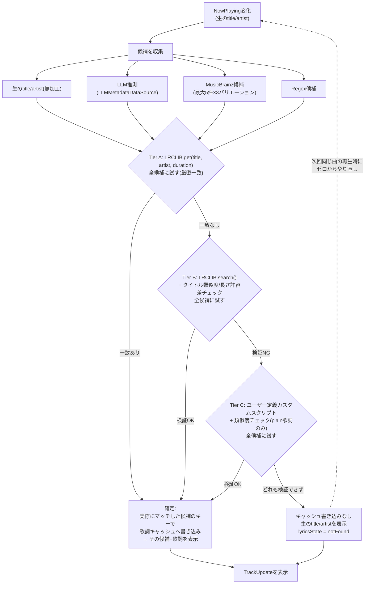

# 自動・確信度ベースのメタデータ+歌詞解決サイクル 設計

関連: #308(自動・確信度ベースの解決サイクル)、#53(手動修正UI案、close済み・本設計に置き換え)

## Motivation

AI(#51)によるメタデータ抽出は多くの場合うまく機能するが、時々間違った結果を返す。特に英語の曲名を無理やり日本語に寄せようとして該当なしになるケースがある。

さらに実運用で確認された、より深刻な問題がある:

- AIが誤ったメタデータを生成した後、その誤ったタイトル/アーティストで歌詞のあいまい検索(fuzzy search)をかけると、**別の曲の歌詞が偶然ヒットしてしまう**。
- この「誤ったメタデータ + 無関係な曲の歌詞」というペアが**キャッシュに正データとして永続化**され、次回以降もずっと誤った内容が表示され続ける。自己修復の手段がない。

lyraは**UIを持たないリッチな壁紙アプリ**であるという原則を優先し、ユーザー操作を強いる手動修正UI(#53)ではなく、**自動的に確信度の高いメタデータ+歌詞のペアを選び出す**サイクルを設計する。ネットワーク/AIトークンの消費は許容し、確信が持てない場合は「間違った答えを自信満々に出す」よりも「answerなし(生データ表示のみ)」を優先する。

## 修正対象の既存バグ

1. **`MetadataRepositoryImpl.resolve()`**(`Sources/MetadataRepository/MetadataRepositoryImpl.swift`) — LLMキャッシュに一行でもあれば即座にそれだけを返し、以降MusicBrainz/Regexには一切フォールバックしない。一度誤ったLLM結果がキャッシュされると永久に固定される。
2. **`LyricsRepositoryImpl.fetchLyrics(candidates:)`**(`Sources/LyricsRepository/LyricsRepositoryImpl.swift`) — 歌詞の検証済みマッチが`candidates`のどの要素であっても、キャッシュへの書き込みは常に`candidates.first`のキーで行われる。あいまい検索でヒットした歌詞が実際には別候補(あるいは全くの別曲)のものでも、表示中の(誤った)候補のキーで永続化されてしまう。

## 設計方針

- メタデータ候補を複数集める(生データ・LLM・MusicBrainz・Regex)。`MetadataUseCaseImpl.resolveCandidates()`が既に全候補を返せるので、これをそのまま使う。
- 信頼度の高い検証方法から順に、**全候補に対して**歌詞マッチングを試す(Tier A → Tier B → Tier C の順で、各Tierは次のTierに進む前に全候補を試し尽くす)。
- **検証できたペアだけをキャッシュに書き込む**。検証は「実際にマッチした候補」のキーで行う(バグ2の修正)。
- 何も検証できなければキャッシュに一切書き込まない(バグ1の修正)→ 次回同じ曲の再生時にまた最初からやり直せる。
- 検証できない場合の表示は、生の(無加工の)title/artistを優先する。AIが余計なことをしていないだけで正しいこともあるため。

### サイクル全体図



**ポイント**:

- Tier A(LRCLIB完全一致)が最も信頼度が高く、そのまま確定してよい。
- Tier B(あいまい検索)は現状バリデーションが皆無なので、タイトル類似度と長さ(duration)の許容差チェックを新設する。
- Tier C(後述のユーザー定義カスタムスクリプト)は時間情報を持たないため、**plain歌詞のフォールバックとしてのみ**、かつLRCLIBで何も検証できなかった場合の最終手段として使う。
- 検証に成功した時点で、歌詞キャッシュを**実際にマッチした候補のキーで**書き込む(`trackName`/`artistName`にその候補のtitle/artistが載るため、確定ペアとして機能する)。メタデータ側の各ソースキャッシュ(LLM/MusicBrainz)は歌詞バリデーションの成否と無関係に、これまで通り即時・無条件で書き込む。

## Tier C: ユーザー定義カスタムスクリプト

### 経緯・スコープ判断

当初はutamap.com(日本語歌詞サイト)専用のHTMLスクレイピング実装を検討していたが、**うたまっぷに限定せず、ユーザーがconfigで任意のコマンド/スクリプトを指定できる汎用機構に一般化する**。utamap.com向けのサンプルスクリプトはREADMEに掲載するのみとし、lyra本体にHTMLパース/スクレイピングのコードは持たせない。

**スコープはlyrics-onlyに限定する(全候補への歌詞マッチングの一Tierとして扱う)**。生メタデータからメタデータ解決と歌詞解決の両方をスクリプトに任せる案(候補生成そのものを置き換える案)は採らない。理由:

- カスタムスクリプトが自己申告するメタデータを無条件に信頼すると、本設計が解決しようとしている「確信度なく確定してキャッシュされる」問題をTier C分だけ再導入してしまう。
- 既存の`LyricsDataSource`という狭いプロトコルにそのまま適合でき、LRCLIBの`.get()`/`.search()`と同列のTierとして既存の候補ループ・検証ロジックに乗せられる。
- JSON出力契約(下記)で`track_name`/`artist_name`をスクリプト側から返せるようにしておくことで、多少の正規化はTier Bと同じ類似度チェックでカバーできる。フルの「メタデータ解決権限」を渡さずとも、この程度の恩恵は得られる。

### Config

```toml
[lyrics]
fallback_command = ["/usr/bin/python3", "/Users/you/.config/lyra/lyrics-fallback.py"]
timeout_ms = 5000
```

- `fallback_command`: 実行するコマンドを **文字列配列(argv形式)** で指定する。単一文字列をホワイトスペース分割する方式は採らない — macOSのパスにはスペースを含み得るため、`Process.arguments`にそのまま渡せる配列形式のほうが安全かつ曖昧さがない。
  - 未設定の場合、Tier C自体をスキップする(既存のTier A/Bのみで判定)。
  - パス展開は一切行わない。`~`/`$HOME`/環境変数展開はサポートせず、リテラルな絶対パスをそのまま`URL(fileURLWithPath:)`に渡す(READMEの記載と一致)。
- `timeout_ms`: プロセスのタイムアウト(ミリ秒)。デフォルト`5000`。ユーザーがconfigで上書き可能。

`LyricsConfig`(Entity, `AIConfig`と同様の最小構成)を新設し、`AppConfig`に`lyrics: LyricsConfig?`フィールドを追加する(既存の`wallpaper`/`ai`と同じ optional-field パターン)。

### 呼び出し方

- `ProcessGateway`経由でargv配列としてspawnする(**シェル文字列展開は行わない** — `YouTubeWallpaperDataSourceImpl`と同じ安全策。track title/artistに任意文字が含まれてもコマンドインジェクションの余地がない)。
- 候補ごとのtitle/artistをコマンドライン引数として追加で渡す: `fallback_command[0] fallback_command[1...] <title> <artist>`
- 環境変数として以下を渡す(**すべて読み取り専用の参考値であり、ユーザーが指定してlyraの探索先を変えられるものではない**):
  - `LYRA_CONFIG_DIR` — `ConfigDataSourceImpl.findConfigFile()`が実際に発見したconfigディレクトリの絶対パス。`XDG_CONFIG_HOME`から算出される値ではなく、lyra自身の複数候補探索(`$XDG_CONFIG_HOME/lyra` → `~/.lyra` → …)の結果そのもの。README上でも「この変数を設定してもlyraの探索先は変わらない」ことを明記する。
  - `LYRA_CACHE_DIR` — 同様に、lyraが実際に使っているキャッシュディレクトリ(`~/.cache/lyra`ベース)の絶対パス。
- プロセスの起動には既存の`findExecutable`/known-paths-then-`which`パターン(`Sources/WallpaperDataSource/FindExecutable.swift`, `DarwinGateway.findExecutable`)は使わない — ユーザーが`fallback_command[0]`にフルパスを指定する前提とし、その旨をREADMEに明記する。launchd環境のPATH制約に関する注意もREADMEに記載する。

### 出力契約

スクリプトはstdoutにJSONを1行出力する:

```json
{"track_name": "...", "artist_name": "...", "plain_lyrics": "..."}
```

- `track_name`/`artist_name`: Tier Bと同じタイトル類似度チェックに使う(スクリプト側の正規化結果を許容する)。
- `plain_lyrics`: 実際の歌詞本文。

lyra側は以下のいずれかを「この候補ではマッチなし」として扱い、次候補(または全候補終了)に進む:

- 終了コードが非ゼロ
- stdoutがJSONとしてパースできない
- `plain_lyrics`が欠落または空文字列

歌詞が見つからない場合にスクリプトが具体的にどう振る舞うか(非ゼロ終了 or 空`plain_lyrics`)はスクリプト作者の自由とし、lyra側はどちらのパターンも「マッチなし」として同一に扱う。README掲載のサンプルではこの契約に沿った実装例を示す。

### タイムアウト

- `timeout_ms`(デフォルト5000ms)を超えたらプロセスをkillし、その候補は「マッチなし」として次候補に進む。
- Tier Cは全候補に対して試すため、最悪ケース(全候補でハング)は `timeout_ms × 候補数`(実質3〜4候補、重複除けばもっと少ない)。デフォルト5秒×4候補=20秒程度に収まる想定。Tier Cは最終手段であり、lyraは表示側で自然に生データ表示へフォールバックするため、この程度の待ち時間は許容範囲とする。

### README

- utamap.com向けのサンプルスクレイピングスクリプト(Python想定)を掲載し、上記の入出力契約に沿った実装例を示す。
- lyra本体にはHTMLパース/スクレイピングのコードを一切持たせない。

## オーケストレーション配置(改訂)

実装計画の作成にあたり既存コードを精読した結果、当初案(専用コラボレーター`TrackResolutionCoordinator`の新設)は不要と判明した。理由と改訂後の配置は以下の通り。

### 判明した事実

- `LyricsResult`(Entity)には既に`trackName`/`artistName`フィールドと`withDisplay(title:artist:)`があり、「確定した候補のtitle/artist」を歌詞キャッシュの値自体に同居させられる。**メタデータと歌詞を別キャッシュで「同時確定」させるための専用の協調ロジックは不要** — 歌詞キャッシュのエントリ自体がすでに「確定ペア」を表現できる形をしている。
- `MetadataRepositoryImpl`のLLM/MusicBrainzキャッシュ書き込み(`resolve()`内、既存のまま)は、歌詞バリデーションの成否と無関係に**そのまま今まで通り即時・無条件で構わない**。バグ1の実害は「LLM成功で他ソースへのフォールバックが止まる」ことであり、キャッシュ書き込みのタイミングそのものではない。全ソースを常に問い合わせるよう修正すれば実害は解消する。
- `TrackInteractorImpl.resolveTrack(from:)`(`Sources/TrackInteractor/TrackInteractorImpl.swift:130-234`)は現状、`candidates.first`から作った未検証の`resolvedTitle`/`resolvedArtist`を`.loading`中の中間表示として送出したあと、歌詞が見つからない場合に`result.trackName ?? resolvedTitle`でこの未検証値にフォールバックしている。これは「検証できない場合は生データを優先する」という設計方針に反する**既存の実バグ**であり、`title`/`artist`(生の値、クロージャで既にキャプチャ済み)にフォールバックするよう2行修正するだけで解決する。新しい型は不要。

### 改訂後の変更範囲(すべて既存ファイルへの追加・修正、新規の協調構造体なし)

1. **`MetadataRepositoryImpl.resolve()`**(バグ1修正) — LLM/MusicBrainz/Regexを独立して(各自のキャッシュ優先で)必ず全て問い合わせ、結果をマージして返す。入力の生トラックも候補の一つとして末尾に含める。
2. **`LyricsRepositoryImpl.fetchLyrics(candidates:)`**(バグ2修正 + Tier B検証 + Tier C追加) — Tier Aループ・Tier B検索の両方で、キャッシュ書き込みを`candidates.first`ではなく**実際にマッチした候補**のキーで行うよう修正。Tier B結果に新設`LyricsMatchValidator`によるタイトル類似度/duration許容差チェックを追加。Tier A/B不成立時、新設`customScriptLyricsDataSource`をTier Cとして追加で試す。
3. **`Sources/LyricsRepository/LyricsMatchValidator.swift`**(新設) — タイトル類似度とduration許容差を判定する純粋structロジック。単体テスト可能。
4. **`Sources/LyricsDataSource/CustomScriptLyricsDataSourceImpl.swift`**(新設、既存の`LyricsDataSource`モジュール内) — Tier C用の`LyricsDataSource`準拠実装。`fallback_command`のargv配列spawn、タイムアウト、JSON出力パースを担う。`Sources/Domain/DataSource/LyricsDataSource.swift`に`customScriptLyricsDataSource`という2つ目のDIキーを追加(既存の`llmMetadataDataSource`/`regexMetadataDataSource`が同一ジェネリック型に対して別キーを持つのと同じパターン)。
5. **`TrackInteractorImpl.resolveTrack(from:)`**(表示フォールバック修正) — 歌詞が見つからない場合のフォールバック先を`resolvedTitle`/`resolvedArtist`(未検証の候補)から`title`/`artist`(生データ)に変更。

## セキュリティ

- カスタムスクリプトの呼び出しは常にargv配列(`Process.arguments`)経由。track title/artist文字列を含め、シェル文字列への埋め込み・展開は一切行わない(コマンドインジェクション対策、`YouTubeWallpaperDataSourceImpl`と同じ方針)。

## テスト方針

- `LyricsMatchValidator`は純粋structとして単体テスト可能にする。
- `LyricsRepositoryImpl`のキャッシュキー修正(バグ2)は、「マッチした候補と異なる`candidates.first`が存在する場合でも、キャッシュ書き込みが正しい候補のキーで行われる」ことを検証するテストで担保する(既存の`Tests/LyricsRepositoryTests/LyricsRepositoryTests.swift`には現状この観点のテストが無いため新設)。
- `MetadataRepositoryImpl`の全ソース問い合わせ修正(バグ1)は、既存の`Tests/MetadataRepositoryTests/MetadataRepositoryTests.swift`にある「LLM成功でMusicBrainz/Regexをスキップする」ことを検証する既存テストの期待値を、新しい「全ソースを問い合わせる」仕様に合わせて更新する。
- カスタムスクリプト呼び出しは`YouTubeWallpaperDataSourceImpl`と同様、`processRunner`のようなテスト注入可能なクロージャ経由にする(実プロセスを起動せずにテストできるように)。
- タイムアウト・異常終了・不正なJSON出力など、スクリプト側の異常系もテストで担保する。
- `TrackInteractorImpl`の表示フォールバック修正は、既存の`Tests/TrackInteractorTests/`配下のテストパターンに沿って、歌詞未検証時に生のtitle/artistが表示されることを検証するテストを追加する。

## 非スコープ(YAGNI)

- パス展開エンジン(`~`/`$HOME`/環境変数展開)全般 — `fallback_command[0]`はリテラルな絶対パス指定のみサポート
- カスタムスクリプトによるメタデータ解決の完全委譲(Option A、不採用)
- `fallback_command[0]`のPATH自動解決(`findExecutable`パターンの流用、不採用 — ユーザーがフルパス指定する前提)
- 同一トラック再生中の再解決トリガー(既存の`removeDuplicates(by: sameTrack)`制約により現状スコープ外、#308から引き継ぎ)

## 次のステップ

本設計の承認後、`writing-plans`スキルで実装計画を立てる。実装計画では以下を具体化する:

- `LyricsConfig` Entity、`AppConfig`への`lyrics`フィールド追加
- カスタムスクリプト用の`LyricsDataSource`実装(`CustomScriptLyricsDataSourceImpl`、Tier Cとして`LyricsRepositoryImpl`に組み込み)
- `LyricsMatchValidator`の新設、`LyricsRepositoryImpl`からの利用
- Tier Bの類似度チェック(タイトル正規化・比較方法、durationの許容差)の具体的な閾値
- `MetadataRepositoryImpl.resolve()`のバグ1修正(全ソース問い合わせ化)と、それに伴う既存テストの期待値更新
- `LyricsRepositoryImpl.fetchLyrics(candidates:)`のバグ2修正(キャッシュキーを実際にマッチした候補に変更)
- `TrackInteractorImpl.resolveTrack(from:)`の表示フォールバック修正(未検証候補ではなく生データへフォールバック)
- モジュール追加チェックリスト(`.claude/rules/module-checklist.md`)に沿ったDI登録/ドキュメント更新(新規SPMモジュールは不要 — 既存の`LyricsRepository`/`LyricsDataSource`/`Domain`モジュールへの追加で完結する)
