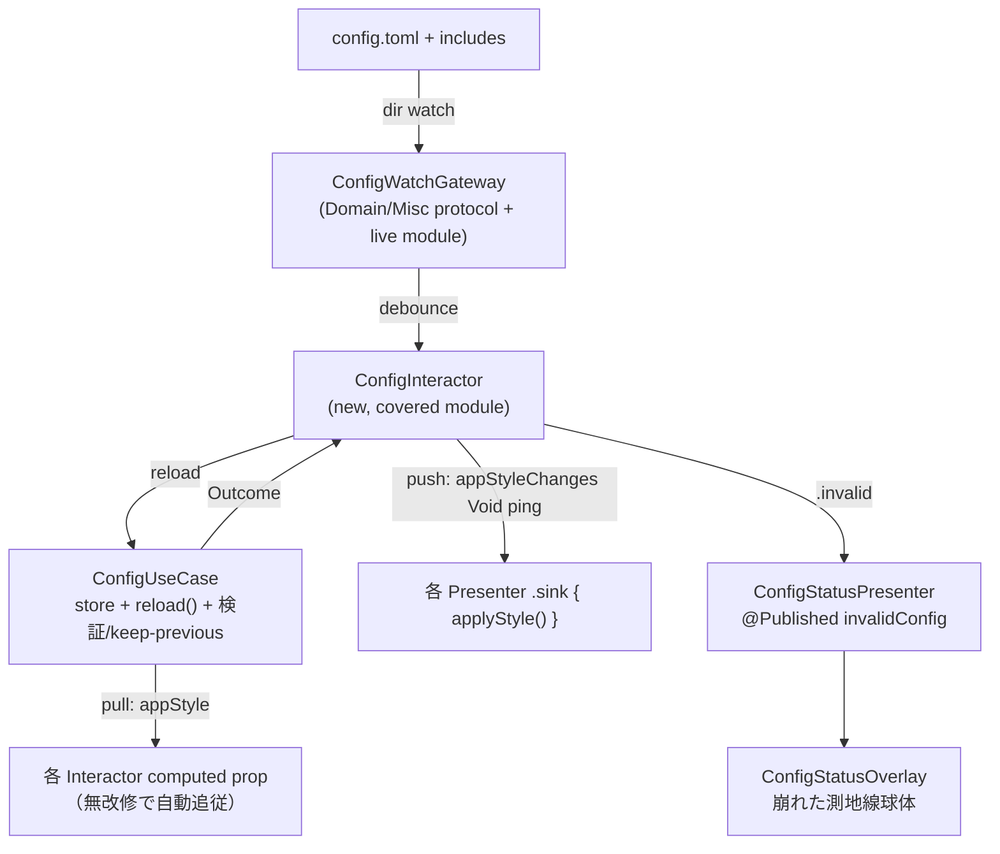

# config ホットリロード 設計仕様 (#41)

| 項目 | 値 |
|---|---|
| Issue | [#41 Watch config file changes and apply without restart](https://github.com/GeneralD/lyra/issues/41) |
| 日付 | 2026-07-12 |
| ステータス | Draft（設計合意済み・実装計画待ち） |
| スコープ | **完全ホットリロード**（全 config 項目）／**自動ファイル監視**トリガー／**グラフィカルなエラー表示** |

## 1. 背景と目的

`config.toml` の変更は現在 daemon 再起動でしか反映されない。スタイル試行錯誤の反復が重い。
過去に一度 hot-reload を試みたが「状態の二重管理・ライフサイクル絡みのバグ（二重購読・monitor リーク・壁紙ブラックアウト）」で実用に至らず wontfix クローズ→再オープンした経緯がある。

本設計の要は **「push（各 Presenter に `restyle()` を生やし `stop(); start()` で再構築する）モデルをやめる」** こと。過去の沼はすべてこの push モデル由来。代わりに **config を単一のリアクティブな source of truth にし、購読を張り替えず値だけを冪等反映する** 設計にすることで、複雑さそのものを消す。

### ゴール

- `config.toml`（および `includes` 先）を保存した瞬間、daemon 再起動なしで全設定が反映される。
- 不正な config に変更した場合、**画面は前回の正しい設定のまま**保たれ、**グラフィカルに**エラーが伝わる（stderr ログはデーモン起動の一般ユーザーに見えないため不採用）。

### 非目標

- CLI ワンショットコマンド（`lyra track` 等・別プロセス）は対象外（毎回最新を読むため元々問題なし）。
- `lyra healthcheck`（別プロセス）の AI チェッカー構築時読みは daemon スコープ外。

## 2. 現状分析（コード実測ベース）

### 凍結点は 2 箇所のみ

1. **本丸**: `Sources/ConfigUseCase/ConfigUseCaseImpl.swift:6` の
   `private lazy var cachedAppStyle: AppStyle = repository.loadAppStyle()`。
   `ConfigUseCaseKey.liveValue` が `static let`（`Sources/DependencyInjection/UseCaseRegistration.swift:11`）でプロセス生涯 1 インスタンス＝起動時に 1 回ロードして永久固定。
   `ConfigDataSourceImpl` / `ConfigRepositoryImpl` はどちらも struct・ステートレスで毎回ディスクを読み直す「素通し」なので、**変更はこの 1 ファイルに閉じ込められる**。
2. **第二の独立凍結**: `Sources/LyricsDataSource/CustomScriptLyricsDataSourceImpl.swift:16-29` が `init()` で `configDataSource.load()?.config.lyrics` を 1 回読み `let` 固定。AppStyle を経由しない別系統。`LLMMetadataDataSourceImpl.resolve()`（`:34-36`）は逆に毎回ディスク読み＝既にホットリロード相当で、これが手本になる。

### 既にライブ（凍結を解けば自動追従する部分）

- 全 Interactor（`TrackInteractor`/`ScreenInteractor`/`WallpaperInteractor`/`SpectrumInteractor`）は `configService.appStyle.*` を都度読む computed property。無改修で追従する。
- `AppPresenter`（`screenChanges` イベント毎に `resolveLayout()` 再呼び出し）、`SpectrumPresenter`（`tick()` が毎フレーム `interactor.spectrumStyle` 再読）、`RipplePresenter.drawingContexts()`（色・半径等を都度読み）は既にライブ。

### 壁（Presenter 層の焼き付け）と構造ハザード

| 箇所 | 問題 |
|---|---|
| `HeaderPresenter.start()` / `LyricsPresenter.start()` | config 由来値を**非 `@Published`** の stored property に 1 回焼き付け。`HeaderView` は plain 値を直読みするため、値を書き換えても SwiftUI が再描画しない |
| `RipplePresenter.start()` | `enabled` を 1 回評価し NSEvent global monitor 装着＋`RippleState` 構築。トグルで着脱されない／`stop()` を挟まず再 `start()` すると monitor 二重登録リーク |
| `WallpaperPresenter` + `AppRouter` | `onPlayerAvailable` が `.first()` で **一度きり** AVPlayerLayer をアタッチ。素朴な `stop(); start()` で壁紙が永久に真っ黒 |
| `AppRouter.frameHandlers`（`:120-134`） | 起動時の `isEnabled` スナップショットで配列構築・以後不変。無効起動→有効化しても DisplayLink の fan-out に tick が含まれない |
| `TrackInteractor.trackChange` 等 | `.share()`（リプレイ無し）。Presenter を再購読すると現在曲が再送されず表示が固まる（**過去 PR 破綻の最有力犯人**） |
| `ConfigDataSourceImpl.tryDecode()`/`load()` | 「ファイルが無い」と「あるが読めない」を区別せず両方 `.defaults` に縮退。reload 時に atomic-save 途中の一瞬を「defaults リセット」と誤認する罠 |
| `includes`（`ConfigDataSourceImpl.resolveIncludes()`, `:158-171`） | 監視を `config.toml` 単体に絞ると include 先の変更を取りこぼす |

## 3. 設計原則 ── 全 Presenter 共通の唯一のルール

各 Presenter で責務を 2 つに割る:

| メソッド | 役割 | 呼ばれる回数 |
|---|---|---|
| `start()` | 購読・監視・AVPlayer/Task の**配線だけ** | 起動時 1 回のみ（二度と再実行しない） |
| `applyStyle()` | config 値の**冪等な反映だけ**（自スライスを diff、重い再構築は変化時のみ） | 起動時 ＋ config 変更の**都度** |

config 変更は `applyStyle()` **しか**叩かない。**購読は絶対に張り替えない** → `.share()` リプレイ喪失も monitor リークも構造的に発生しない。`AppWindow.apply`（#265 の「毎回フル再計算・差分だけ書き込む・dedup しない」冪等モデル）を Presenter に横展開したもの。

## 4. アーキテクチャ

### 中核（`ConfigUseCase`）

- `private lazy var cachedAppStyle` → **ロック付き可変 store**（`OSAllocatedUnfairLock<AppStyle>`、既存 `SpectrumInteractorImpl.processor` と同型）。既存のデータ競合リスク（`lazy var` の非スレッドセーフ初期化）も同時に解消。
- 公開 API:
  - `var appStyle: AppStyle { get }` … store の現在値（pull 消費者向け・従来通り）
  - `func reload() -> ConfigReloadOutcome` … 検証 → 成功かつ変更ありなら store 更新 → Outcome を返す。不正なら store を変えず `.invalid(reason)` を返す。
  - `ConfigReloadOutcome` = `.unchanged` / `.updated(AppStyle)` / `.invalid(ConfigReloadFailure)`（Entity）
- **Combine は入れない**（UseCase は業務ロジック層に留める）。変更通知の Combine 化は Interactor 層（`ConfigInteractor`）が担う＝アーキ規約の既存例外内。

### 変更伝播トポロジ（VIPER 準拠）

- Presenter は UseCase を直接触らない。`ConfigInteractor`（新）を各 Presenter に注入し、`appStyleChanges: AnyPublisher<Void, Never>`（「変わった」ping）を購読 → `applyStyle()`。
- 値は各 Presenter が自分の feature Interactor の live computed prop で再 pull する（既存経路）。ping は Void で十分。ただし重い再構築（wallpaper）は `applyStyle()` 内で**自スライスを diff** し変化時のみ実行（冪等 apply の規律）。

## 5. 新規／変更コンポーネント（すべて既存パターンの複製）

| ピース | 種別 | 手本 |
|---|---|---|
| `ConfigWatchGateway` | Domain/Misc protocol ＋ 専用ライブ実装モジュール | `AudioTapGateway`→`CoreAudioTapGateway`。DispatchSource は `App/SignalTerminationHandler.swift` のラップ型を転用 |
| `ConfigInteractor` | 新 covered module ＋ Domain protocol ＋ DI 1 行 | `ScreenInteractor`（OS 通知→Publisher、start/stop ライフサイクル） |
| `ConfigUseCase` リアクティブ化 | 既存 covered module の改修 | `OSAllocatedUnfairLock`（`SpectrumInteractorImpl`） |
| `ConfigStatusPresenter` ＋ `ConfigStatusOverlay` view | 新 Presenter ＋ 新 View | `WallpaperPresenter.showLoadingIndicator` ＋ `WallpaperLoadingOverlay` |
| 崩れた測地線球体インジケータ | `OverlayContentView` へ追加 | `GeodesicLoadingIndicator` を再利用（`GeodesicGeometry.edges` 共用） |
| lyrics DataSource の毎回読み | `CustomScriptLyricsDataSourceImpl` 改修 | `LLMMetadataDataSourceImpl.resolve()` の都度 `configDataSource.load()` |
| `AppLaunchEnvironment` に `LYRA_UI_TEST_CONFIG` | E2E 用シーム追加 | 既存 `LYRA_UI_TEST_*` env |

**配置規約**: `ConfigWatchGateway` protocol は `Domain/Misc`、ライブ実装は専用モジュール、`liveValue` は `GatewayRegistration.swift` に 1 行。実ロジックは covered モジュール（`ConfigUseCase`/`ConfigInteractor`/専用 Gateway 実装）に置き、`Domain`/`DependencyInjection`（coverage 除外）には契約・配線のみ。

## 6. ハザード → 解決マッピング

| ハザード | 解決 |
|---|---|
| `cachedAppStyle` 凍結 | ロック付き store ＋ `reload()`。1 ファイルに閉じる |
| lyrics 第二凍結 | `CustomScriptLyricsDataSourceImpl` を毎回 `configDataSource.load()` に（AppStyle 経由すら不要） |
| Header/Lyrics 非 `@Published` 焼付 | style プロパティを `@Published` 化 ＋ `applyStyle()` で再代入 |
| `.share()` リプレイ喪失 | 購読を張り替えない設計により**発生しない**。`applyStyle()` は現在表示中トラックへ新スタイルを再適用するだけ |
| Ripple `enabled` トグル ＋ monitor | `applyStyle()` が enabled を diff → 変化時のみ monitor 着脱 ＋ `RippleState` 再構築（冪等ガード） |
| `frameHandlers` 固定配列 | ripple/spectrum の tick を**常時含め**、enabled 判定をクロージャ内へ（毎フレーム bool 1 個、実質ゼロコスト）。#252/#258 の意図はクロージャ内 early-return で維持 |
| Wallpaper `.first()` ブラックアウト | `onPlayerAvailable` を **player インスタンス変化毎に再アタッチ**へ変更。`applyStyle()` は items を diff、変化時のみ再構築（可能なら `replaceCurrentItem` で player 保持） |
| screen 再選択の駆動導線ゼロ | `AppPresenter` の既存 merge に `configChanges` を追加 → `resolveLayout()`。`screen_debounce` 変化は vacantTask 再起動 |
| 「無い」と「読めない」混同 | 区別を追加。読取/parse 失敗は**前回値保持**（§9） |
| atomic-save で fd 失効・includes 追従 | **親ディレクトリ監視**（§10） |

## 7. エラー UX ── 崩れた測地線球体

- 既存の `GeodesicLoadingIndicator`（金色の測地線球体＝ゴールドバーグ多面体ワイヤーフレーム、Canvas + `TimelineView`、暗いハローで明暗どちらの壁紙でも可読）を**再利用**し、`GeodesicGeometry.edges` を共用。
- **不正状態**: 金 → **琥珀色**に変わり、ワイヤーフレームが**破断・ジッター**（数本の支柱が外れて漂う）。「config が壊れた＝球体が壊れた」の視覚的対応。
- **挙動**: トーストではなく、**on-disk config が不正な間だけ表示**（正しい reload が通れば消える）。ローディング球体より**小さく・隅寄り**（`bottom-trailing` 等、歌詞カラムと喧嘩しない）。キャプションは**出現時のみ** `config invalid · kept previous style`。
- **詳細な原因は `lyra healthcheck`（既に strict 検証済み）に委譲**。球体は「壊れてる・前回維持」だけを簡潔に伝える。
- **ゼロアイドルコスト**: `WallpaperLoadingOverlay` と同型の条件付き挿入（`.opacity(0)` ではなく tree からの出し入れ、#252 準拠）。
- **視覚の詰めは実装前に別途**: 琥珀の色値・球体サイズ・破断表現の度合いは、`#Preview`（既存の Loading Indicator プレビュー同様）＋ dev-verification 実機で確定させる。

## 8. `ConfigInteractor` の責務

- start(): `ConfigWatchGateway` の監視を開始。イベントを debounce（100〜200ms 目安、`@Dependency(\.continuousClock)` 注入）→ `configUseCase.reload()` を呼ぶ。
- reload の Outcome を捌く: `.updated` → `appStyleChanges` に ping、`invalidConfig` を nil クリア。`.invalid` → `ConfigStatusPresenter` へ渡す。`.unchanged` → 何もしない。
- stop(): 監視停止・Task/購読解放（`AppPresenter.stop()`、`WallpaperPresenter.deinit` の二重キャンセル安全策を踏襲）。
- AppRouter が `start()`/`stop()` のライフサイクルに組み込む。

## 9. 不正 config の検証と keep-previous

- `reload()` はまず `ConfigRepositoryImpl.validate()`（既存の `tryDecode()` ＋ `strictDecodeOptionalSections()` の 2 段 strict decode）で妥当性を確認。成功時のみ `loadAppStyle()` → store 更新。
- **「無い」と「読めない」を区別**する改修を追加（現状 `load()`/`tryDecode()` は両方 `.defaults` に縮退）。ファイル存在＆読取失敗（atomic-save 途中・パーミッション）は **store を変えず `.invalid`**。ファイル不在（意図的削除）はデフォルト適用として別扱い。
- 既存の `ConfigValidationResult.unreadable`（現在デッドケース）を実際に生成する経路をここで追加する余地がある。

## 10. ファイル監視の詳細

- **親ディレクトリ監視**方式（`DispatchSource.makeFileSystemObjectSource` を config **ディレクトリ**の fd に対して `.write`）。多くのエディタは atomic-save（一時ファイル→rename）で置き換えるため、ファイル fd 直監視だと 1 回目以降失効する。ディレクトリ監視なら create/rename/modify を捕捉できる。
- **`includes` 追従**: include 先も file tier で個別に watch し、別ディレクトリの include はその親ディレクトリも watch する（#337 で実装済み。当初は「同ディレクトリ前提・別ディレクトリは将来課題」だったが、in-place 上書き検知のための file fd 直 watch ＋外部親ディレクトリ watch ＋イベント毎再アームまで拡張した）。include が未作成でも親ディレクトリを watch し、後からの作成を検知する。
- **debounce**: 保存 1 回で複数イベントが飛ぶ・巨大 config の連続書き込みを coalesce。
- Gateway 化により、テストでは fake が「変更」を号令一下で発火（§11 ①）でき、実 FS タイミング非依存。

## 11. テスト戦略（横断・4 レーン）

各 PR は自分の担当スライスを以下 4 レーンで検証する。

| レーン | 実体 | 捕まえるもの | 実装 |
|---|---|---|---|
| **① パイプライン E2E**（in-process・決定論的） | 実 VIPER グラフ ＋ fake `ConfigWatchGateway` ＋ `ConfigDataSourceImpl(configHome: temp)`。configA→変更発火→configB→**Presenter 公開スタイルが変わったか**を assert。不正 config で**前回値保持＋エラー面立ち上がり**も assert | 伝播・keep-previous・エラー面（最重要の配線リグレッション） | 新規統合テストターゲット。`withDependencies` で leaf のみ差し替え |
| **② レンダリング差分 E2E**（in-process） | 既存 `ViewRenderingTests.render()`（`NSHostingView` ＋ `ImageRenderer(content:).cgImage`、Canvas/TimelineView を同期実行）で configA vs configB を実画像化し**ピクセル差**を assert | `@Published`→View 再描画（Header/Lyrics 焼付）・球体エラーの実描画・トグルで spectrum/ripple が現れる | `ViewsTests` に追加 |
| **③ ライブスモーク**（host/VM） | 壁紙 config 差替 → `check-overlay.swift`（`memory > width×height` のブランク検出）で**まだ非ブランク**を assert | 壁紙ブラックアウト・オーバーレイ消滅（PR4 の番犬） | dev-verification lane / `lyra-vm-harness.sh capture` |
| **④ VM capture / 手動**（PR 毎 1 眼） | 実ディスプレイでスクショ | 実**動画**壁紙の再生・**マルチモニタ**再選択・アニメ体感 | VM harness / 手動 |

### 限界（正直に）

- **AVPlayerLayer の動画は in-process レンダに写らない**（SwiftUI ではなく別 CALayer）→ 壁紙の映像は ③④ で担保。
- `check-overlay` のブランク検出は粗い（全黒は捕るが色違いは捕れない）→ ② が担う。
- ヘッドレスレンダは 1 フレーム（アニメ滑らかさは ④）。

swift-snapshot-testing の導入も可能だが参照画像管理が増えるため、まずは手書きの「2 レンダが異なる／非全黒／サンプル領域の主色が期待通り」で軽く始める。

## 12. 配信計画 ── 全スコープを小さく刻む（各 PR 単体で緑＆価値）

過去の失敗は big-bang。独立してマージ可能な単位に割る。

| PR | 内容 | 直後に見える成果 | 主なテスト |
|---|---|---|---|
| **PR1 中核** | reactive store ＋ `reload()` ＋ 検証/keep-previous ＋「無い/読めない」区別 ＋ `ConfigWatchGateway` ＋ `ConfigInteractor` ＋ `ConfigStatusPresenter`/`ConfigStatusOverlay`（崩れた球体） ＋ lyrics DataSource 毎回読み | pull 消費者（spectrum/ripple 見た目・screen）が即ホットリロード。不正 config で球体エラー | ① パイプライン E2E（伝播・keep-previous・エラー面）、②（球体描画）、Gateway 単体（fake） |
| **PR2 プレゼン** | Header/Lyrics の `@Published` 化 ＋ `start()`/`applyStyle()` 分割 | font/色/サイズ/artwork 即反映 | ①（Header/Lyrics 伝播）、②（レンダ差分） |
| **PR3 トグル** | ripple/spectrum の on⇄off（`frameHandlers` 常時含む化・monitor 着脱・capture start/stop） | 有効/無効の即時反映 | ①、②（有効時に View 出現）、monitor 着脱の単体 |
| **PR4 重量級** | wallpaper ソース差替（AVPlayer `.first()`→再アタッチ）＋ screen 再選択 | 壁紙/画面選択の即時反映 | ①、③（非ブランク番犬）、④（実機・動画/マルチモニタ） |

**難所は PR4 の AVPlayer 再アタッチと PR1 のファイル監視 atomic-save 再 arm の 2 点のみ**。残りは統一 seam の機械適用。

## 13. リスクと未解決の詰め

### リスク

- AVPlayer 再アタッチ（PR4）: `.first()` 解除後の再アタッチ経路を誤ると壁紙ブラックアウト。③ の番犬 ＋ ④ 実機で必ず検証。
- ファイル監視の atomic-save 再 arm（PR1）: 誤ると「1 回目の変更しか検知しない」。親ディレクトリ監視で回避。fake Gateway で単体テスト。
- `withDependencies` で config 系をオーバーライドする将来コードが入ると「単一実体」前提が静かに崩れる → コメントで明文化。

### 未解決（実装前 or PR1 前に詰める）

- **エラー球体の視覚**: 琥珀の色値・サイズ・隅の位置・破断表現の度合い（`#Preview` ＋ 実機で確定）。
- **debounce の具体値**（100/150/200ms のいずれか、実機の保存挙動で調整）。
- **別ディレクトリ include の追従**: 初回は同ディレクトリ前提。必要なら将来 issue。

## 14. 参照（現行コードの正）

issue #41 本文の参照コード（`BackdropConfig`/`OverlayWindow` 等）は陳腐化。本仕様の実ファイルパスを正とする。主要点:

- 凍結: `Sources/ConfigUseCase/ConfigUseCaseImpl.swift:6`、`Sources/LyricsDataSource/CustomScriptLyricsDataSourceImpl.swift:16-29`
- ライブ手本: `Sources/MetadataDataSource/LLMMetadataDataSourceImpl.swift:34-36`
- 冪等 apply: `Sources/Views/Overlay/AppWindow.swift`（#265）
- 監視ライフサイクル手本: `Sources/Presenters/App/AppPresenter.swift`（vacant polling）
- DispatchSource 手本: `Sources/App/SignalTerminationHandler.swift`
- Gateway 規約: `Sources/Domain/Misc/ProcessGateway.swift` / `AudioTapGateway.swift`
- 球体: `Sources/Views/Overlay/OverlayContentView.swift:109`（`GeodesicLoadingIndicator`）、`GeodesicGeometry.swift`
- ヘッドレスレンダ: `Tests/ViewsTests/ViewRenderingTests.swift`（`render()`）
- ライブスモーク: `.claude/scripts/check-overlay.swift`
